# Практическая работа №3
## Выполнил студент группы П25-2.1. Хохлов Максим


### Раздел 1. Базовые условия if и if-else
---
№ 1. Пользователь вводит целое число. Проверить, является ли оно положительным.

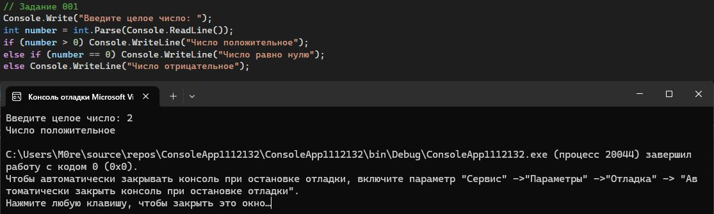

```csharp
using System;

namespace _3_practic
{
    internal class Program
    {
        static void Main(string[] args)
        {
            Console.Write("Введите целое число: ");
            int number = int.Parse(Console.ReadLine());
            if (number > 0) Console.WriteLine("Число положительное");
            else if (number == 0) Console.WriteLine("Число равно нулю");
            else Console.WriteLine("Число отрицательное");
        }
    }
}
```

---

№ 2. Пользователь вводит целое число. Проверить, является ли оно четным.

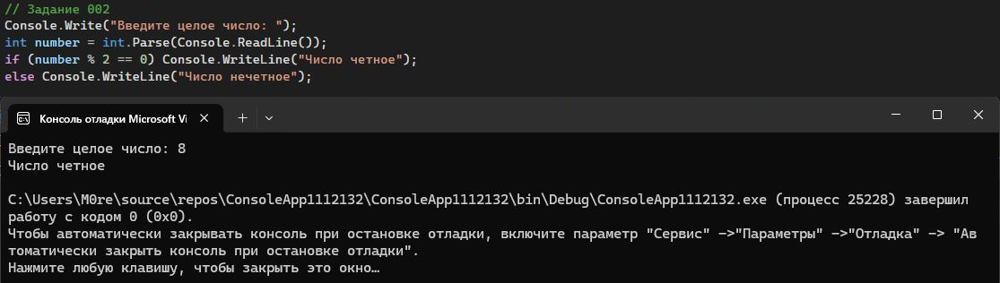

```csharp
using System;

namespace _3_practic
{
    internal class Program
    {
        static void Main(string[] args)
        {
            Console.Write("Введите целое число: ");
            int number = int.Parse(Console.ReadLine());
            if (number % 2 == 0) Console.WriteLine("Число четное");
            else Console.WriteLine("Число нечетное");
        }
    }
}
```

---

№ 3. Даны два целых числа. Вывести наибольшее из них.

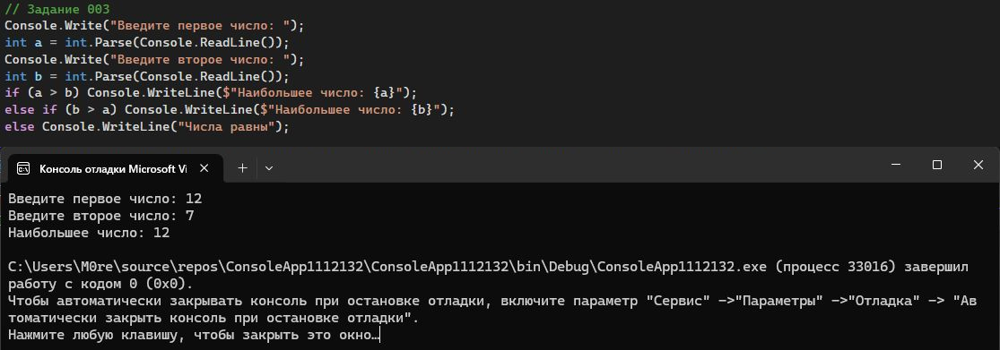

```csharp
using System;

namespace _3_practic
{
    internal class Program
    {
        static void Main(string[] args)
        {
            Console.Write("Введите первое число: ");
            int a = int.Parse(Console.ReadLine());
            Console.Write("Введите второе число: ");
            int b = int.Parse(Console.ReadLine());
            if (a > b) Console.WriteLine($"Наибольшее число: {a}");
            else if (b > a) Console.WriteLine($"Наибольшее число: {b}");
            else Console.WriteLine("Числа равны");
        }
    }
}
```

---

№ 4. Даны два числа с плавающей точкой. Вывести наименьшее.

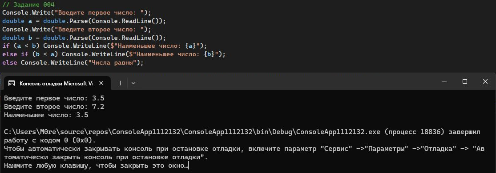

```csharp
using System;

namespace _3_practic
{
    internal class Program
    {
        static void Main(string[] args)
        {
            Console.Write("Введите первое число: ");
            double a = double.Parse(Console.ReadLine());
            Console.Write("Введите второе число: ");
            double b = double.Parse(Console.ReadLine());
            if (a < b) Console.WriteLine($"Наименьшее число: {a}");
            else if (b < a) Console.WriteLine($"Наименьшее число: {b}");
            else Console.WriteLine("Числа равны");
        }
    }
}
```

---

№ 5. Проверить, делится ли введенное число нацело на 5.

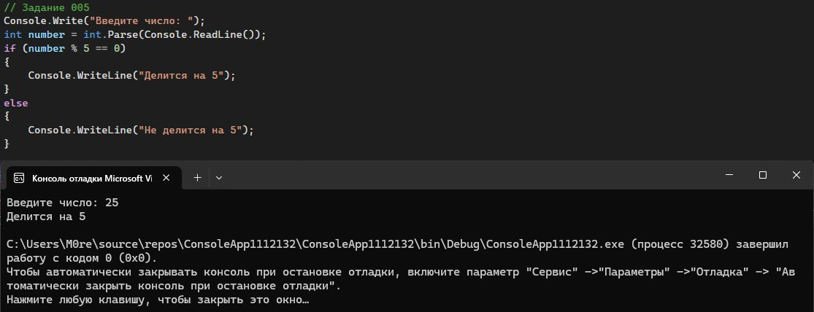

```csharp
using System;

namespace _3_practic
{
    internal class Program
    {
        static void Main(string[] args)
        {
            Console.Write("Введите число: ");
            int number = int.Parse(Console.ReadLine());
            if (number % 5 == 0)
            {
                Console.WriteLine("Делится на 5");
            }
            else
            {
                Console.WriteLine("Не делится на 5");
            }
        }
    }
}
```

---

№ 6. Проверить, оканчивается ли введенное целое число нулем.

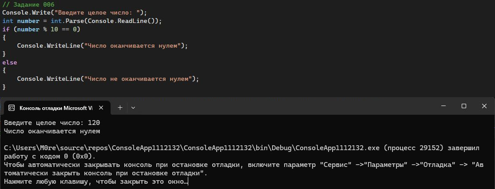

```csharp
using System;

namespace _3_practic
{
    internal class Program
    {
        static void Main(string[] args)
        {
            Console.Write("Введите целое число: ");
            int number = int.Parse(Console.ReadLine());
            if (number % 10 == 0)
            {
                Console.WriteLine("Число оканчивается нулем");
            }
            else
            {
                Console.WriteLine("Число не оканчивается нулем");
            }
        }
    }
}
```

---

№ 7. Пользователь вводит температуру воздуха. Если она ниже нуля, вывести: «На улице мороз, наденьте шапку».

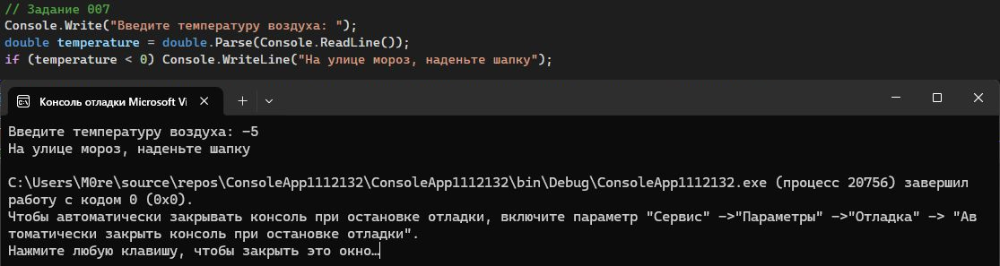

```csharp
using System;

namespace _3_practic
{
    internal class Program
    {
        static void Main(string[] args)
        {
            Console.Write("Введите температуру воздуха: ");
            double temperature = double.Parse(Console.ReadLine());
            if (temperature < 0) Console.WriteLine("На улице мороз, наденьте шапку");
        }
    }
}
```

---

№ 8. Дано число. Если оно больше 100, уменьшить его на 20, иначе увеличить на 10.

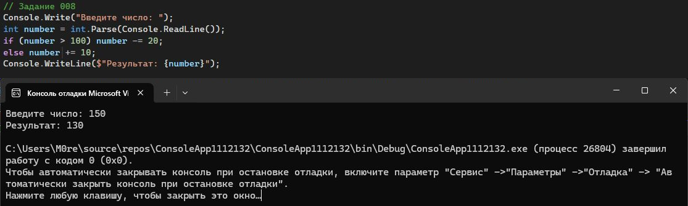

```csharp
using System;

namespace _3_practic
{
    internal class Program
    {
        static void Main(string[] args)
        {
            Console.Write("Введите число: ");
            int number = int.Parse(Console.ReadLine());
            if (number > 100) number -= 20;
            else number += 10;
            Console.WriteLine($"Результат: {number}");
        }
    }
}
```

---

№ 9. Ввести два числа. Если они равны, вывести «Числа равны», иначе вывести их произведение.

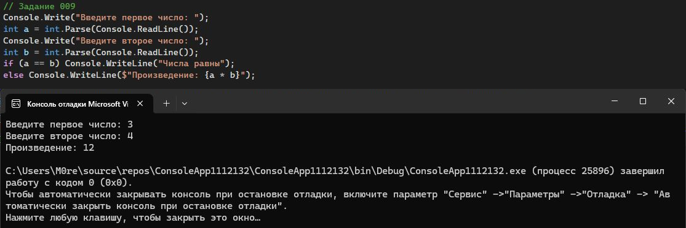

```csharp
using System;

namespace _3_practic
{
    internal class Program
    {
        static void Main(string[] args)
        {
            Console.Write("Введите первое число: ");
            int a = int.Parse(Console.ReadLine());
            Console.Write("Введите второе число: ");
            int b = int.Parse(Console.ReadLine());
            if (a == b) Console.WriteLine("Числа равны");
            else Console.WriteLine($"Произведение: {a * b}");
        }
    }
}
```

---

№ 10. Пользователь вводит свой возраст. Если возраст от 18 и старше, вывести «Доступ разрешен», иначе «Доступ запрещен».

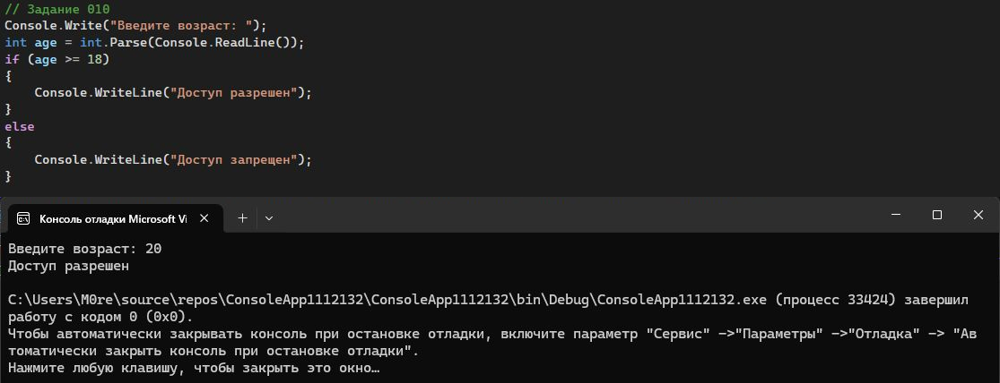

```csharp
using System;

namespace _3_practic
{
    internal class Program
    {
        static void Main(string[] args)
        {
            Console.Write("Введите возраст: ");
            int age = int.Parse(Console.ReadLine());
            if (age >= 18)
            {
                Console.WriteLine("Доступ разрешен");
            }
            else
            {
                Console.WriteLine("Доступ запрещен");
            }
        }
    }
}
```

---

№ 11. Ввести число. Если оно трехзначное, вывести «Да», иначе «Нет».

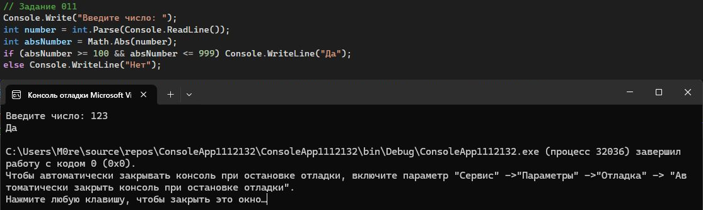

```csharp
using System;

namespace _3_practic
{
    internal class Program
    {
        static void Main(string[] args)
        {
            Console.Write("Введите число: ");
            int number = int.Parse(Console.ReadLine());
            int absNumber = Math.Abs(number);
            if (absNumber >= 100 && absNumber <= 999) Console.WriteLine("Да");
            else Console.WriteLine("Нет");
        }
    }
}
```

---

№ 12. Проверить, делится ли число на 3 без остатка.

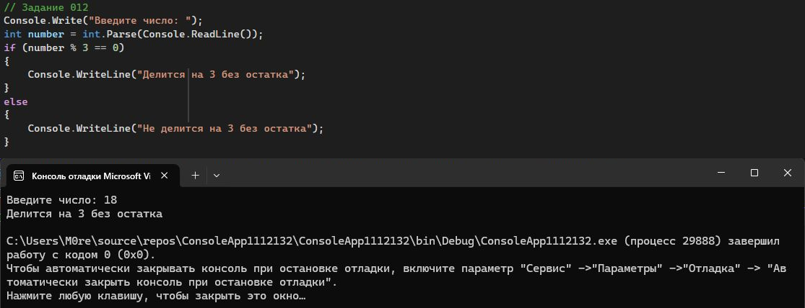

```csharp
using System;

namespace _3_practic
{
    internal class Program
    {
        static void Main(string[] args)
        {
            Console.Write("Введите число: ");
            int number = int.Parse(Console.ReadLine());
            if (number % 3 == 0)
            {
                Console.WriteLine("Делится на 3 без остатка");
            }
            else
            {
                Console.WriteLine("Не делится на 3 без остатка");
            }
        }
    }
}
```

---

№ 13. Даны координаты точки на числовой прямой $X$. Определить, лежит ли точка правее нуля.

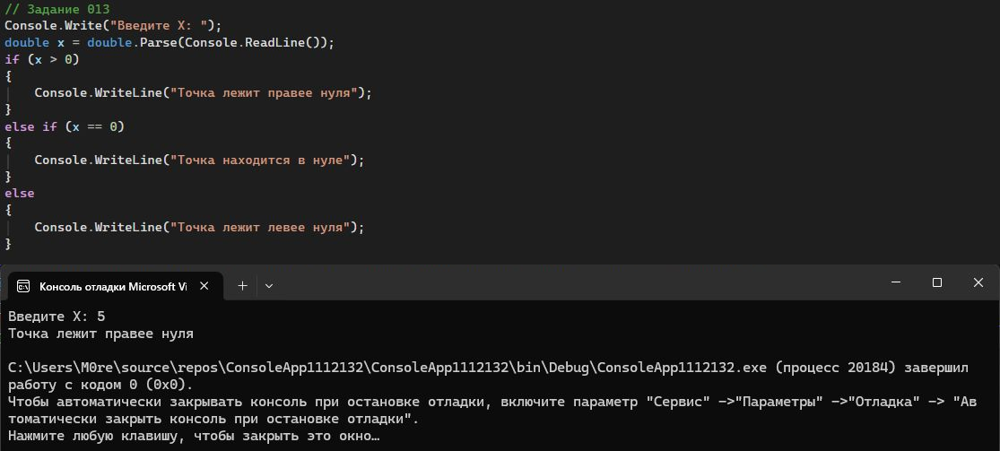

```csharp
using System;

namespace _3_practic
{
    internal class Program
    {
        static void Main(string[] args)
        {
            Console.Write("Введите X: ");
            double x = double.Parse(Console.ReadLine());
            if (x > 0)
            {
                Console.WriteLine("Точка лежит правее нуля");
            }
            else if (x == 0)
            {
                Console.WriteLine("Точка находится в нуле");
            }
            else
            {
                Console.WriteLine("Точка лежит левее нуля");
            }
        }
    }
}
```

---

№ 14. Ввести баланс счета. Если баланс отрицательный, вывести «Задолженность!».

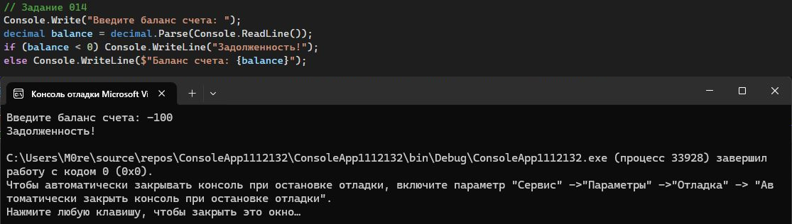

```csharp
using System;

namespace _3_practic
{
    internal class Program
    {
        static void Main(string[] args)
        {
            Console.Write("Введите баланс счета: ");
            decimal balance = decimal.Parse(Console.ReadLine());
            if (balance < 0) Console.WriteLine("Задолженность!");
            else Console.WriteLine($"Баланс счета: {balance}");
        }
    }
}
```

---

№ 15. Пользователь вводит пароль (целое число). Если введен 1234, вывести «Вход выполнен», иначе «Неверный пароль».

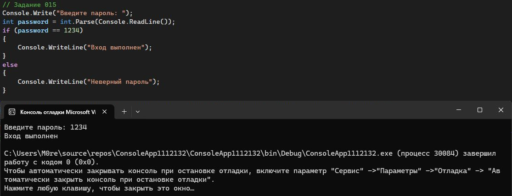

```csharp
using System;

namespace _3_practic
{
    internal class Program
    {
        static void Main(string[] args)
        {
            Console.Write("Введите пароль: ");
            int password = int.Parse(Console.ReadLine());
            if (password == 1234)
            {
                Console.WriteLine("Вход выполнен");
            }
            else
            {
                Console.WriteLine("Неверный пароль");
            }
        }
    }
}
```

---

№ 16. Проверить, является ли введенное число отрицательным.

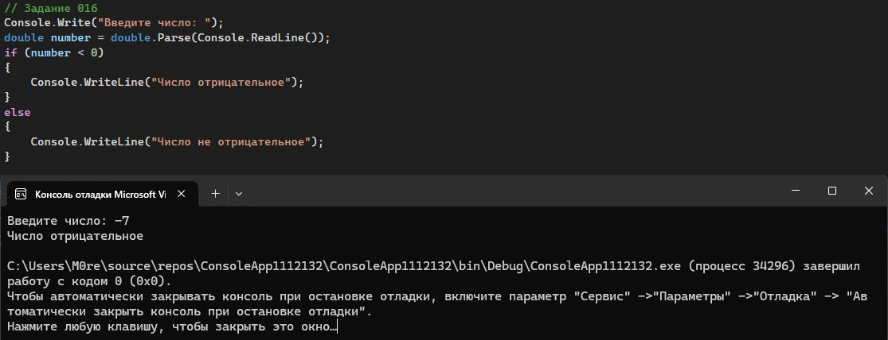

```csharp
using System;

namespace _3_practic
{
    internal class Program
    {
        static void Main(string[] args)
        {
            Console.Write("Введите число: ");
            double number = double.Parse(Console.ReadLine());
            if (number < 0)
            {
                Console.WriteLine("Число отрицательное");
            }
            else
            {
                Console.WriteLine("Число не отрицательное");
            }
        }
    }
}
```

---

№ 17. Даны два числа. Вывести разность большего и меньшего числа.

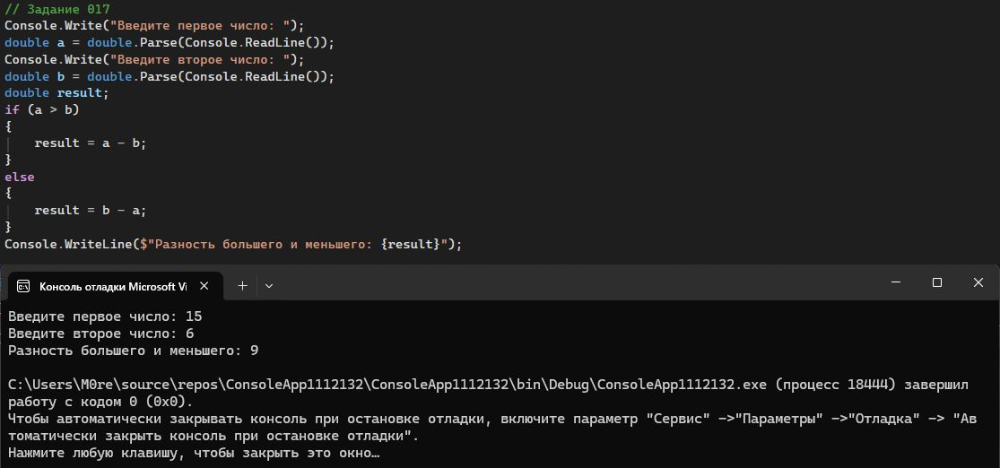

```csharp
using System;

namespace _3_practic
{
    internal class Program
    {
        static void Main(string[] args)
        {
            Console.Write("Введите первое число: ");
            double a = double.Parse(Console.ReadLine());
            Console.Write("Введите второе число: ");
            double b = double.Parse(Console.ReadLine());
            double result;
            if (a > b)
            {
                result = a - b;
            }
            else
            {
                result = b - a;
            }
            Console.WriteLine($"Разность большего и меньшего: {result}");
        }
    }
}
```

---

№ 18. Ввести сумму покупки. Если сумма превышает 1000 рублей, предоставить скидку 5% и вывести итоговую цену.

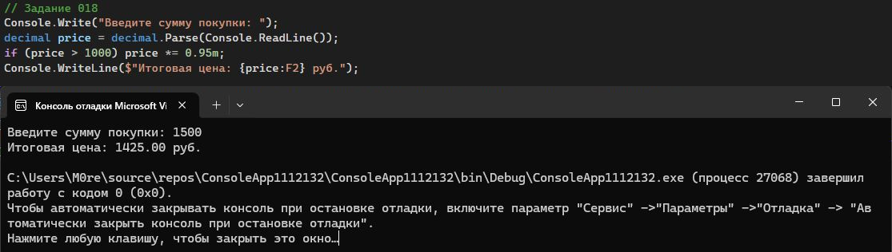

```csharp
using System;

namespace _3_practic
{
    internal class Program
    {
        static void Main(string[] args)
        {
            Console.Write("Введите сумму покупки: ");
            decimal price = decimal.Parse(Console.ReadLine());
            if (price > 1000) price *= 0.95m;
            Console.WriteLine($"Итоговая цена: {price:F2} руб.");
        }
    }
}
```

---

№ 19. Ввести число. Если оно четное, разделить его на 2, если нечетное — умножить на 3.

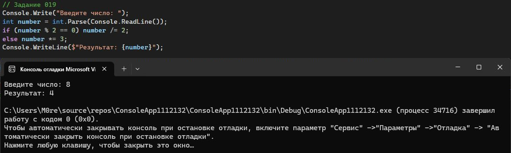

```csharp
using System;

namespace _3_practic
{
    internal class Program
    {
        static void Main(string[] args)
        {
            Console.Write("Введите число: ");
            int number = int.Parse(Console.ReadLine());
            if (number % 2 == 0) number /= 2;
            else number *= 3;
            Console.WriteLine($"Результат: {number}");
        }
    }
}
```

---

№ 20. Пользователь вводит скорость движения. Если скорость выше 90 км/ч, вывести сообщение о нарушении.

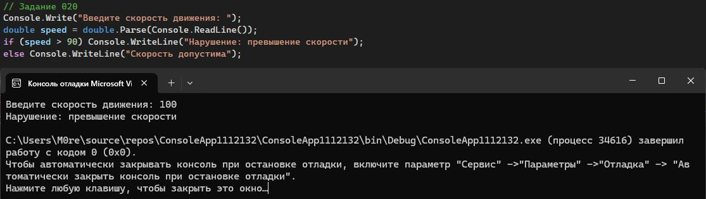

```csharp
using System;

namespace _3_practic
{
    internal class Program
    {
        static void Main(string[] args)
        {
            Console.Write("Введите скорость движения: ");
            double speed = double.Parse(Console.ReadLine());
            if (speed > 90) Console.WriteLine("Нарушение: превышение скорости");
            else Console.WriteLine("Скорость допустима");
        }
    }
}
```

---

№ 21. Дано целое число. Проверить, равно ли оно нулю.

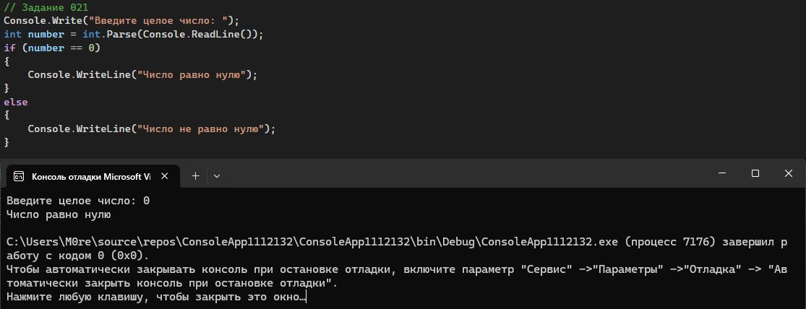

```csharp
using System;

namespace _3_practic
{
    internal class Program
    {
        static void Main(string[] args)
        {
            Console.Write("Введите целое число: ");
            int number = int.Parse(Console.ReadLine());
            if (number == 0)
            {
                Console.WriteLine("Число равно нулю");
            }
            else
            {
                Console.WriteLine("Число не равно нулю");
            }
        }
    }
}
```

---

№ 22. Ввести два вещественных числа. Проверить, равны ли они с точностью до 0.001.

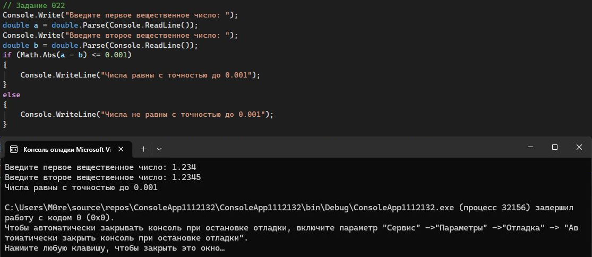

```csharp
using System;

namespace _3_practic
{
    internal class Program
    {
        static void Main(string[] args)
        {
            Console.Write("Введите первое вещественное число: ");
            double a = double.Parse(Console.ReadLine());
            Console.Write("Введите второе вещественное число: ");
            double b = double.Parse(Console.ReadLine());
            if (Math.Abs(a - b) <= 0.001)
            {
                Console.WriteLine("Числа равны с точностью до 0.001");
            }
            else
            {
                Console.WriteLine("Числа не равны с точностью до 0.001");
            }
        }
    }
}
```

---

№ 23. Проверить, делится ли число $A$ на число $B$ без остатка.

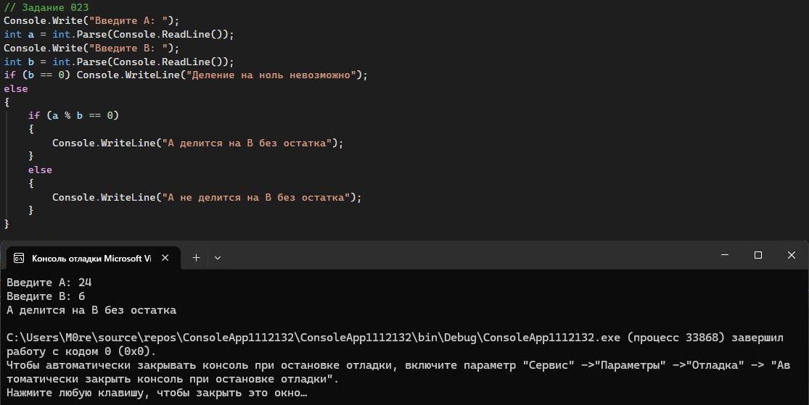

```csharp
using System;

namespace _3_practic
{
    internal class Program
    {
        static void Main(string[] args)
        {
            Console.Write("Введите A: ");
            int a = int.Parse(Console.ReadLine());
            Console.Write("Введите B: ");
            int b = int.Parse(Console.ReadLine());
            if (b == 0) Console.WriteLine("Деление на ноль невозможно");
            else
            {
                if (a % b == 0)
                {
                    Console.WriteLine("A делится на B без остатка");
                }
                else
                {
                    Console.WriteLine("A не делится на B без остатка");
                }
            }
        }
    }
}
```

---

№ 24. Даны два угла треугольника в градусах. Проверить, существует ли такой треугольник (сумма меньше 180).

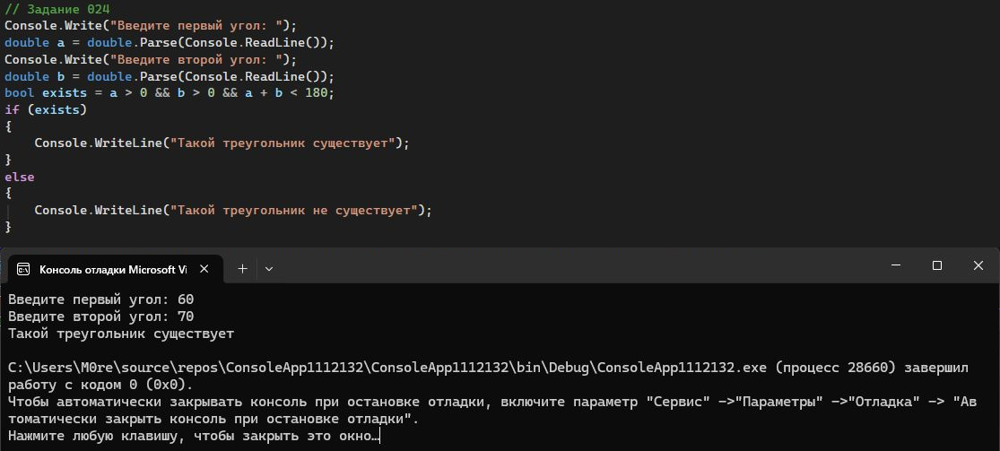

```csharp
using System;

namespace _3_practic
{
    internal class Program
    {
        static void Main(string[] args)
        {
            Console.Write("Введите первый угол: ");
            double a = double.Parse(Console.ReadLine());
            Console.Write("Введите второй угол: ");
            double b = double.Parse(Console.ReadLine());
            bool exists = a > 0 && b > 0 && a + b < 180;
            if (exists)
            {
                Console.WriteLine("Такой треугольник существует");
            }
            else
            {
                Console.WriteLine("Такой треугольник не существует");
            }
        }
    }
}
```

---

№ 25. Ввести радиус круга и сторону квадрата. Определить, у какой фигуры площадь больше.

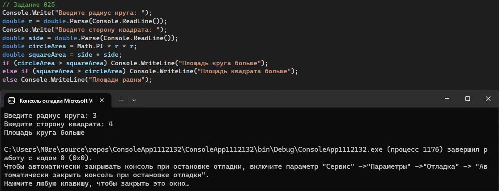

```csharp
using System;

namespace _3_practic
{
    internal class Program
    {
        static void Main(string[] args)
        {
            Console.Write("Введите радиус круга: ");
            double r = double.Parse(Console.ReadLine());
            Console.Write("Введите сторону квадрата: ");
            double side = double.Parse(Console.ReadLine());
            double circleArea = Math.PI * r * r;
            double squareArea = side * side;
            if (circleArea > squareArea) Console.WriteLine("Площадь круга больше");
            else if (squareArea > circleArea) Console.WriteLine("Площадь квадрата больше");
            else Console.WriteLine("Площади равны");
        }
    }
}
```

---

№ 26. Ввести два числа. Вывести частное большего на меньшее (предусмотреть проверку деления на 0).

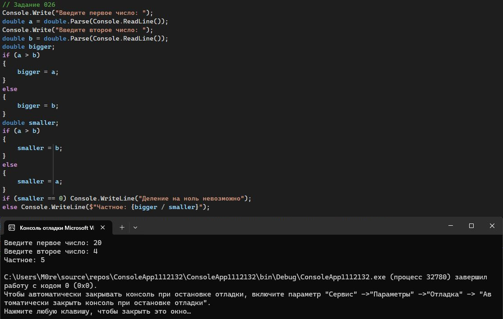

```csharp
using System;

namespace _3_practic
{
    internal class Program
    {
        static void Main(string[] args)
        {
            Console.Write("Введите первое число: ");
            double a = double.Parse(Console.ReadLine());
            Console.Write("Введите второе число: ");
            double b = double.Parse(Console.ReadLine());
            double bigger;
            if (a > b)
            {
                bigger = a;
            }
            else
            {
                bigger = b;
            }
            double smaller;
            if (a > b)
            {
                smaller = b;
            }
            else
            {
                smaller = a;
            }
            if (smaller == 0) Console.WriteLine("Деление на ноль невозможно");
            else Console.WriteLine($"Частное: {bigger / smaller}");
        }
    }
}
```

---

№ 27. Проверить, является ли последняя цифра числа семеркой.

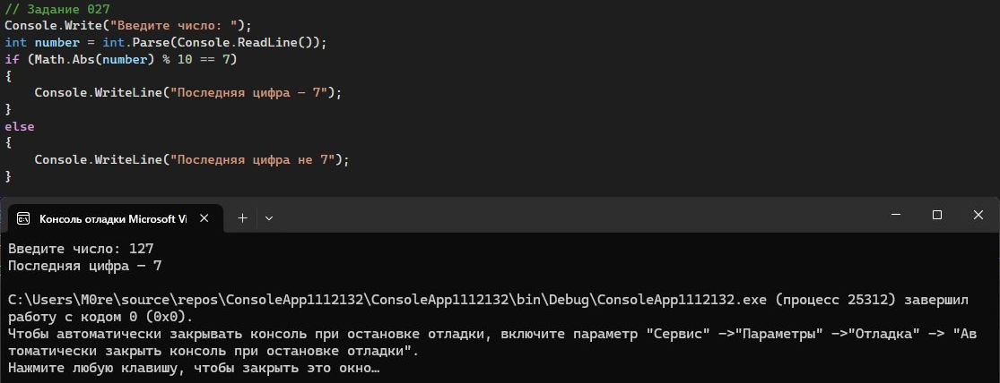

```csharp
using System;

namespace _3_practic
{
    internal class Program
    {
        static void Main(string[] args)
        {
            Console.Write("Введите число: ");
            int number = int.Parse(Console.ReadLine());
            if (Math.Abs(number) % 10 == 7)
            {
                Console.WriteLine("Последняя цифра — 7");
            }
            else
            {
                Console.WriteLine("Последняя цифра не 7");
            }
        }
    }
}
```

---

№ 28. Дано число. Если оно нечетное и положительное, вывести «Да».

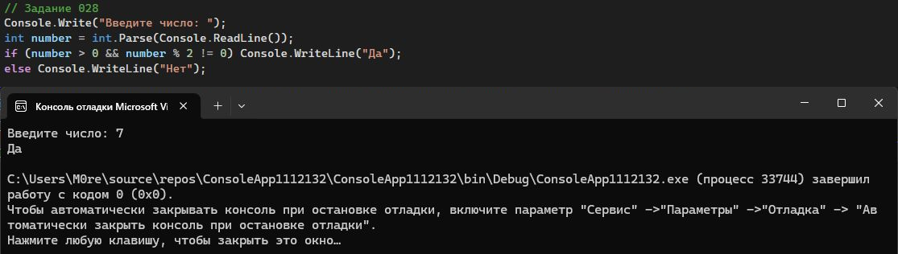

```csharp
using System;

namespace _3_practic
{
    internal class Program
    {
        static void Main(string[] args)
        {
            Console.Write("Введите число: ");
            int number = int.Parse(Console.ReadLine());
            if (number > 0 && number % 2 != 0) Console.WriteLine("Да");
            else Console.WriteLine("Нет");
        }
    }
}
```

---

№ 29. Ввести объем свободного места на диске (в ГБ). Если места меньше 5 ГБ, вывести предупреждение.

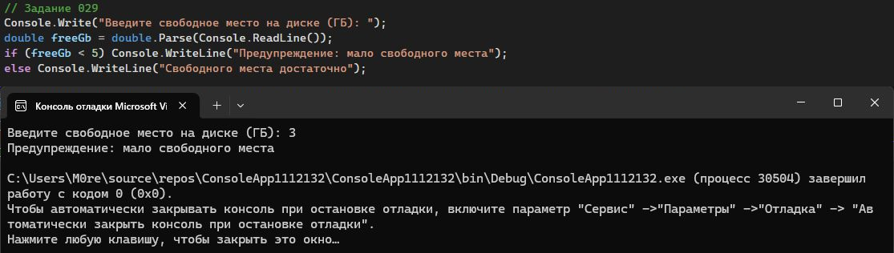

```csharp
using System;

namespace _3_practic
{
    internal class Program
    {
        static void Main(string[] args)
        {
            Console.Write("Введите свободное место на диске (ГБ): ");
            double freeGb = double.Parse(Console.ReadLine());
            if (freeGb < 5) Console.WriteLine("Предупреждение: мало свободного места");
            else Console.WriteLine("Свободного места достаточно");
        }
    }
}
```

---

№ 30. Пользователь вводит оценку (2, 3, 4, 5). Если оценка 4 или 5, вывести «Молодец», иначе «Нужно подтянуться».

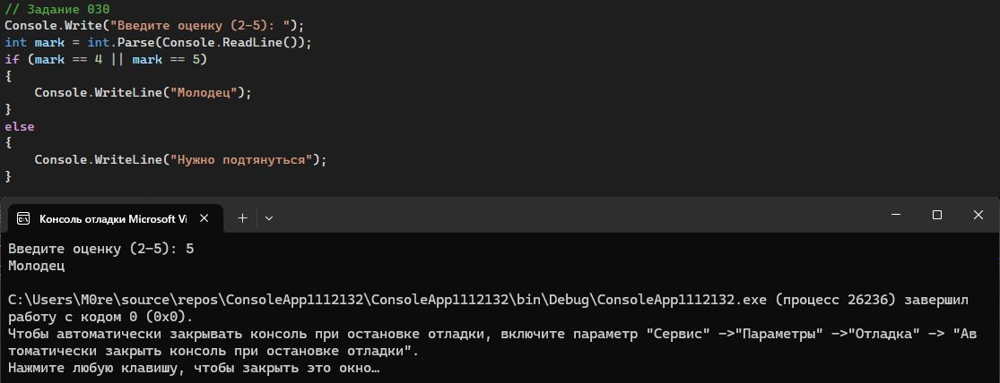

```csharp
using System;

namespace _3_practic
{
    internal class Program
    {
        static void Main(string[] args)
        {
            Console.Write("Введите оценку (2-5): ");
            int mark = int.Parse(Console.ReadLine());
            if (mark == 4 || mark == 5)
            {
                Console.WriteLine("Молодец");
            }
            else
            {
                Console.WriteLine("Нужно подтянуться");
            }
        }
    }
}
```

---

№ 31. Даны два символа. Проверить, совпадают ли они.

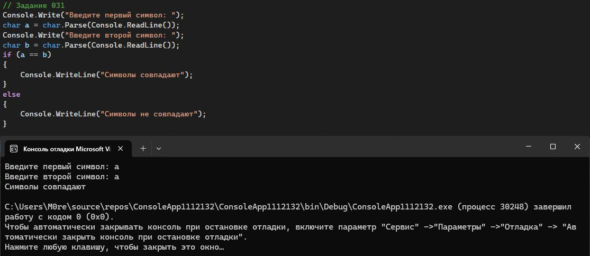

```csharp
using System;

namespace _3_practic
{
    internal class Program
    {
        static void Main(string[] args)
        {
            Console.Write("Введите первый символ: ");
            char a = char.Parse(Console.ReadLine());
            Console.Write("Введите второй символ: ");
            char b = char.Parse(Console.ReadLine());
            if (a == b)
            {
                Console.WriteLine("Символы совпадают");
            }
            else
            {
                Console.WriteLine("Символы не совпадают");
            }
        }
    }
}
```

---

№ 32. Ввести число. Если оно кратно и 2, и 7, вывести «Кратно 14».

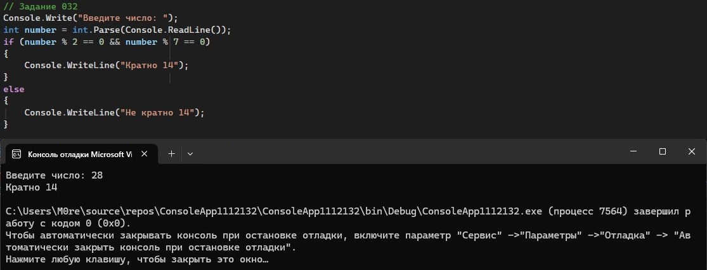

```csharp
using System;

namespace _3_practic
{
    internal class Program
    {
        static void Main(string[] args)
        {
            Console.Write("Введите число: ");
            int number = int.Parse(Console.ReadLine());
            if (number % 2 == 0 && number % 7 == 0)
            {
                Console.WriteLine("Кратно 14");
            }
            else
            {
                Console.WriteLine("Не кратно 14");
            }
        }
    }
}
```

---

№ 33. Ввести массу груза. Если масса превышает допустимые 3.5 тонны, вывести «Перегруз!».

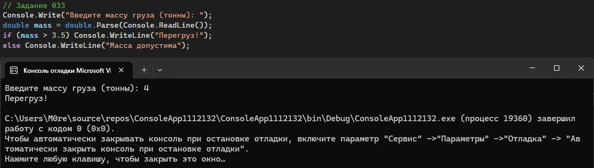

```csharp
using System;

namespace _3_practic
{
    internal class Program
    {
        static void Main(string[] args)
        {
            Console.Write("Введите массу груза (тонны): ");
            double mass = double.Parse(Console.ReadLine());
            if (mass > 3.5) Console.WriteLine("Перегруз!");
            else Console.WriteLine("Масса допустима");
        }
    }
}
```

---

№ 34. Ввести текущее время (часы от 0 до 23). Если время от 6 до 12, вывести «Доброе утро».

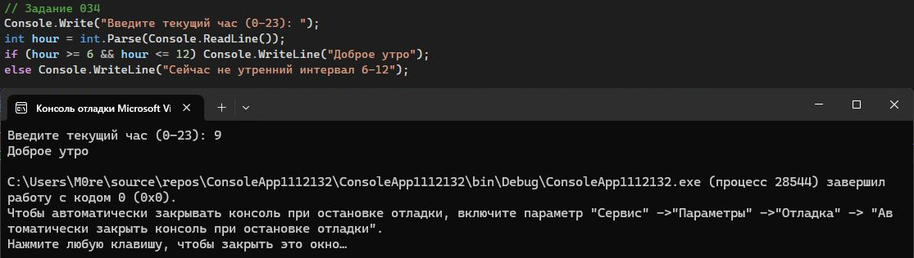

```csharp
using System;

namespace _3_practic
{
    internal class Program
    {
        static void Main(string[] args)
        {
            Console.Write("Введите текущий час (0-23): ");
            int hour = int.Parse(Console.ReadLine());
            if (hour >= 6 && hour <= 12) Console.WriteLine("Доброе утро");
            else Console.WriteLine("Сейчас не утренний интервал 6-12");
        }
    }
}
```

---

№ 35. Ввести рост человека в см. Если рост больше 200 см, вывести «Очень высокий».

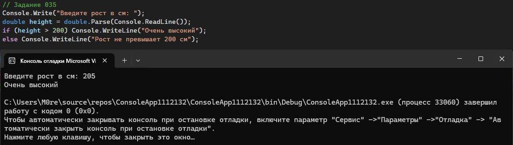

```csharp
using System;

namespace _3_practic
{
    internal class Program
    {
        static void Main(string[] args)
        {
            Console.Write("Введите рост в см: ");
            double height = double.Parse(Console.ReadLine());
            if (height > 200) Console.WriteLine("Очень высокий");
            else Console.WriteLine("Рост не превышает 200 см");
        }
    }
}
```

---

№ 36. Дано двузначное число. Определить, какая из его цифр больше.

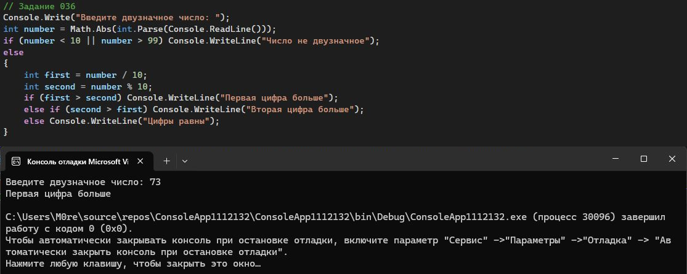

```csharp
using System;

namespace _3_practic
{
    internal class Program
    {
        static void Main(string[] args)
        {
            Console.Write("Введите двузначное число: ");
            int number = Math.Abs(int.Parse(Console.ReadLine()));
            if (number < 10 || number > 99) Console.WriteLine("Число не двузначное");
            else
            {
                int first = number / 10;
                int second = number % 10;
                if (first > second) Console.WriteLine("Первая цифра больше");
                else if (second > first) Console.WriteLine("Вторая цифра больше");
                else Console.WriteLine("Цифры равны");
            }
        }
    }
}
```

---

№ 37. Ввести стоимость товара. Если товар бесплатный (цена 0), вывести «Акция!».

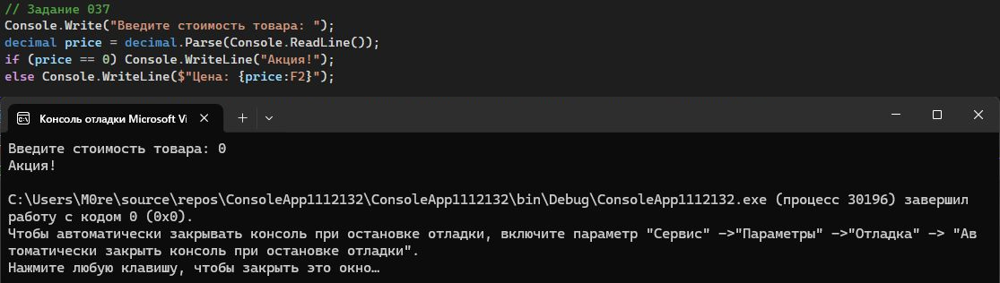

```csharp
using System;

namespace _3_practic
{
    internal class Program
    {
        static void Main(string[] args)
        {
            Console.Write("Введите стоимость товара: ");
            decimal price = decimal.Parse(Console.ReadLine());
            if (price == 0) Console.WriteLine("Акция!");
            else Console.WriteLine($"Цена: {price:F2}");
        }
    }
}
```

---

№ 38. Проверить, содержит ли введенное двузначное число одинаковые цифры.

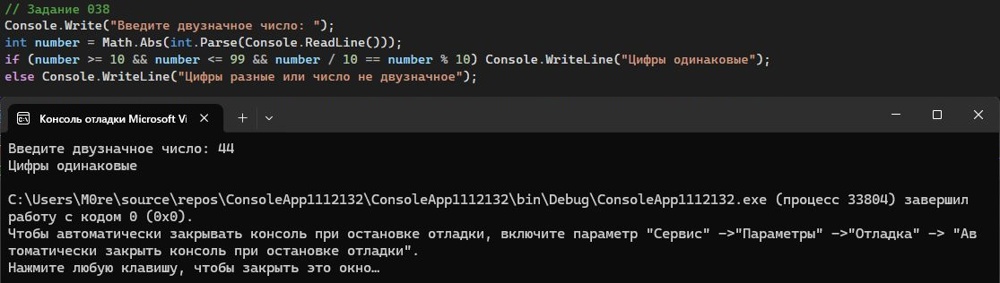

```csharp
using System;

namespace _3_practic
{
    internal class Program
    {
        static void Main(string[] args)
        {
            Console.Write("Введите двузначное число: ");
            int number = Math.Abs(int.Parse(Console.ReadLine()));
            if (number >= 10 && number <= 99 && number / 10 == number % 10) Console.WriteLine("Цифры одинаковые");
            else Console.WriteLine("Цифры разные или число не двузначное");
        }
    }
}
```

---

№ 39. Ввести уровень громкости (0–100). Если громкость превышает 80, вывести «Слишком громко для слуха».

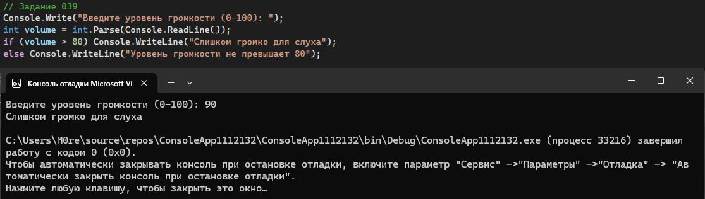

```csharp
using System;

namespace _3_practic
{
    internal class Program
    {
        static void Main(string[] args)
        {
            Console.Write("Введите уровень громкости (0-100): ");
            int volume = int.Parse(Console.ReadLine());
            if (volume > 80) Console.WriteLine("Слишком громко для слуха");
            else Console.WriteLine("Уровень громкости не превышает 80");
        }
    }
}
```

---

№ 40. Даны два числа. Если их сумма четная, вывести сумму, иначе вывести их разность.

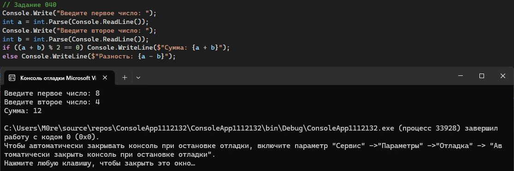

```csharp
using System;

namespace _3_practic
{
    internal class Program
    {
        static void Main(string[] args)
        {
            Console.Write("Введите первое число: ");
            int a = int.Parse(Console.ReadLine());
            Console.Write("Введите второе число: ");
            int b = int.Parse(Console.ReadLine());
            if ((a + b) % 2 == 0) Console.WriteLine($"Сумма: {a + b}");
            else Console.WriteLine($"Разность: {a - b}");
        }
    }
}
```

---

№ 41. Ввести количество страниц в документе. Если страниц больше 100, включить двухстороннюю печать.

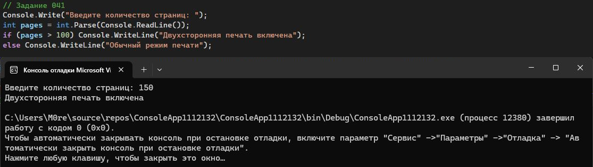

```csharp
using System;

namespace _3_practic
{
    internal class Program
    {
        static void Main(string[] args)
        {
            Console.Write("Введите количество страниц: ");
            int pages = int.Parse(Console.ReadLine());
            if (pages > 100) Console.WriteLine("Двухсторонняя печать включена");
            else Console.WriteLine("Обычный режим печати");
        }
    }
}
```

---

№ 42. Проверить, является ли введенное целое число полным квадратом (для проверки использовать `Math.Sqrt`).

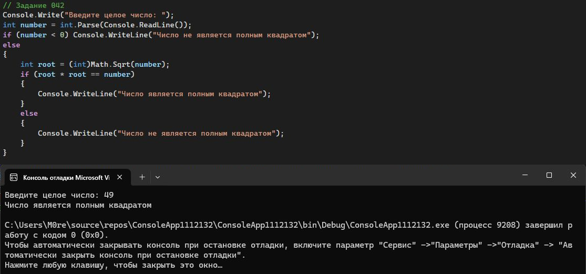

```csharp
using System;

namespace _3_practic
{
    internal class Program
    {
        static void Main(string[] args)
        {
            Console.Write("Введите целое число: ");
            int number = int.Parse(Console.ReadLine());
            if (number < 0) Console.WriteLine("Число не является полным квадратом");
            else
            {
                int root = (int)Math.Sqrt(number);
                if (root * root == number)
                {
                    Console.WriteLine("Число является полным квадратом");
                }
                else
                {
                    Console.WriteLine("Число не является полным квадратом");
                }
            }
        }
    }
}
```

---

№ 43. Ввести атмосферное давление. Если давление ниже 740 мм рт. ст., вывести «Пониженное давление».

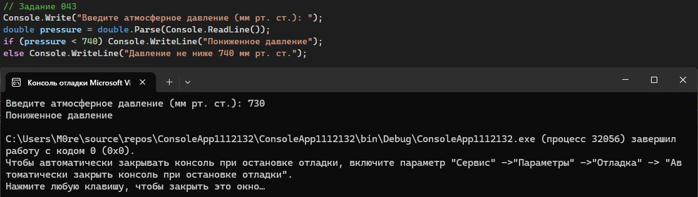

```csharp
using System;

namespace _3_practic
{
    internal class Program
    {
        static void Main(string[] args)
        {
            Console.Write("Введите атмосферное давление (мм рт. ст.): ");
            double pressure = double.Parse(Console.ReadLine());
            if (pressure < 740) Console.WriteLine("Пониженное давление");
            else Console.WriteLine("Давление не ниже 740 мм рт. ст.");
        }
    }
}
```

---

№ 44. Ввести количество забитых мячей командами А и Б. Вывести победителя или сообщить о ничьей.

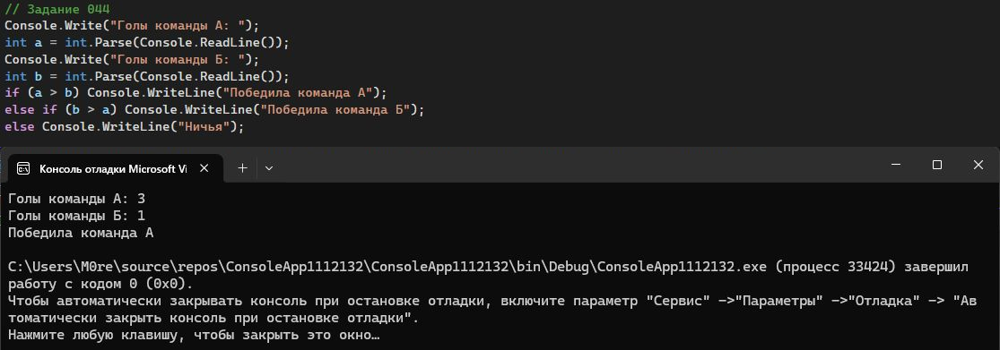

```csharp
using System;

namespace _3_practic
{
    internal class Program
    {
        static void Main(string[] args)
        {
            Console.Write("Голы команды А: ");
            int a = int.Parse(Console.ReadLine());
            Console.Write("Голы команды Б: ");
            int b = int.Parse(Console.ReadLine());
            if (a > b) Console.WriteLine("Победила команда А");
            else if (b > a) Console.WriteLine("Победила команда Б");
            else Console.WriteLine("Ничья");
        }
    }
}
```

---

№ 45. Дано число. Заменить его на абсолютную величину (модуль) без использования `Math.Abs`.

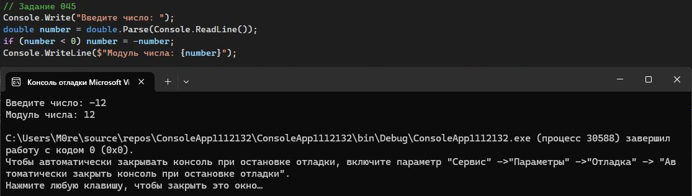

```csharp
using System;

namespace _3_practic
{
    internal class Program
    {
        static void Main(string[] args)
        {
            Console.Write("Введите число: ");
            double number = double.Parse(Console.ReadLine());
            if (number < 0) number = -number;
            Console.WriteLine($"Модуль числа: {number}");
        }
    }
}
```

---

№ 46. Ввести показатель уровня сахара в крови. Если показатель выше 6.1 ммоль/л, вывести «Выше нормы».

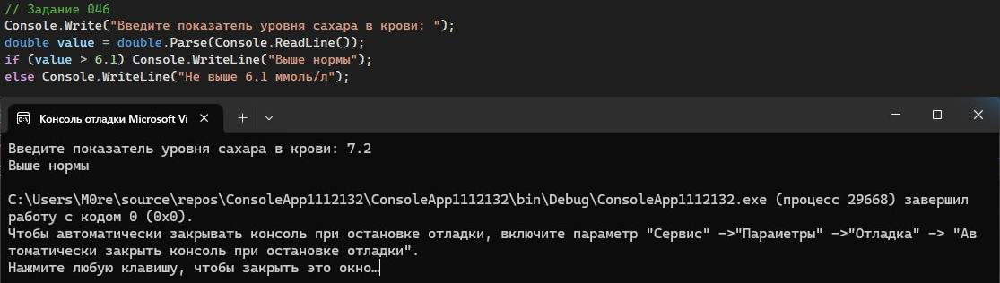

```csharp
using System;

namespace _3_practic
{
    internal class Program
    {
        static void Main(string[] args)
        {
            Console.Write("Введите показатель уровня сахара в крови: ");
            double value = double.Parse(Console.ReadLine());
            if (value > 6.1) Console.WriteLine("Выше нормы");
            else Console.WriteLine("Не выше 6.1 ммоль/л");
        }
    }
}
```

---

№ 47. Проверить, хватит ли пользователю средств на счете для оплаты проезда стоимостью 35 рублей.

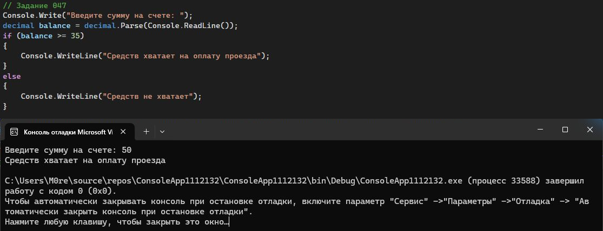

```csharp
using System;

namespace _3_practic
{
    internal class Program
    {
        static void Main(string[] args)
        {
            Console.Write("Введите сумму на счете: ");
            decimal balance = decimal.Parse(Console.ReadLine());
            if (balance >= 35)
            {
                Console.WriteLine("Средств хватает на оплату проезда");
            }
            else
            {
                Console.WriteLine("Средств не хватает");
            }
        }
    }
}
```

---

№ 48. Ввести номер текущего этажа. Если этаж выше 10, вывести «Высотный этаж».

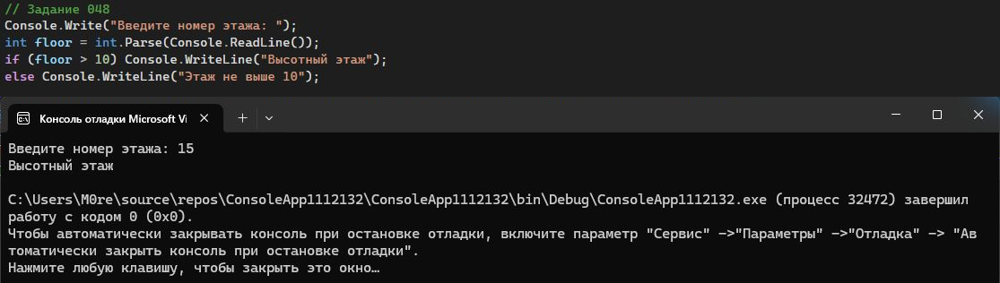

```csharp
using System;

namespace _3_practic
{
    internal class Program
    {
        static void Main(string[] args)
        {
            Console.Write("Введите номер этажа: ");
            int floor = int.Parse(Console.ReadLine());
            if (floor > 10) Console.WriteLine("Высотный этаж");
            else Console.WriteLine("Этаж не выше 10");
        }
    }
}
```

---

№ 49. Ввести два слова. Проверить, одинаковы ли они по длине.

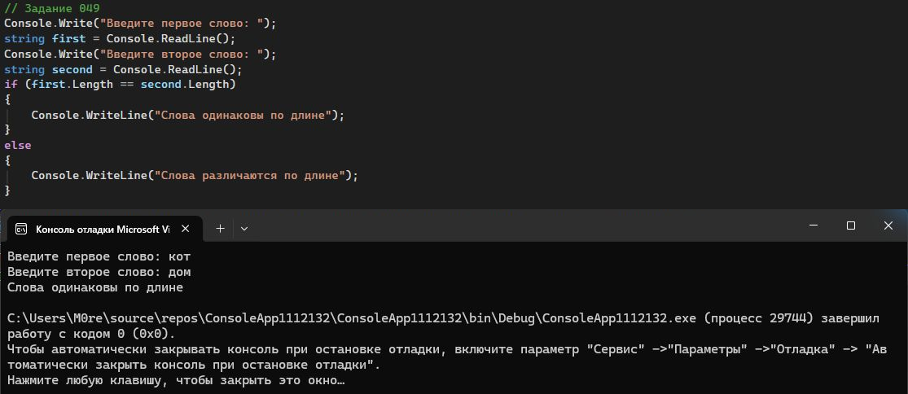

```csharp
using System;

namespace _3_practic
{
    internal class Program
    {
        static void Main(string[] args)
        {
            Console.Write("Введите первое слово: ");
            string first = Console.ReadLine();
            Console.Write("Введите второе слово: ");
            string second = Console.ReadLine();
            if (first.Length == second.Length)
            {
                Console.WriteLine("Слова одинаковы по длине");
            }
            else
            {
                Console.WriteLine("Слова различаются по длине");
            }
        }
    }
}
```

---

№ 50. Пользователь вводит целое число. Вывести строковое сообщение: «Число четное» либо «Число нечетное».

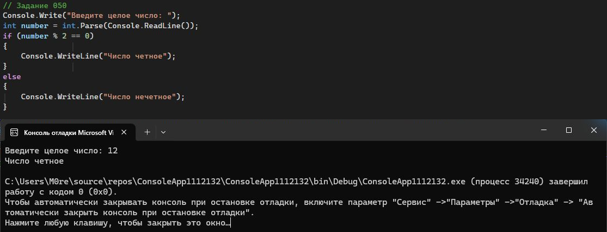

```csharp
using System;

namespace _3_practic
{
    internal class Program
    {
        static void Main(string[] args)
        {
            Console.Write("Введите целое число: ");
            int number = int.Parse(Console.ReadLine());
            if (number % 2 == 0)
            {
                Console.WriteLine("Число четное");
            }
            else
            {
                Console.WriteLine("Число нечетное");
            }
        }
    }
}
```

---

### Раздел 2. Множественные ветвления else if и диапазоны
---
№ 51. Ввести балл за тест (0–100). Вывести оценку по шкале ECTS: A (90-100), B (80-89), C (70-79), D (60-69), F (менее 60).

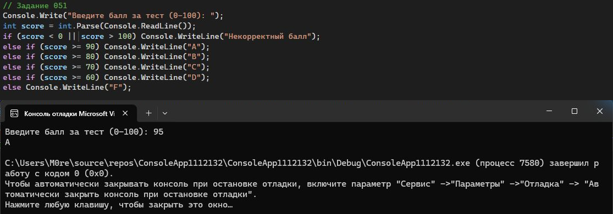

```csharp
using System;

namespace _3_practic
{
    internal class Program
    {
        static void Main(string[] args)
        {
            Console.Write("Введите балл за тест (0-100): ");
            int score = int.Parse(Console.ReadLine());
            if (score < 0 || score > 100) Console.WriteLine("Некорректный балл");
            else if (score >= 90) Console.WriteLine("A");
            else if (score >= 80) Console.WriteLine("B");
            else if (score >= 70) Console.WriteLine("C");
            else if (score >= 60) Console.WriteLine("D");
            else Console.WriteLine("F");
        }
    }
}
```

---

№ 52. Ввести возраст человека. Определить категорию: ребенок (0-12), подросток (13-17), взрослый (18-64), пожилой (65+).

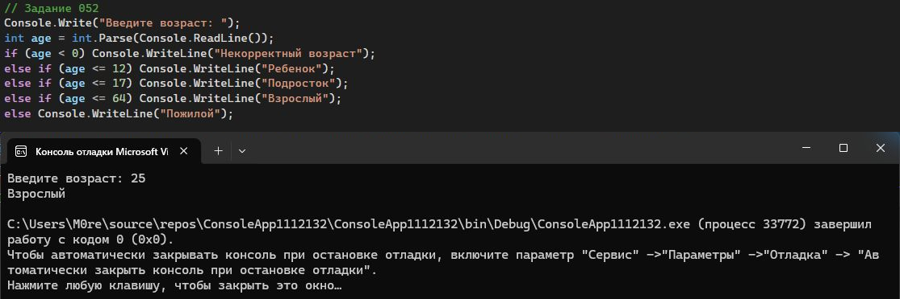

```csharp
using System;

namespace _3_practic
{
    internal class Program
    {
        static void Main(string[] args)
        {
            Console.Write("Введите возраст: ");
            int age = int.Parse(Console.ReadLine());
            if (age < 0) Console.WriteLine("Некорректный возраст");
            else if (age <= 12) Console.WriteLine("Ребенок");
            else if (age <= 17) Console.WriteLine("Подросток");
            else if (age <= 64) Console.WriteLine("Взрослый");
            else Console.WriteLine("Пожилой");
        }
    }
}
```

---

№ 53. Ввести температуру воды. Вывести ее агрегатное состояние: «Лед» ($\le 0$), «Жидкость» ($0 < t < 100$), «Пар» ($\ge 100$).

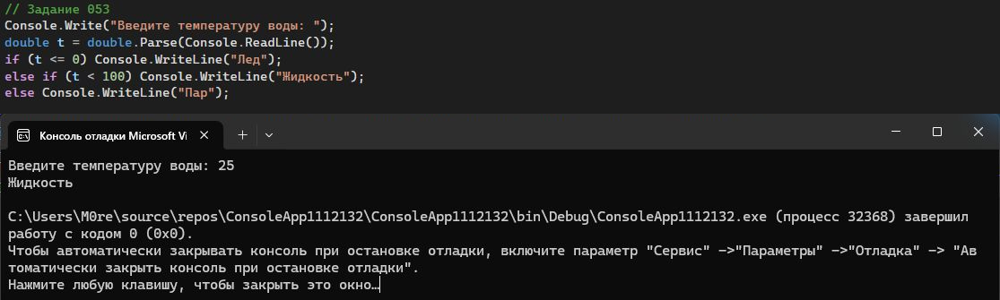

```csharp
using System;

namespace _3_practic
{
    internal class Program
    {
        static void Main(string[] args)
        {
            Console.Write("Введите температуру воды: ");
            double t = double.Parse(Console.ReadLine());
            if (t <= 0) Console.WriteLine("Лед");
            else if (t < 100) Console.WriteLine("Жидкость");
            else Console.WriteLine("Пар");
        }
    }
}
```

---

№ 54. Ввести уровень заряда аккумулятора смартфона (в %). Вывести: «Критический» ($< 10$), «Низкий» (10-20), «Нормальный» (21-80), «Полный» (81-100).

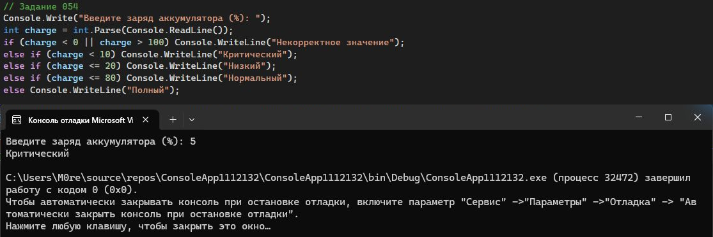

```csharp
using System;

namespace _3_practic
{
    internal class Program
    {
        static void Main(string[] args)
        {
            Console.Write("Введите заряд аккумулятора (%): ");
            int charge = int.Parse(Console.ReadLine());
            if (charge < 0 || charge > 100) Console.WriteLine("Некорректное значение");
            else if (charge < 10) Console.WriteLine("Критический");
            else if (charge <= 20) Console.WriteLine("Низкий");
            else if (charge <= 80) Console.WriteLine("Нормальный");
            else Console.WriteLine("Полный");
        }
    }
}
```

---

№ 55. Ввести число оборотов двигателя в минуту (RPM). Вывести режим: «Заглушен» (0), «Холостой ход» (1-900), «Рабочий» (901-3500), «Красная зона» (3501+).

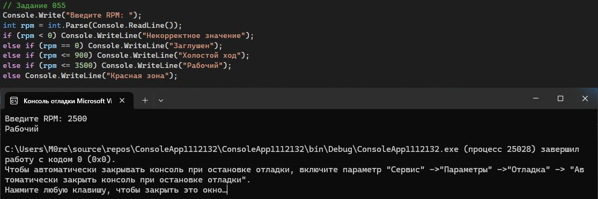

```csharp
using System;

namespace _3_practic
{
    internal class Program
    {
        static void Main(string[] args)
        {
            Console.Write("Введите RPM: ");
            int rpm = int.Parse(Console.ReadLine());
            if (rpm < 0) Console.WriteLine("Некорректное значение");
            else if (rpm == 0) Console.WriteLine("Заглушен");
            else if (rpm <= 900) Console.WriteLine("Холостой ход");
            else if (rpm <= 3500) Console.WriteLine("Рабочий");
            else Console.WriteLine("Красная зона");
        }
    }
}
```

---

№ 56. Ввести сумму дохода за год. Рассчитать подоходный налог: до 2.4 млн — 13%, до 5 млн — 15%, выше 5 млн — 18%.

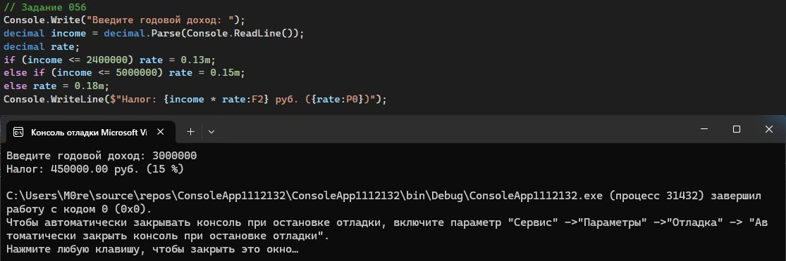

```csharp
using System;

namespace _3_practic
{
    internal class Program
    {
        static void Main(string[] args)
        {
            Console.Write("Введите годовой доход: ");
            decimal income = decimal.Parse(Console.ReadLine());
            decimal rate;
            if (income <= 2400000) rate = 0.13m;
            else if (income <= 5000000) rate = 0.15m;
            else rate = 0.18m;
            Console.WriteLine($"Налог: {income * rate:F2} руб. ({rate:P0})");
        }
    }
}
```

---

№ 57. По введенной координате $X$ точки на плоскости (при $Y = 0$) определить ее положение: на нуле, в положительной или отрицательной полуоси.

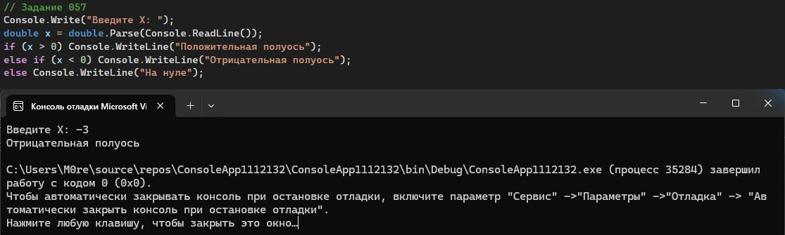

```csharp
using System;

namespace _3_practic
{
    internal class Program
    {
        static void Main(string[] args)
        {
            Console.Write("Введите X: ");
            double x = double.Parse(Console.ReadLine());
            if (x > 0) Console.WriteLine("Положительная полуось");
            else if (x < 0) Console.WriteLine("Отрицательная полуось");
            else Console.WriteLine("На нуле");
        }
    }
}
```

---

№ 58. Ввести индекс массы тела (ИМТ). Вывести категорию: дефицит веса ($< 18.5$), норма (18.5-24.9), избыток (25-29.9), ожирение ($30+$).

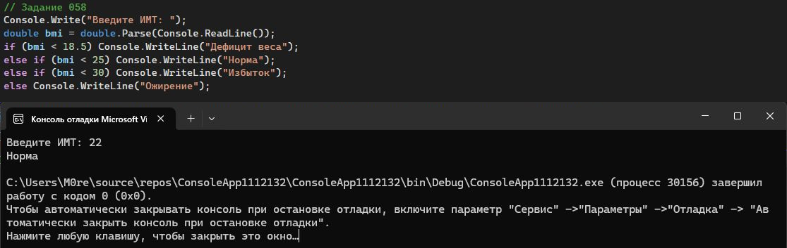

```csharp
using System;

namespace _3_practic
{
    internal class Program
    {
        static void Main(string[] args)
        {
            Console.Write("Введите ИМТ: ");
            double bmi = double.Parse(Console.ReadLine());
            if (bmi < 18.5) Console.WriteLine("Дефицит веса");
            else if (bmi < 25) Console.WriteLine("Норма");
            else if (bmi < 30) Console.WriteLine("Избыток");
            else Console.WriteLine("Ожирение");
        }
    }
}
```

---

№ 59. Ввести скорость ветра (м/с). Вывести категорию по шкале: штиль ($< 0.2$), легкий ветерок (0.2-5), умеренный (5.1-14), шторм (14.1-24), ураган ($> 24$).

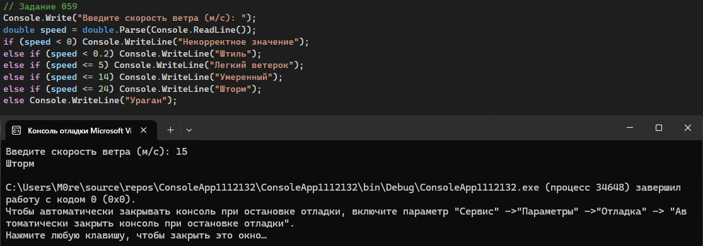

```csharp
using System;

namespace _3_practic
{
    internal class Program
    {
        static void Main(string[] args)
        {
            Console.Write("Введите скорость ветра (м/с): ");
            double speed = double.Parse(Console.ReadLine());
            if (speed < 0) Console.WriteLine("Некорректное значение");
            else if (speed < 0.2) Console.WriteLine("Штиль");
            else if (speed <= 5) Console.WriteLine("Легкий ветерок");
            else if (speed <= 14) Console.WriteLine("Умеренный");
            else if (speed <= 24) Console.WriteLine("Шторм");
            else Console.WriteLine("Ураган");
        }
    }
}
```

---

№ 60. Ввести стаж работы сотрудника (в годах). Вывести размер надбавки: $< 1$ года — 0%, 1-5 лет — 5%, 6-10 лет — 10%, $> 10$ лет — 15%.

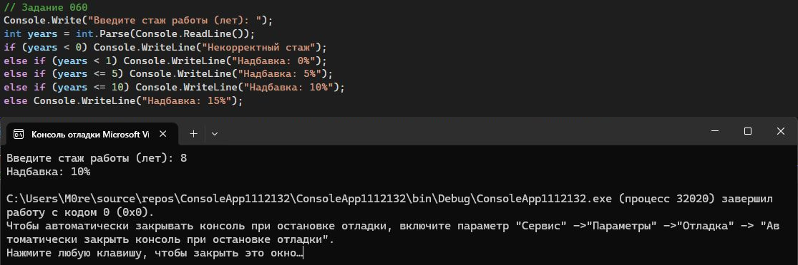

```csharp
using System;

namespace _3_practic
{
    internal class Program
    {
        static void Main(string[] args)
        {
            Console.Write("Введите стаж работы (лет): ");
            int years = int.Parse(Console.ReadLine());
            if (years < 0) Console.WriteLine("Некорректный стаж");
            else if (years < 1) Console.WriteLine("Надбавка: 0%");
            else if (years <= 5) Console.WriteLine("Надбавка: 5%");
            else if (years <= 10) Console.WriteLine("Надбавка: 10%");
            else Console.WriteLine("Надбавка: 15%");
        }
    }
}
```

---

№ 61. Пользователь вводит текущий час (0–23). Вывести: «Ночь» (0-5), «Утро» (6-11), «День» (12-17), «Вечер» (18-23).

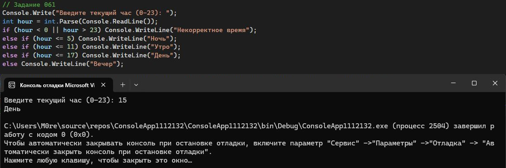

```csharp
using System;

namespace _3_practic
{
    internal class Program
    {
        static void Main(string[] args)
        {
            Console.Write("Введите текущий час (0-23): ");
            int hour = int.Parse(Console.ReadLine());
            if (hour < 0 || hour > 23) Console.WriteLine("Некорректное время");
            else if (hour <= 5) Console.WriteLine("Ночь");
            else if (hour <= 11) Console.WriteLine("Утро");
            else if (hour <= 17) Console.WriteLine("День");
            else Console.WriteLine("Вечер");
        }
    }
}
```

---

№ 62. Ввести толщину льда на водоеме (см). Вывести: «Выход запрещен» ($< 7$), «Одиночный пешеход» (7-12), «Группа людей» (13-20), «Транспорт» ($> 20$).

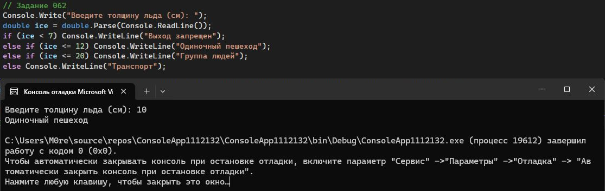

```csharp
using System;

namespace _3_practic
{
    internal class Program
    {
        static void Main(string[] args)
        {
            Console.Write("Введите толщину льда (см): ");
            double ice = double.Parse(Console.ReadLine());
            if (ice < 7) Console.WriteLine("Выход запрещен");
            else if (ice <= 12) Console.WriteLine("Одиночный пешеход");
            else if (ice <= 20) Console.WriteLine("Группа людей");
            else Console.WriteLine("Транспорт");
        }
    }
}
```

---

№ 63. Даны три целых числа $A$, $B$, $C$. Найти максимальное из них, используя каскадное условие.

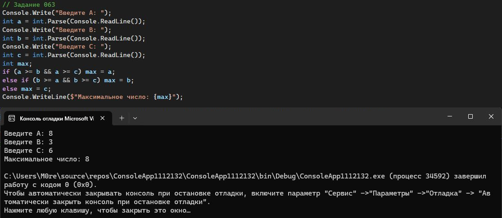

```csharp
using System;

namespace _3_practic
{
    internal class Program
    {
        static void Main(string[] args)
        {
            Console.Write("Введите A: ");
            int a = int.Parse(Console.ReadLine());
            Console.Write("Введите B: ");
            int b = int.Parse(Console.ReadLine());
            Console.Write("Введите C: ");
            int c = int.Parse(Console.ReadLine());
            int max;
            if (a >= b && a >= c) max = a;
            else if (b >= a && b >= c) max = b;
            else max = c;
            Console.WriteLine($"Максимальное число: {max}");
        }
    }
}
```

---

№ 64. Даны три числа. Найти минимальное из них.

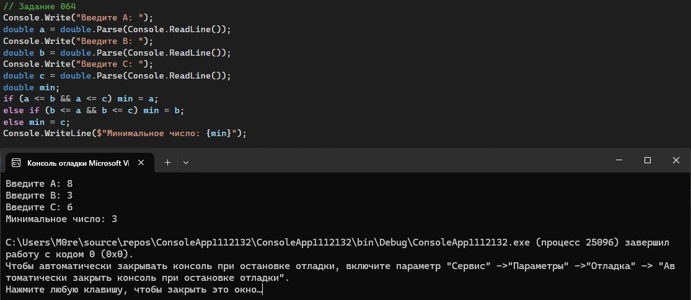

```csharp
using System;

namespace _3_practic
{
    internal class Program
    {
        static void Main(string[] args)
        {
            Console.Write("Введите A: ");
            double a = double.Parse(Console.ReadLine());
            Console.Write("Введите B: ");
            double b = double.Parse(Console.ReadLine());
            Console.Write("Введите C: ");
            double c = double.Parse(Console.ReadLine());
            double min;
            if (a <= b && a <= c) min = a;
            else if (b <= a && b <= c) min = b;
            else min = c;
            Console.WriteLine($"Минимальное число: {min}");
        }
    }
}
```

---

№ 65. Даны три числа. Определить, сколько из них положительных (0, 1, 2 или 3).

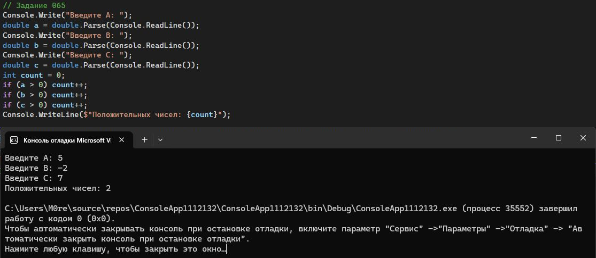

```csharp
using System;

namespace _3_practic
{
    internal class Program
    {
        static void Main(string[] args)
        {
            Console.Write("Введите A: ");
            double a = double.Parse(Console.ReadLine());
            Console.Write("Введите B: ");
            double b = double.Parse(Console.ReadLine());
            Console.Write("Введите C: ");
            double c = double.Parse(Console.ReadLine());
            int count = 0;
            if (a > 0) count++;
            if (b > 0) count++;
            if (c > 0) count++;
            Console.WriteLine($"Положительных чисел: {count}");
        }
    }
}
```

---

№ 66. Ввести средний балл диплома. Вывести: «Без отличия» ($< 4.5$), «Претендент на красный диплом» (4.5-4.74), «Красный диплом» ($\ge 4.75$).

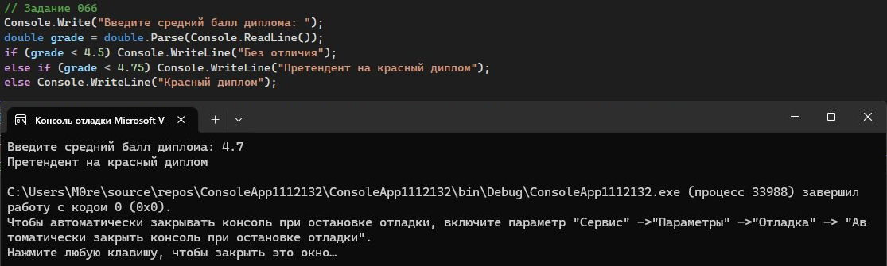

```csharp
using System;

namespace _3_practic
{
    internal class Program
    {
        static void Main(string[] args)
        {
            Console.Write("Введите средний балл диплома: ");
            double grade = double.Parse(Console.ReadLine());
            if (grade < 4.5) Console.WriteLine("Без отличия");
            else if (grade < 4.75) Console.WriteLine("Претендент на красный диплом");
            else Console.WriteLine("Красный диплом");
        }
    }
}
```

---

№ 67. Ввести значение артериального давления (систолическое). Вывести: гипотония ($< 90$), норма (90-120), предгипертензия (121-139), гипертензия ($\ge 140$).

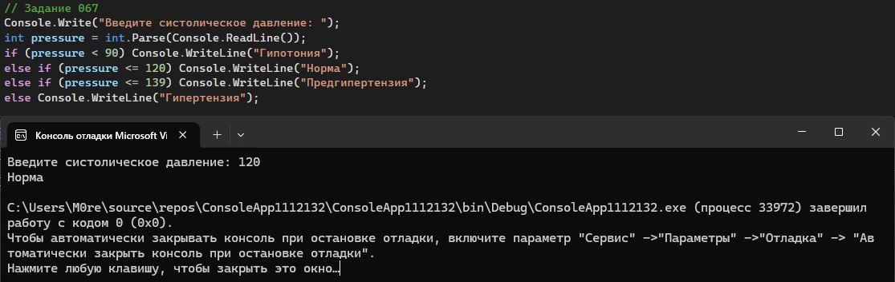

```csharp
using System;

namespace _3_practic
{
    internal class Program
    {
        static void Main(string[] args)
        {
            Console.Write("Введите систолическое давление: ");
            int pressure = int.Parse(Console.ReadLine());
            if (pressure < 90) Console.WriteLine("Гипотония");
            else if (pressure <= 120) Console.WriteLine("Норма");
            else if (pressure <= 139) Console.WriteLine("Предгипертензия");
            else Console.WriteLine("Гипертензия");
        }
    }
}
```

---

№ 68. Ввести рейтинг шахматиста (Эло). Вывести ранг: любитель ($< 1400$), разрядник (1400-1999), мастер (2000-2399), гроссмейстер ($\ge 2400$).

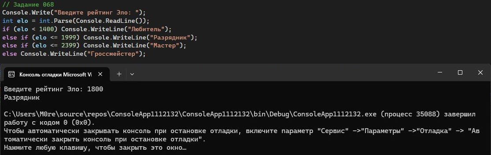

```csharp
using System;

namespace _3_practic
{
    internal class Program
    {
        static void Main(string[] args)
        {
            Console.Write("Введите рейтинг Эло: ");
            int elo = int.Parse(Console.ReadLine());
            if (elo < 1400) Console.WriteLine("Любитель");
            else if (elo <= 1999) Console.WriteLine("Разрядник");
            else if (elo <= 2399) Console.WriteLine("Мастер");
            else Console.WriteLine("Гроссмейстер");
        }
    }
}
```

---

№ 69. Ввести число и определить, сколькизначным оно является (однозначное, двузначное, трехзначное или более).

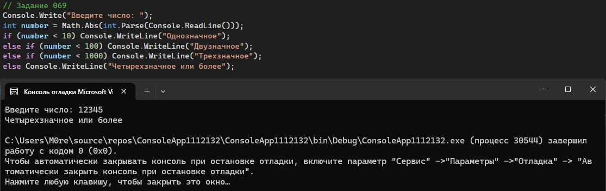

```csharp
using System;

namespace _3_practic
{
    internal class Program
    {
        static void Main(string[] args)
        {
            Console.Write("Введите число: ");
            int number = Math.Abs(int.Parse(Console.ReadLine()));
            if (number < 10) Console.WriteLine("Однозначное");
            else if (number < 100) Console.WriteLine("Двузначное");
            else if (number < 1000) Console.WriteLine("Трехзначное");
            else Console.WriteLine("Четырехзначное или более");
        }
    }
}
```

---

№ 70. Ввести дальность поездки на такси (км). Рассчитать тариф: до 5 км — 200 руб, от 5 до 15 км — 200 + 25 руб/км, свыше 15 км — 200 + 20 руб/км.

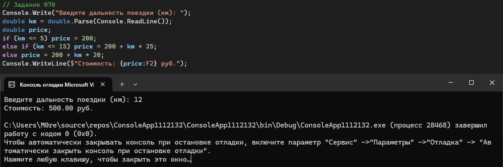

```csharp
using System;

namespace _3_practic
{
    internal class Program
    {
        static void Main(string[] args)
        {
            Console.Write("Введите дальность поездки (км): ");
            double km = double.Parse(Console.ReadLine());
            double price;
            if (km <= 5) price = 200;
            else if (km <= 15) price = 200 + km * 25;
            else price = 200 + km * 20;
            Console.WriteLine($"Стоимость: {price:F2} руб.");
        }
    }
}
```

---

№ 71. Ввести количество осадков за сутки (мм). Определить: без осадков (0), слабый дождь (0.1-4), умеренный (4.1-15), сильный ливень ($> 15$).

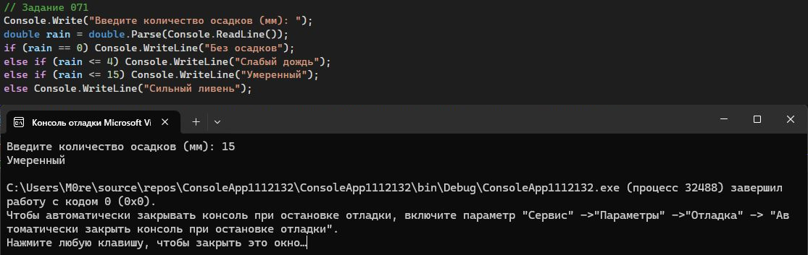

```csharp
using System;

namespace _3_practic
{
    internal class Program
    {
        static void Main(string[] args)
        {
            Console.Write("Введите количество осадков (мм): ");
            double rain = double.Parse(Console.ReadLine());
            if (rain == 0) Console.WriteLine("Без осадков");
            else if (rain <= 4) Console.WriteLine("Слабый дождь");
            else if (rain <= 15) Console.WriteLine("Умеренный");
            else Console.WriteLine("Сильный ливень");
        }
    }
}
```

---

№ 72. Ввести процент выполнения плана продаж. Вывести статус: план сорван ($< 70\%$), удовлетворительно (70-99%), выполнен (100-119%), перевыполнен ($\ge 120\%$).

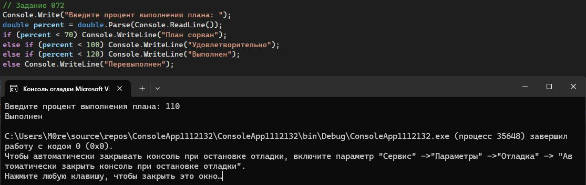

```csharp
using System;

namespace _3_practic
{
    internal class Program
    {
        static void Main(string[] args)
        {
            Console.Write("Введите процент выполнения плана: ");
            double percent = double.Parse(Console.ReadLine());
            if (percent < 70) Console.WriteLine("План сорван");
            else if (percent < 100) Console.WriteLine("Удовлетворительно");
            else if (percent < 120) Console.WriteLine("Выполнен");
            else Console.WriteLine("Перевыполнен");
        }
    }
}
```

---

№ 73. Даны три числа. Упорядочить их по возрастанию и вывести на консоль.

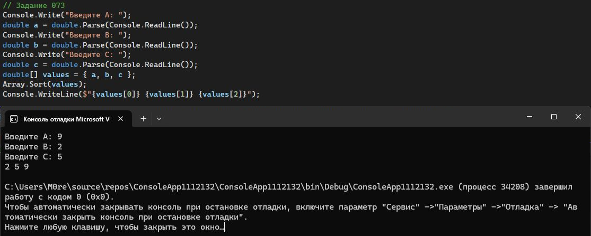

```csharp
using System;

namespace _3_practic
{
    internal class Program
    {
        static void Main(string[] args)
        {
            Console.Write("Введите A: ");
            double a = double.Parse(Console.ReadLine());
            Console.Write("Введите B: ");
            double b = double.Parse(Console.ReadLine());
            Console.Write("Введите C: ");
            double c = double.Parse(Console.ReadLine());
            double[] values = { a, b, c };
            Array.Sort(values);
            Console.WriteLine($"{values[0]} {values[1]} {values[2]}");
        }
    }
}
```

---

№ 74. Дано число $X$. Вычислить значение кусочно-заданной функции: $f(x) = x^2$, если $x > 0$; $f(x) = 0$, если $x = 0$; $f(x) = -x$, если $x < 0$.

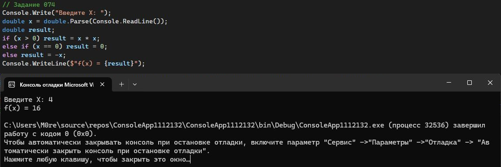

```csharp
using System;

namespace _3_practic
{
    internal class Program
    {
        static void Main(string[] args)
        {
            Console.Write("Введите X: ");
            double x = double.Parse(Console.ReadLine());
            double result;
            if (x > 0) result = x * x;
            else if (x == 0) result = 0;
            else result = -x;
            Console.WriteLine($"f(x) = {result}");
        }
    }
}
```

---

№ 75. Ввести октановое число бензина. Классифицировать: $< 92$ — несоответствие стандарту, 92 — АИ-92, 95 — АИ-95, 98-100 — АИ-98/100, $> 100$ — спорт/авиатопливо.

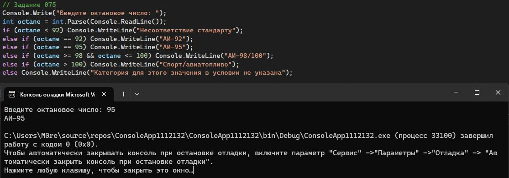

```csharp
using System;

namespace _3_practic
{
    internal class Program
    {
        static void Main(string[] args)
        {
            Console.Write("Введите октановое число: ");
            int octane = int.Parse(Console.ReadLine());
            if (octane < 92) Console.WriteLine("Несоответствие стандарту");
            else if (octane == 92) Console.WriteLine("АИ-92");
            else if (octane == 95) Console.WriteLine("АИ-95");
            else if (octane >= 98 && octane <= 100) Console.WriteLine("АИ-98/100");
            else if (octane > 100) Console.WriteLine("Спорт/авиатопливо");
            else Console.WriteLine("Категория для этого значения в условии не указана");
        }
    }
}
```

---

№ 76. Ввести сумму покупок за месяц для начисления кешбэка: до 10 000 руб — 1%, до 50 000 руб — 3%, свыше 50 000 руб — 5%. Вывести сумму кешбэка.

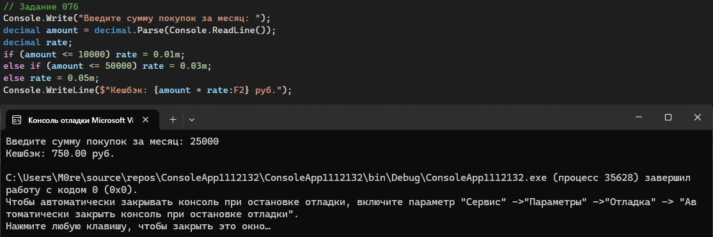

```csharp
using System;

namespace _3_practic
{
    internal class Program
    {
        static void Main(string[] args)
        {
            Console.Write("Введите сумму покупок за месяц: ");
            decimal amount = decimal.Parse(Console.ReadLine());
            decimal rate;
            if (amount <= 10000) rate = 0.01m;
            else if (amount <= 50000) rate = 0.03m;
            else rate = 0.05m;
            Console.WriteLine($"Кешбэк: {amount * rate:F2} руб.");
        }
    }
}
```

---

№ 77. Ввести глубину погружения аквалангиста (метры). Вывести зону: рекреационная ($< 40$), техническая (40-100), глубоководная ($> 100$).

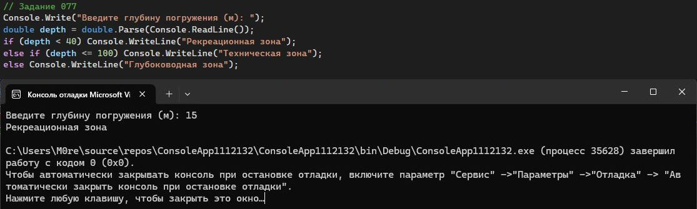

```csharp
using System;

namespace _3_practic
{
    internal class Program
    {
        static void Main(string[] args)
        {
            Console.Write("Введите глубину погружения (м): ");
            double depth = double.Parse(Console.ReadLine());
            if (depth < 40) Console.WriteLine("Рекреационная зона");
            else if (depth <= 100) Console.WriteLine("Техническая зона");
            else Console.WriteLine("Глубоководная зона");
        }
    }
}
```

---

№ 78. Ввести количество штрафных баллов водителя. Вывести: «Предупреждение» (1-5), «Временное ограничение» (6-10), «Лишение прав» ($> 10$).

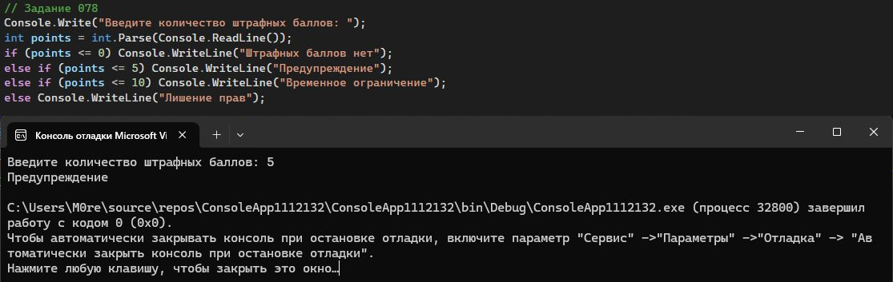

```csharp
using System;

namespace _3_practic
{
    internal class Program
    {
        static void Main(string[] args)
        {
            Console.Write("Введите количество штрафных баллов: ");
            int points = int.Parse(Console.ReadLine());
            if (points <= 0) Console.WriteLine("Штрафных баллов нет");
            else if (points <= 5) Console.WriteLine("Предупреждение");
            else if (points <= 10) Console.WriteLine("Временное ограничение");
            else Console.WriteLine("Лишение прав");
        }
    }
}
```

---

№ 79. Ввести уровень кислотности почвы (pH). Определить: кислая ($< 6.0$), нейтральная (6.0-7.2), щелочная ($> 7.2$).

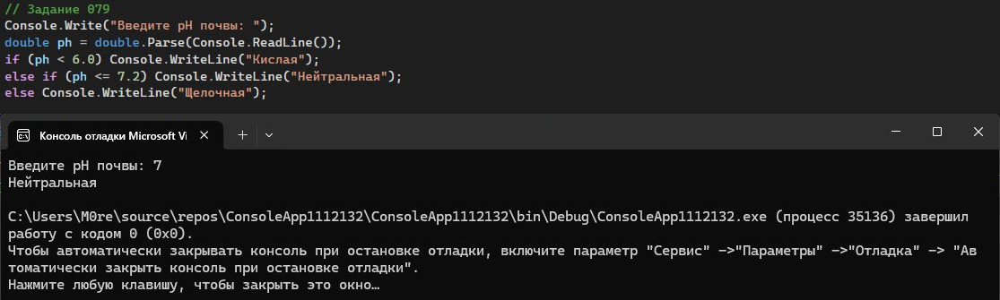

```csharp
using System;

namespace _3_practic
{
    internal class Program
    {
        static void Main(string[] args)
        {
            Console.Write("Введите pH почвы: ");
            double ph = double.Parse(Console.ReadLine());
            if (ph < 6.0) Console.WriteLine("Кислая");
            else if (ph <= 7.2) Console.WriteLine("Нейтральная");
            else Console.WriteLine("Щелочная");
        }
    }
}
```

---

№ 80. Ввести количество набранных очков в компьютерной игре. Присвоить медаль: Бронзовая (1000-2499), Серебряная (2500-4999), Золотая (5000+), иначе без медали.

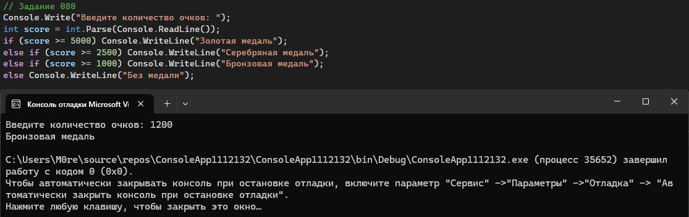

```csharp
using System;

namespace _3_practic
{
    internal class Program
    {
        static void Main(string[] args)
        {
            Console.Write("Введите количество очков: ");
            int score = int.Parse(Console.ReadLine());
            if (score >= 5000) Console.WriteLine("Золотая медаль");
            else if (score >= 2500) Console.WriteLine("Серебряная медаль");
            else if (score >= 1000) Console.WriteLine("Бронзовая медаль");
            else Console.WriteLine("Без медали");
        }
    }
}
```

---

№ 81. Ввести крепость напитка в градусах. Классифицировать: безалкогольный (0), слабоалкогольный (0.1-8), среднеалкогольный (8.1-25), крепкий ($> 25$).

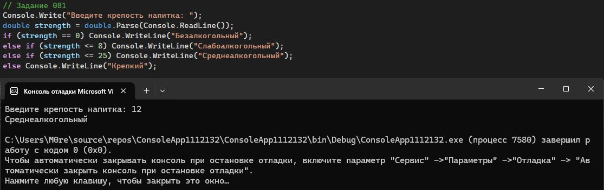

```csharp
using System;

namespace _3_practic
{
    internal class Program
    {
        static void Main(string[] args)
        {
            Console.Write("Введите крепость напитка: ");
            double strength = double.Parse(Console.ReadLine());
            if (strength == 0) Console.WriteLine("Безалкогольный");
            else if (strength <= 8) Console.WriteLine("Слабоалкогольный");
            else if (strength <= 25) Console.WriteLine("Среднеалкогольный");
            else Console.WriteLine("Крепкий");
        }
    }
}
```

---

№ 82. Ввести показатель уровня шума в децибелах (дБ). Вывести вердикт: тихо ($< 40$), норма (40-60), шумно (61-80), вредно для здоровья ($> 80$).

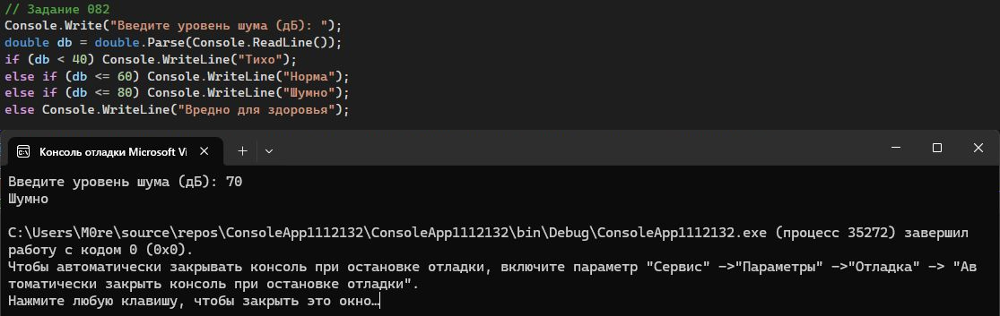

```csharp
using System;

namespace _3_practic
{
    internal class Program
    {
        static void Main(string[] args)
        {
            Console.Write("Введите уровень шума (дБ): ");
            double db = double.Parse(Console.ReadLine());
            if (db < 40) Console.WriteLine("Тихо");
            else if (db <= 60) Console.WriteLine("Норма");
            else if (db <= 80) Console.WriteLine("Шумно");
            else Console.WriteLine("Вредно для здоровья");
        }
    }
}
```

---

№ 83. Ввести вес почтовой посылки (кг). Рассчитать категорию отправления: мелкий пакет ($< 2$), стандартная (2-10), тяжеловесная (10.1-31.5), крупногабарит ($> 31.5$).

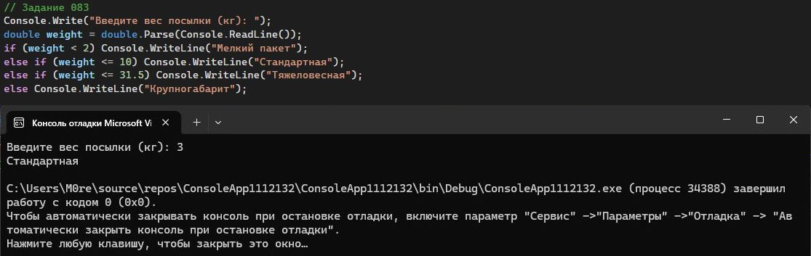

```csharp
using System;

namespace _3_practic
{
    internal class Program
    {
        static void Main(string[] args)
        {
            Console.Write("Введите вес посылки (кг): ");
            double weight = double.Parse(Console.ReadLine());
            if (weight < 2) Console.WriteLine("Мелкий пакет");
            else if (weight <= 10) Console.WriteLine("Стандартная");
            else if (weight <= 31.5) Console.WriteLine("Тяжеловесная");
            else Console.WriteLine("Крупногабарит");
        }
    }
}
```

---

№ 84. Ввести количество комнат в квартире. Вывести: студия/однокомнатная (1), двухкомнатная (2), трехкомнатная (3), многокомнатная (4+).

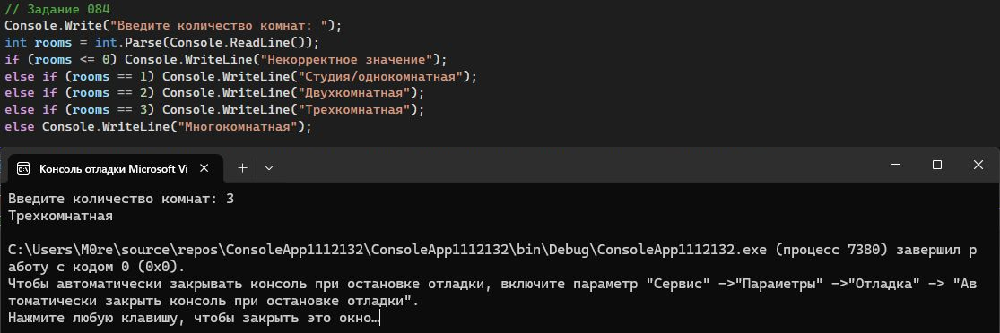

```csharp
using System;

namespace _3_practic
{
    internal class Program
    {
        static void Main(string[] args)
        {
            Console.Write("Введите количество комнат: ");
            int rooms = int.Parse(Console.ReadLine());
            if (rooms <= 0) Console.WriteLine("Некорректное значение");
            else if (rooms == 1) Console.WriteLine("Студия/однокомнатная");
            else if (rooms == 2) Console.WriteLine("Двухкомнатная");
            else if (rooms == 3) Console.WriteLine("Трехкомнатная");
            else Console.WriteLine("Многокомнатная");
        }
    }
}
```

---

№ 85. Ввести процент заряда повербанка. Вывести количество светящихся светодиодов на корпусе (1, 2, 3 или 4). Примечание: исходное условие не задаёт все числовые значения; здесь использованы условные учебные значения.

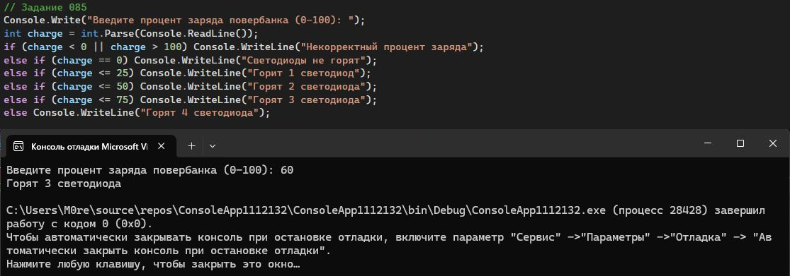

```csharp
using System;

namespace _3_practic
{
    internal class Program
    {
        static void Main(string[] args)
        {
            Console.Write("Введите процент заряда повербанка (0-100): ");
            int charge = int.Parse(Console.ReadLine());
            if (charge < 0 || charge > 100) Console.WriteLine("Некорректный процент заряда");
            else if (charge == 0) Console.WriteLine("Светодиоды не горят");
            else if (charge <= 25) Console.WriteLine("Горит 1 светодиод");
            else if (charge <= 50) Console.WriteLine("Горят 2 светодиода");
            else if (charge <= 75) Console.WriteLine("Горят 3 светодиода");
            else Console.WriteLine("Горят 4 светодиода");
        }
    }
}
```

---

№ 86. Ввести выслугу лет военнослужащего. Вывести процент пенсионной надбавки. Примечание: исходное условие не задаёт все числовые значения; здесь использованы условные учебные значения.

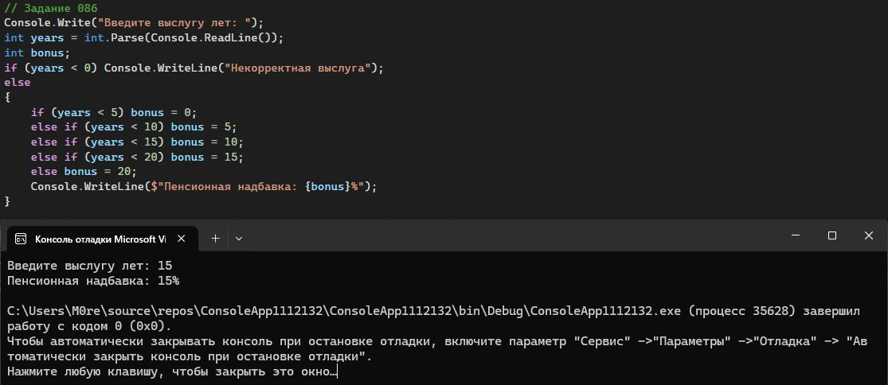

```csharp
using System;

namespace _3_practic
{
    internal class Program
    {
        static void Main(string[] args)
        {
            Console.Write("Введите выслугу лет: ");
            int years = int.Parse(Console.ReadLine());
            int bonus;
            if (years < 0) Console.WriteLine("Некорректная выслуга");
            else
            {
                if (years < 5) bonus = 0;
                else if (years < 10) bonus = 5;
                else if (years < 15) bonus = 10;
                else if (years < 20) bonus = 15;
                else bonus = 20;
                Console.WriteLine($"Пенсионная надбавка: {bonus}%");
            }
        }
    }
}
```

---

№ 87. Ввести время отклика сервера (пинг в мс). Вывести: идеальный ($< 20$), хороший (20-60), посредственный (61-120), плохой ($> 120$).

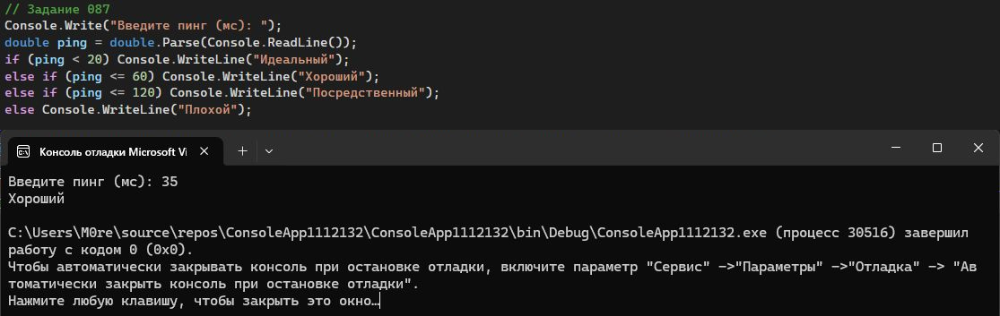

```csharp
using System;

namespace _3_practic
{
    internal class Program
    {
        static void Main(string[] args)
        {
            Console.Write("Введите пинг (мс): ");
            double ping = double.Parse(Console.ReadLine());
            if (ping < 20) Console.WriteLine("Идеальный");
            else if (ping <= 60) Console.WriteLine("Хороший");
            else if (ping <= 120) Console.WriteLine("Посредственный");
            else Console.WriteLine("Плохой");
        }
    }
}
```

---

№ 88. Ввести концентрацию CO2 в помещении (ppm). Вывести вердикт: норма ($< 800$), душно (800-1200), проветрить немедленно ($> 1200$).

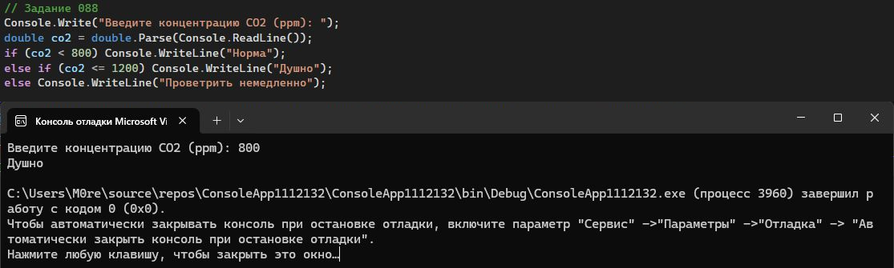

```csharp
using System;

namespace _3_practic
{
    internal class Program
    {
        static void Main(string[] args)
        {
            Console.Write("Введите концентрацию CO2 (ppm): ");
            double co2 = double.Parse(Console.ReadLine());
            if (co2 < 800) Console.WriteLine("Норма");
            else if (co2 <= 1200) Console.WriteLine("Душно");
            else Console.WriteLine("Проветрить немедленно");
        }
    }
}
```

---

№ 89. Ввести количество пройденных шагов за день. Вывести: гиподинамия ($< 5000$), норма (5000-9999), активный день (10000-14999), рекорд ($> 15000$).

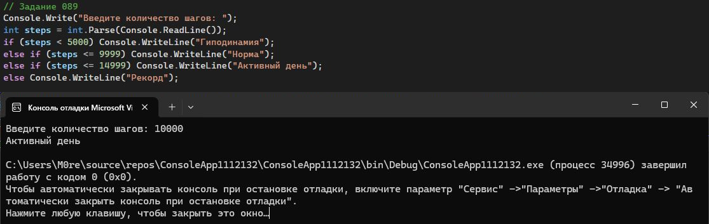

```csharp
using System;

namespace _3_practic
{
    internal class Program
    {
        static void Main(string[] args)
        {
            Console.Write("Введите количество шагов: ");
            int steps = int.Parse(Console.ReadLine());
            if (steps < 5000) Console.WriteLine("Гиподинамия");
            else if (steps <= 9999) Console.WriteLine("Норма");
            else if (steps <= 14999) Console.WriteLine("Активный день");
            else Console.WriteLine("Рекорд");
        }
    }
}
```

---

№ 90. Ввести диаметр автомобильного колесного диска в дюймах. Определить класс: малолитражки (13-14), компактные авто (15-16), кроссоверы/бизнес (17-19), внедорожники/спорт ($20+$).

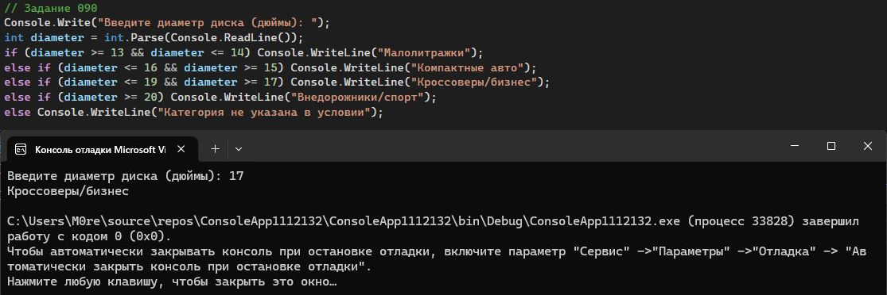

```csharp
using System;

namespace _3_practic
{
    internal class Program
    {
        static void Main(string[] args)
        {
            Console.Write("Введите диаметр диска (дюймы): ");
            int diameter = int.Parse(Console.ReadLine());
            if (diameter >= 13 && diameter <= 14) Console.WriteLine("Малолитражки");
            else if (diameter <= 16 && diameter >= 15) Console.WriteLine("Компактные авто");
            else if (diameter <= 19 && diameter >= 17) Console.WriteLine("Кроссоверы/бизнес");
            else if (diameter >= 20) Console.WriteLine("Внедорожники/спорт");
            else Console.WriteLine("Категория не указана в условии");
        }
    }
}
```

---

№ 91. Ввести значение влажности воздуха (%). Вывести: сухой воздух ($< 30$), комфорт (30-60), повышенная влажность ($> 60$).

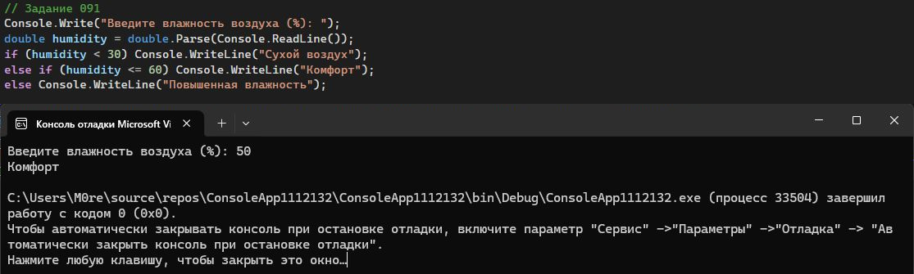

```csharp
using System;

namespace _3_practic
{
    internal class Program
    {
        static void Main(string[] args)
        {
            Console.Write("Введите влажность воздуха (%): ");
            double humidity = double.Parse(Console.ReadLine());
            if (humidity < 30) Console.WriteLine("Сухой воздух");
            else if (humidity <= 60) Console.WriteLine("Комфорт");
            else Console.WriteLine("Повышенная влажность");
        }
    }
}
```

---

№ 92. Даны три числа. Проверить, сколько из них равны между собой (все разные, два равны, все три равны).

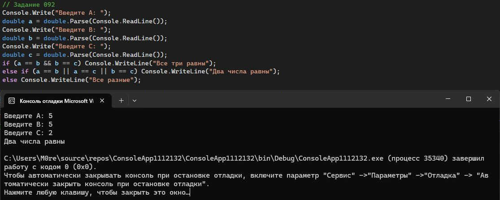

```csharp
using System;

namespace _3_practic
{
    internal class Program
    {
        static void Main(string[] args)
        {
            Console.Write("Введите A: ");
            double a = double.Parse(Console.ReadLine());
            Console.Write("Введите B: ");
            double b = double.Parse(Console.ReadLine());
            Console.Write("Введите C: ");
            double c = double.Parse(Console.ReadLine());
            if (a == b && b == c) Console.WriteLine("Все три равны");
            else if (a == b || a == c || b == c) Console.WriteLine("Два числа равны");
            else Console.WriteLine("Все разные");
        }
    }
}
```

---

№ 93. Ввести номер четверти координатной плоскости (1–4) и вывести диапазоны знаков для координат $X$ и $Y$.

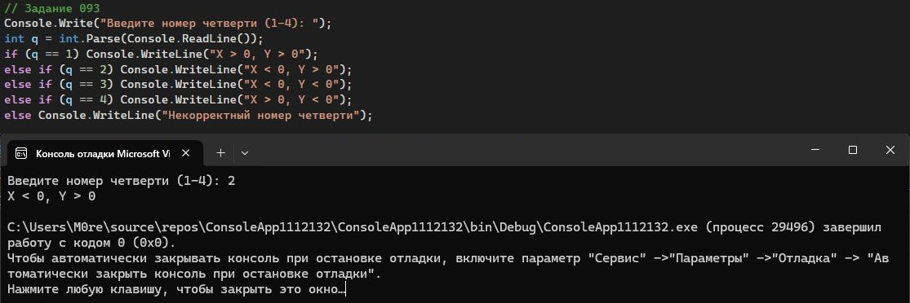

```csharp
using System;

namespace _3_practic
{
    internal class Program
    {
        static void Main(string[] args)
        {
            Console.Write("Введите номер четверти (1-4): ");
            int q = int.Parse(Console.ReadLine());
            if (q == 1) Console.WriteLine("X > 0, Y > 0");
            else if (q == 2) Console.WriteLine("X < 0, Y > 0");
            else if (q == 3) Console.WriteLine("X < 0, Y < 0");
            else if (q == 4) Console.WriteLine("X > 0, Y < 0");
            else Console.WriteLine("Некорректный номер четверти");
        }
    }
}
```

---

№ 94. Ввести температуру процессора компьютера. Вывести: холодный ($< 45$), нормальная нагрузка (45-75), троттлинг/перегрев ($> 75$).

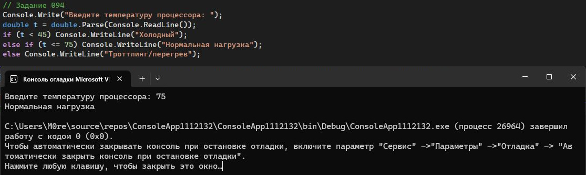

```csharp
using System;

namespace _3_practic
{
    internal class Program
    {
        static void Main(string[] args)
        {
            Console.Write("Введите температуру процессора: ");
            double t = double.Parse(Console.ReadLine());
            if (t < 45) Console.WriteLine("Холодный");
            else if (t <= 75) Console.WriteLine("Нормальная нагрузка");
            else Console.WriteLine("Троттлинг/перегрев");
        }
    }
}
```

---

№ 95. Ввести остаток срока годности продукта в днях. Вывести: «Срочно употребить» ($\le 2$), «Нормально» (3-30), «Длительное хранение» ($> 30$).

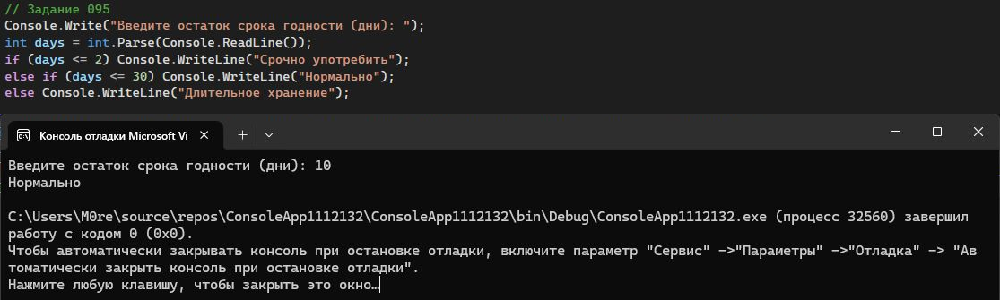

```csharp
using System;

namespace _3_practic
{
    internal class Program
    {
        static void Main(string[] args)
        {
            Console.Write("Введите остаток срока годности (дни): ");
            int days = int.Parse(Console.ReadLine());
            if (days <= 2) Console.WriteLine("Срочно употребить");
            else if (days <= 30) Console.WriteLine("Нормально");
            else Console.WriteLine("Длительное хранение");
        }
    }
}
```

---

№ 96. Ввести сумму кредита и срок. Рассчитать процентную ставку в зависимости от срока (до года, до трех лет, свыше трех лет). Примечание: исходное условие не задаёт все числовые значения; здесь использованы условные учебные значения.

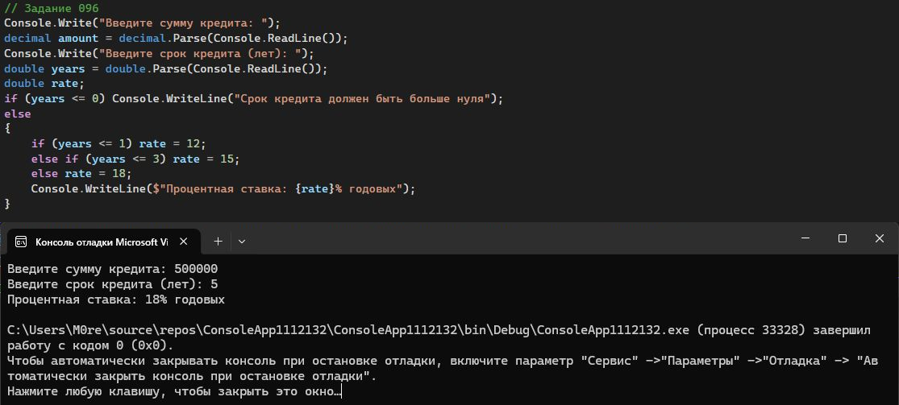

```csharp
using System;

namespace _3_practic
{
    internal class Program
    {
        static void Main(string[] args)
        {
            Console.Write("Введите сумму кредита: ");
            decimal amount = decimal.Parse(Console.ReadLine());
            Console.Write("Введите срок кредита (лет): ");
            double years = double.Parse(Console.ReadLine());
            double rate;
            if (years <= 0) Console.WriteLine("Срок кредита должен быть больше нуля");
            else
            {
                if (years <= 1) rate = 12;
                else if (years <= 3) rate = 15;
                else rate = 18;
                Console.WriteLine($"Процентная ставка: {rate}% годовых");
            }
        }
    }
}
```

---

№ 97. Ввести частоту обновления монитора (Гц). Определить: офис (60-75), базовый игровой (120-144), киберспорт ($165+$).

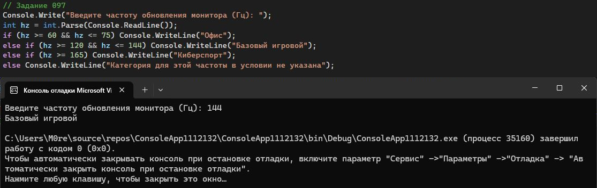

```csharp
using System;

namespace _3_practic
{
    internal class Program
    {
        static void Main(string[] args)
        {
            Console.Write("Введите частоту обновления монитора (Гц): ");
            int hz = int.Parse(Console.ReadLine());
            if (hz >= 60 && hz <= 75) Console.WriteLine("Офис");
            else if (hz >= 120 && hz <= 144) Console.WriteLine("Базовый игровой");
            else if (hz >= 165) Console.WriteLine("Киберспорт");
            else Console.WriteLine("Категория для этой частоты в условии не указана");
        }
    }
}
```

---

№ 98. Ввести расход топлива автомобиля на 100 км пути. Вывести вердикт: экономичный ($< 6$ л), средний (6-10 л), прожорливый ($> 10$ л).

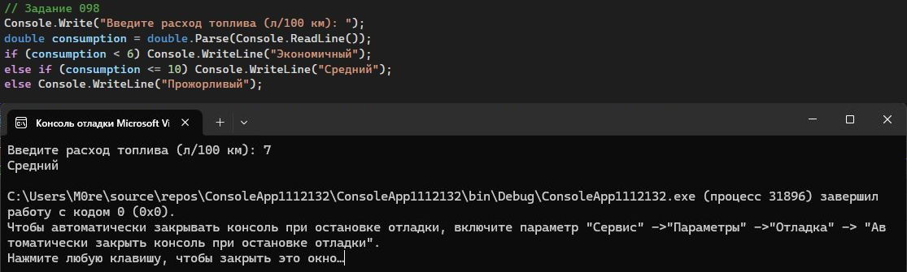

```csharp
using System;

namespace _3_practic
{
    internal class Program
    {
        static void Main(string[] args)
        {
            Console.Write("Введите расход топлива (л/100 км): ");
            double consumption = double.Parse(Console.ReadLine());
            if (consumption < 6) Console.WriteLine("Экономичный");
            else if (consumption <= 10) Console.WriteLine("Средний");
            else Console.WriteLine("Прожорливый");
        }
    }
}
```

---

№ 99. Ввести количество страниц книги. Классифицировать: брошюра ($< 48$), повесть (48-150), роман (151-600), фолиант ($> 600$).

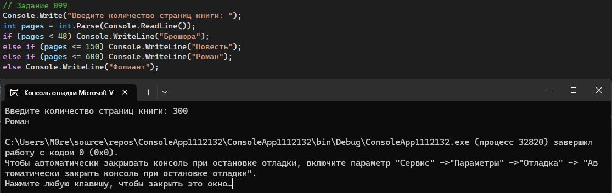

```csharp
using System;

namespace _3_practic
{
    internal class Program
    {
        static void Main(string[] args)
        {
            Console.Write("Введите количество страниц книги: ");
            int pages = int.Parse(Console.ReadLine());
            if (pages < 48) Console.WriteLine("Брошюра");
            else if (pages <= 150) Console.WriteLine("Повесть");
            else if (pages <= 600) Console.WriteLine("Роман");
            else Console.WriteLine("Фолиант");
        }
    }
}
```

---

№ 100. Ввести число и проверить, попадает ли оно в интервалы $[0; 10]$, $[20; 30]$ или $[50; 100]$.

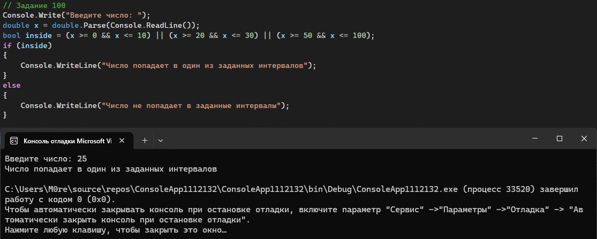

```csharp
using System;

namespace _3_practic
{
    internal class Program
    {
        static void Main(string[] args)
        {
            Console.Write("Введите число: ");
            double x = double.Parse(Console.ReadLine());
            bool inside = (x >= 0 && x <= 10) || (x >= 20 && x <= 30) || (x >= 50 && x <= 100);
            if (inside)
            {
                Console.WriteLine("Число попадает в один из заданных интервалов");
            }
            else
            {
                Console.WriteLine("Число не попадает в заданные интервалы");
            }
        }
    }
}
```

---

### Раздел 3. Составные логические условия &&, ||, !
---
№ 101. Дано целое число. Проверить, принадлежит ли оно числовому отрезку $[10; 50]$.

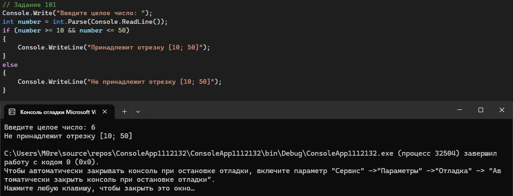

```csharp
using System;

namespace _3_practic
{
    internal class Program
    {
        static void Main(string[] args)
        {
            Console.Write("Введите целое число: ");
            int number = int.Parse(Console.ReadLine());
            if (number >= 10 && number <= 50)
            {
                Console.WriteLine("Принадлежит отрезку [10; 50]");
            }
            else
            {
                Console.WriteLine("Не принадлежит отрезку [10; 50]");
            }
        }
    }
}
```

---

№ 102. Проверить, является ли введенное целое число положительным и четным одновременно.

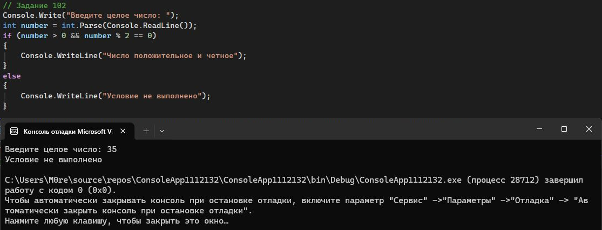

```csharp
using System;

namespace _3_practic
{
    internal class Program
    {
        static void Main(string[] args)
        {
            Console.Write("Введите целое число: ");
            int number = int.Parse(Console.ReadLine());
            if (number > 0 && number % 2 == 0)
            {
                Console.WriteLine("Число положительное и четное");
            }
            else
            {
                Console.WriteLine("Условие не выполнено");
            }
        }
    }
}
```

---

№ 103. Проверить, лежит ли число вне диапазона $[-10; 10]$.

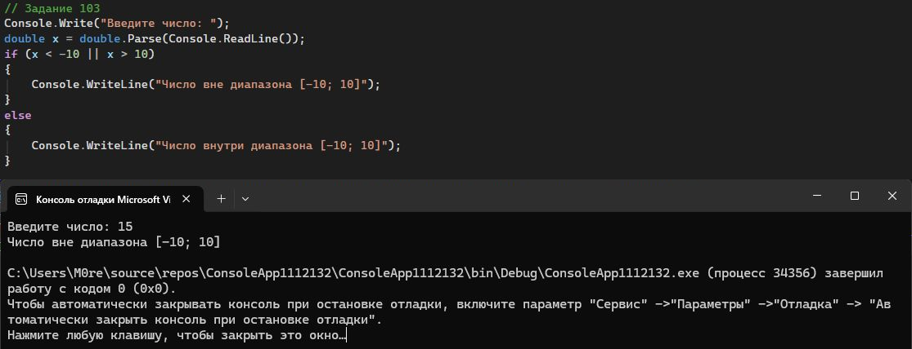

```csharp
using System;

namespace _3_practic
{
    internal class Program
    {
        static void Main(string[] args)
        {
            Console.Write("Введите число: ");
            double x = double.Parse(Console.ReadLine());
            if (x < -10 || x > 10)
            {
                Console.WriteLine("Число вне диапазона [-10; 10]");
            }
            else
            {
                Console.WriteLine("Число внутри диапазона [-10; 10]");
            }
        }
    }
}
```

---

№ 104. Ввести логин и пароль пользователя. Вывести «Успех», если логин равен `admin` и пароль `secret`.

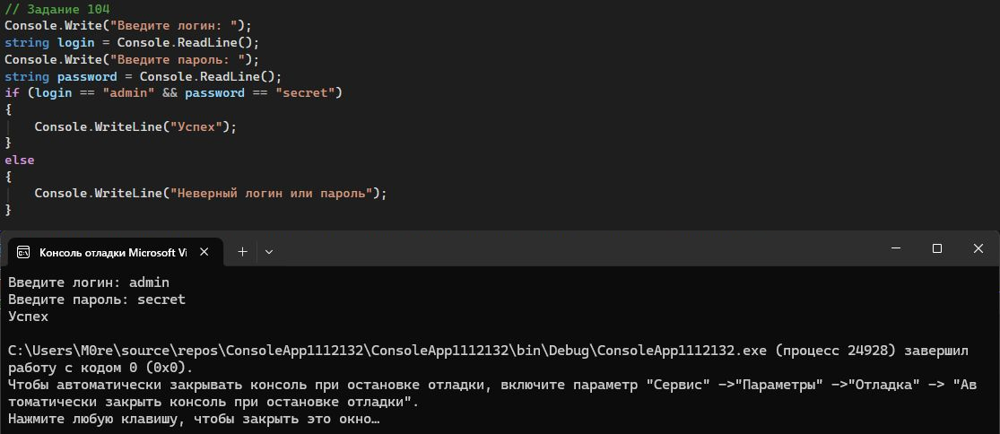

```csharp
using System;

namespace _3_practic
{
    internal class Program
    {
        static void Main(string[] args)
        {
            Console.Write("Введите логин: ");
            string login = Console.ReadLine();
            Console.Write("Введите пароль: ");
            string password = Console.ReadLine();
            if (login == "admin" && password == "secret")
            {
                Console.WriteLine("Успех");
            }
            else
            {
                Console.WriteLine("Неверный логин или пароль");
            }
        }
    }
}
```

---

№ 105. Проверить, является ли введенный год високосным (делится на 4, но не на 100, либо делится на 400).

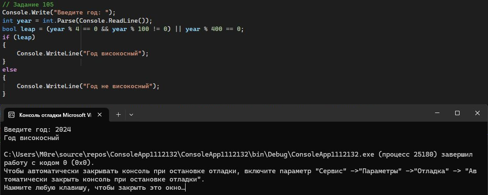

```csharp
using System;

namespace _3_practic
{
    internal class Program
    {
        static void Main(string[] args)
        {
            Console.Write("Введите год: ");
            int year = int.Parse(Console.ReadLine());
            bool leap = (year % 4 == 0 && year % 100 != 0) || year % 400 == 0;
            if (leap)
            {
                Console.WriteLine("Год високосный");
            }
            else
            {
                Console.WriteLine("Год не високосный");
            }
        }
    }
}
```

---

№ 106. Даны координаты точки $(X, Y)$. Определить, попадает ли точка в I координатную четверть ($X > 0$ и $Y > 0$).

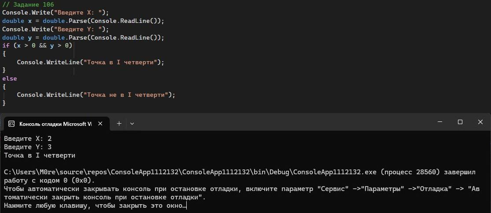

```csharp
using System;

namespace _3_practic
{
    internal class Program
    {
        static void Main(string[] args)
        {
            Console.Write("Введите X: ");
            double x = double.Parse(Console.ReadLine());
            Console.Write("Введите Y: ");
            double y = double.Parse(Console.ReadLine());
            if (x > 0 && y > 0)
            {
                Console.WriteLine("Точка в I четверти");
            }
            else
            {
                Console.WriteLine("Точка не в I четверти");
            }
        }
    }
}
```

---

№ 107. Определить, попадает ли точка $(X, Y)$ во II четверть плоскости.

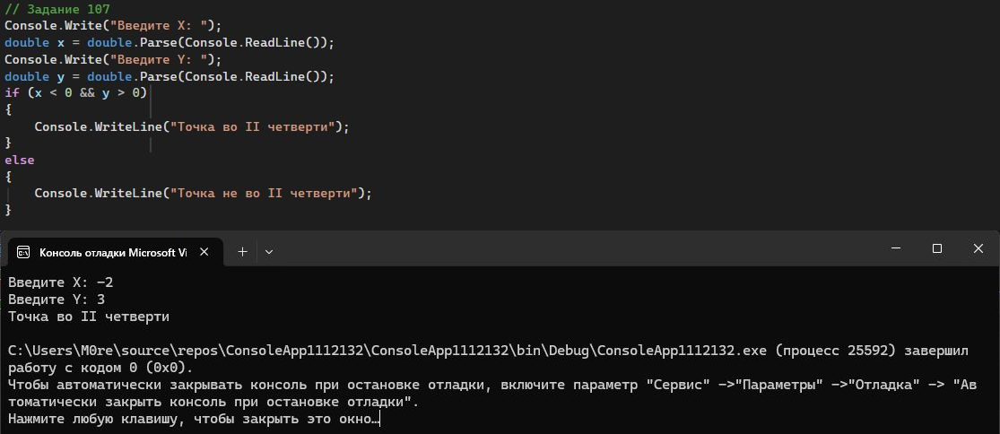

```csharp
using System;

namespace _3_practic
{
    internal class Program
    {
        static void Main(string[] args)
        {
            Console.Write("Введите X: ");
            double x = double.Parse(Console.ReadLine());
            Console.Write("Введите Y: ");
            double y = double.Parse(Console.ReadLine());
            if (x < 0 && y > 0)
            {
                Console.WriteLine("Точка во II четверти");
            }
            else
            {
                Console.WriteLine("Точка не во II четверти");
            }
        }
    }
}
```

---

№ 108. Определить, попадает ли точка $(X, Y)$ в III четверть плоскости.


```csharp
using System;

namespace _3_practic
{
    internal class Program
    {
        static void Main(string[] args)
        {
            Console.Write("Введите X: ");
            double x = double.Parse(Console.ReadLine());
            Console.Write("Введите Y: ");
            double y = double.Parse(Console.ReadLine());
            if (x < 0 && y < 0)
            {
                Console.WriteLine("Точка в III четверти");
            }
            else
            {
                Console.WriteLine("Точка не в III четверти");
            }
        }
    }
}
```

---

№ 109. Определить, попадает ли точка $(X, Y)$ в IV четверть плоскости.

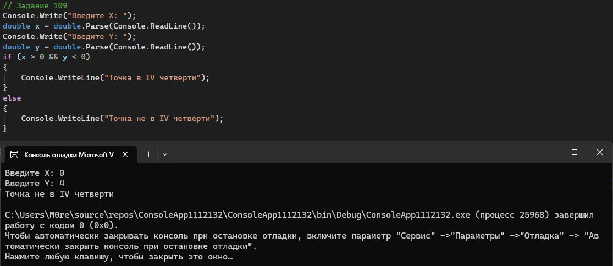

```csharp
using System;

namespace _3_practic
{
    internal class Program
    {
        static void Main(string[] args)
        {
            Console.Write("Введите X: ");
            double x = double.Parse(Console.ReadLine());
            Console.Write("Введите Y: ");
            double y = double.Parse(Console.ReadLine());
            if (x > 0 && y < 0)
            {
                Console.WriteLine("Точка в IV четверти");
            }
            else
            {
                Console.WriteLine("Точка не в IV четверти");
            }
        }
    }
}
```

---

№ 110. Даны три стороны $A$, $B$, $C$. Проверить, является ли треугольник прямоугольным (теорема Пифагора).

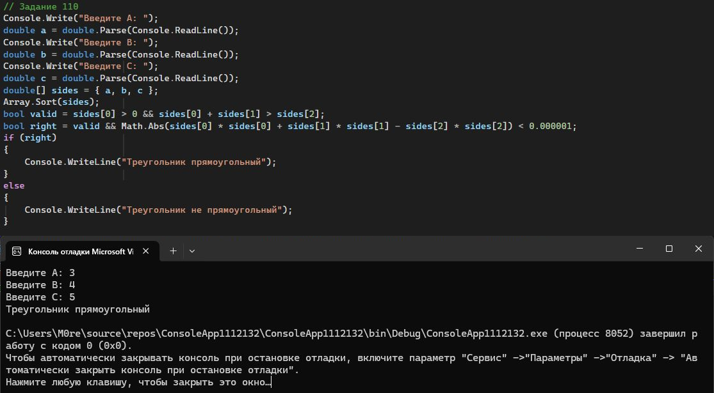

```csharp
using System;

namespace _3_practic
{
    internal class Program
    {
        static void Main(string[] args)
        {
            Console.Write("Введите A: ");
            double a = double.Parse(Console.ReadLine());
            Console.Write("Введите B: ");
            double b = double.Parse(Console.ReadLine());
            Console.Write("Введите C: ");
            double c = double.Parse(Console.ReadLine());
            double[] sides = { a, b, c };
            Array.Sort(sides);
            bool valid = sides[0] > 0 && sides[0] + sides[1] > sides[2];
            bool right = valid && Math.Abs(sides[0] * sides[0] + sides[1] * sides[1] - sides[2] * sides[2]) < 0.000001;
            if (right)
            {
                Console.WriteLine("Треугольник прямоугольный");
            }
            else
            {
                Console.WriteLine("Треугольник не прямоугольный");
            }
        }
    }
}
```

---

№ 111. Даны три стороны. Проверить, является ли треугольник равнобедренным.

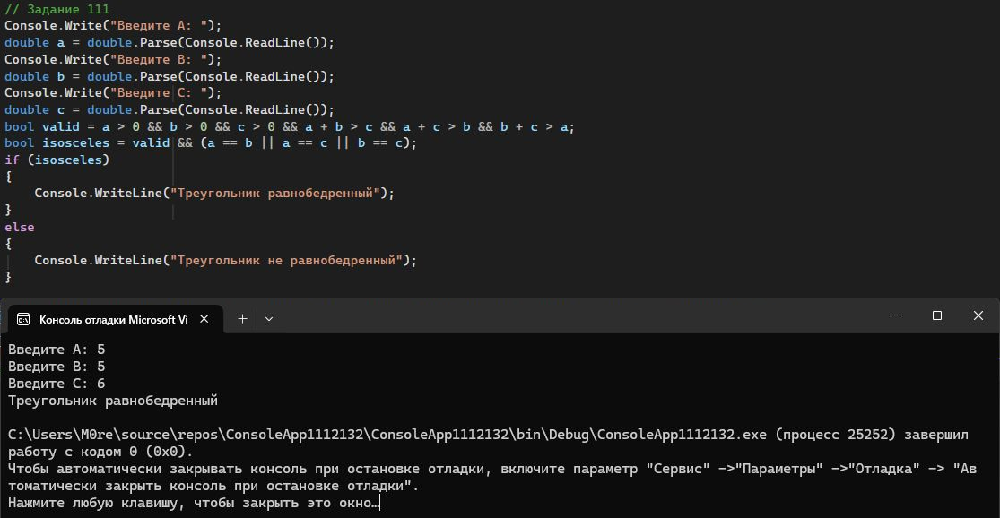

```csharp
using System;

namespace _3_practic
{
    internal class Program
    {
        static void Main(string[] args)
        {
            Console.Write("Введите A: ");
            double a = double.Parse(Console.ReadLine());
            Console.Write("Введите B: ");
            double b = double.Parse(Console.ReadLine());
            Console.Write("Введите C: ");
            double c = double.Parse(Console.ReadLine());
            bool valid = a > 0 && b > 0 && c > 0 && a + b > c && a + c > b && b + c > a;
            bool isosceles = valid && (a == b || a == c || b == c);
            if (isosceles)
            {
                Console.WriteLine("Треугольник равнобедренный");
            }
            else
            {
                Console.WriteLine("Треугольник не равнобедренный");
            }
        }
    }
}
```

---

№ 112. Ввести возраст и стаж вождения. Разрешить аренду каршеринга бизнес-класса, если возраст $\ge 23$ лет И стаж $\ge 3$ лет.

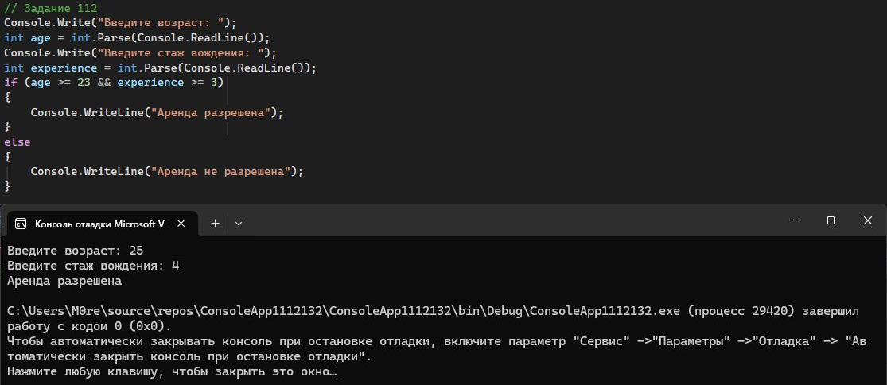

```csharp
using System;

namespace _3_practic
{
    internal class Program
    {
        static void Main(string[] args)
        {
            Console.Write("Введите возраст: ");
            int age = int.Parse(Console.ReadLine());
            Console.Write("Введите стаж вождения: ");
            int experience = int.Parse(Console.ReadLine());
            if (age >= 23 && experience >= 3)
            {
                Console.WriteLine("Аренда разрешена");
            }
            else
            {
                Console.WriteLine("Аренда не разрешена");
            }
        }
    }
}
```

---

№ 113. Проверить, делится ли число одновременно на 3 и на 5 без остатка.

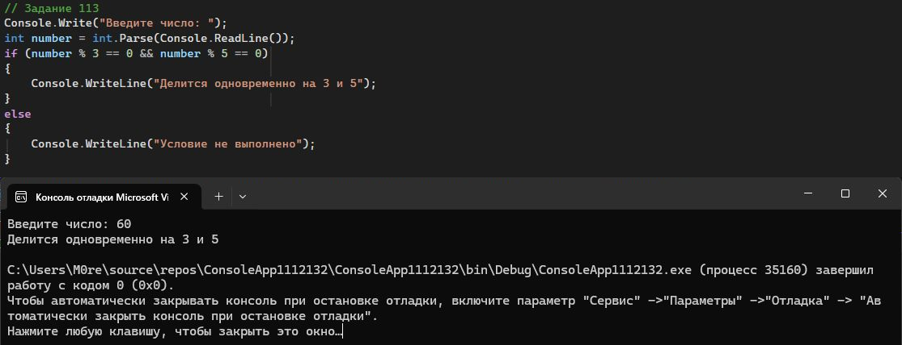

```csharp
using System;

namespace _3_practic
{
    internal class Program
    {
        static void Main(string[] args)
        {
            Console.Write("Введите число: ");
            int number = int.Parse(Console.ReadLine());
            if (number % 3 == 0 && number % 5 == 0)
            {
                Console.WriteLine("Делится одновременно на 3 и 5");
            }
            else
            {
                Console.WriteLine("Условие не выполнено");
            }
        }
    }
}
```

---

№ 114. Проверить, является ли число трехзначным и оканчивается ли оно на цифру 5.

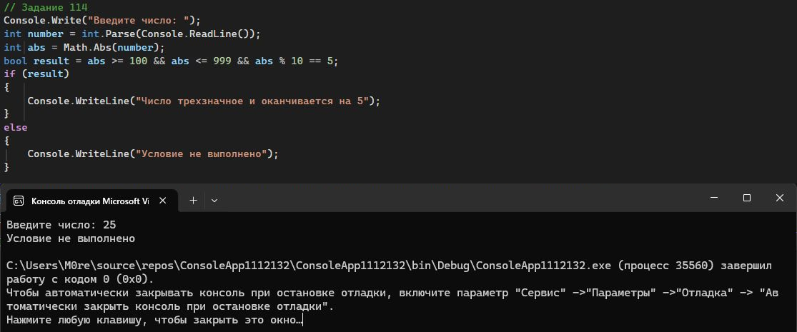

```csharp
using System;

namespace _3_practic
{
    internal class Program
    {
        static void Main(string[] args)
        {
            Console.Write("Введите число: ");
            int number = int.Parse(Console.ReadLine());
            int abs = Math.Abs(number);
            bool result = abs >= 100 && abs <= 999 && abs % 10 == 5;
            if (result)
            {
                Console.WriteLine("Число трехзначное и оканчивается на 5");
            }
            else
            {
                Console.WriteLine("Условие не выполнено");
            }
        }
    }
}
```

---

№ 115. Даны три числа. Проверить, упорядочены ли они строго по возрастанию ($A < B < C$).

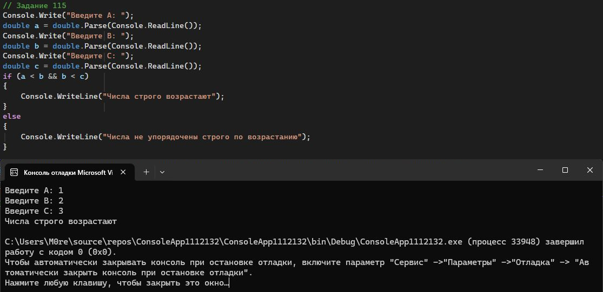

```csharp
using System;

namespace _3_practic
{
    internal class Program
    {
        static void Main(string[] args)
        {
            Console.Write("Введите A: ");
            double a = double.Parse(Console.ReadLine());
            Console.Write("Введите B: ");
            double b = double.Parse(Console.ReadLine());
            Console.Write("Введите C: ");
            double c = double.Parse(Console.ReadLine());
            if (a < b && b < c)
            {
                Console.WriteLine("Числа строго возрастают");
            }
            else
            {
                Console.WriteLine("Числа не упорядочены строго по возрастанию");
            }
        }
    }
}
```

---

№ 116. Проверить, верно ли, что среди трех введенных чисел есть хотя бы одно четное.

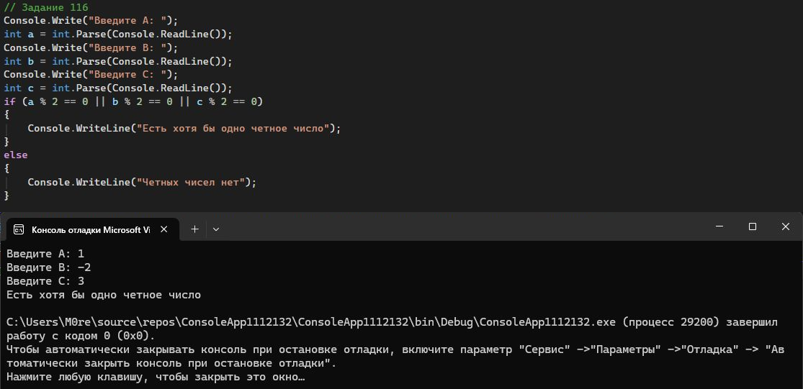

```csharp
using System;

namespace _3_practic
{
    internal class Program
    {
        static void Main(string[] args)
        {
            Console.Write("Введите A: ");
            int a = int.Parse(Console.ReadLine());
            Console.Write("Введите B: ");
            int b = int.Parse(Console.ReadLine());
            Console.Write("Введите C: ");
            int c = int.Parse(Console.ReadLine());
            if (a % 2 == 0 || b % 2 == 0 || c % 2 == 0)
            {
                Console.WriteLine("Есть хотя бы одно четное число");
            }
            else
            {
                Console.WriteLine("Четных чисел нет");
            }
        }
    }
}
```

---

№ 117. Проверить, верно ли, что среди трех чисел ровно одно равно нулю.

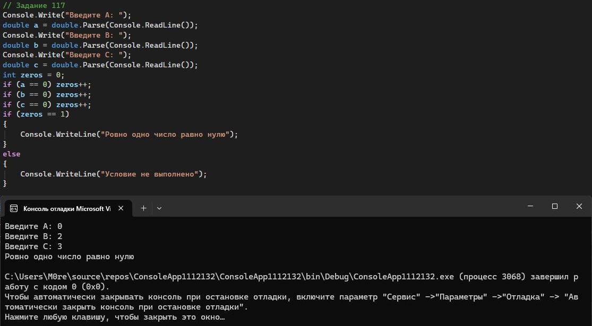

```csharp
using System;

namespace _3_practic
{
    internal class Program
    {
        static void Main(string[] args)
        {
            Console.Write("Введите A: ");
            double a = double.Parse(Console.ReadLine());
            Console.Write("Введите B: ");
            double b = double.Parse(Console.ReadLine());
            Console.Write("Введите C: ");
            double c = double.Parse(Console.ReadLine());
            int zeros = 0;
            if (a == 0) zeros++;
            if (b == 0) zeros++;
            if (c == 0) zeros++;
            if (zeros == 1)
            {
                Console.WriteLine("Ровно одно число равно нулю");
            }
            else
            {
                Console.WriteLine("Условие не выполнено");
            }
        }
    }
}
```

---

№ 118. Ввести температуру и влажность. Вывести предупреждение о гололедице, если температура $\le 0^\circ\text{C}$ И влажность $> 85\%$.

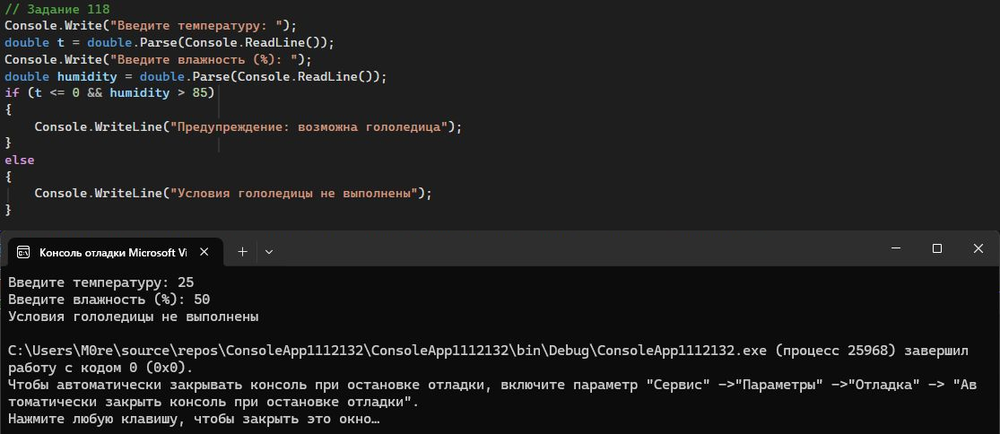

```csharp
using System;

namespace _3_practic
{
    internal class Program
    {
        static void Main(string[] args)
        {
            Console.Write("Введите температуру: ");
            double t = double.Parse(Console.ReadLine());
            Console.Write("Введите влажность (%): ");
            double humidity = double.Parse(Console.ReadLine());
            if (t <= 0 && humidity > 85)
            {
                Console.WriteLine("Предупреждение: возможна гололедица");
            }
            else
            {
                Console.WriteLine("Условия гололедицы не выполнены");
            }
        }
    }
}
```

---

№ 119. Даны координаты точки $(X, Y)$. Проверить, лежит ли точка внутри круга радиуса $R$ с центром в начале координат ($x^2 + y^2 \le R^2$).

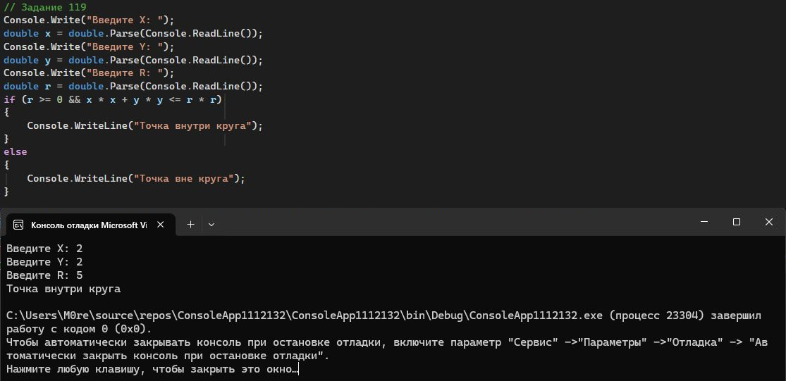

```csharp
using System;

namespace _3_practic
{
    internal class Program
    {
        static void Main(string[] args)
        {
            Console.Write("Введите X: ");
            double x = double.Parse(Console.ReadLine());
            Console.Write("Введите Y: ");
            double y = double.Parse(Console.ReadLine());
            Console.Write("Введите R: ");
            double r = double.Parse(Console.ReadLine());
            if (r >= 0 && x * x + y * y <= r * r)
            {
                Console.WriteLine("Точка внутри круга");
            }
            else
            {
                Console.WriteLine("Точка вне круга");
            }
        }
    }
}
```

---

№ 120. Даны координаты точки $(X, Y)$. Проверить, лежит ли точка внутри прямоугольника со сторонами, параллельными осям, заданного углами $(X_1, Y_1)$ и $(X_2, Y_2)$.

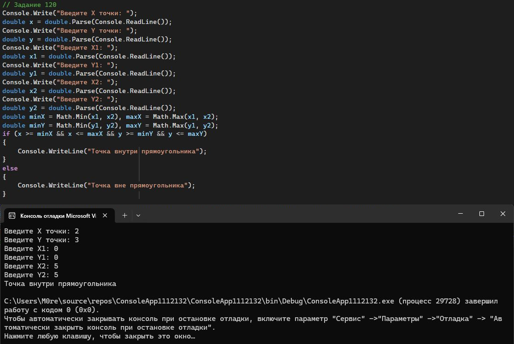

```csharp
using System;

namespace _3_practic
{
    internal class Program
    {
        static void Main(string[] args)
        {
            Console.Write("Введите X точки: ");
            double x = double.Parse(Console.ReadLine());
            Console.Write("Введите Y точки: ");
            double y = double.Parse(Console.ReadLine());
            Console.Write("Введите X1: ");
            double x1 = double.Parse(Console.ReadLine());
            Console.Write("Введите Y1: ");
            double y1 = double.Parse(Console.ReadLine());
            Console.Write("Введите X2: ");
            double x2 = double.Parse(Console.ReadLine());
            Console.Write("Введите Y2: ");
            double y2 = double.Parse(Console.ReadLine());
            double minX = Math.Min(x1, x2), maxX = Math.Max(x1, x2);
            double minY = Math.Min(y1, y2), maxY = Math.Max(y1, y2);
            if (x >= minX && x <= maxX && y >= minY && y <= maxY)
            {
                Console.WriteLine("Точка внутри прямоугольника");
            }
            else
            {
                Console.WriteLine("Точка вне прямоугольника");
            }
        }
    }
}
```

---

№ 121. Ввести день и месяц рождения. Проверить, корректна ли дата (например, день от 1 до 31, месяц от 1 до 12, с учетом длины месяцев).

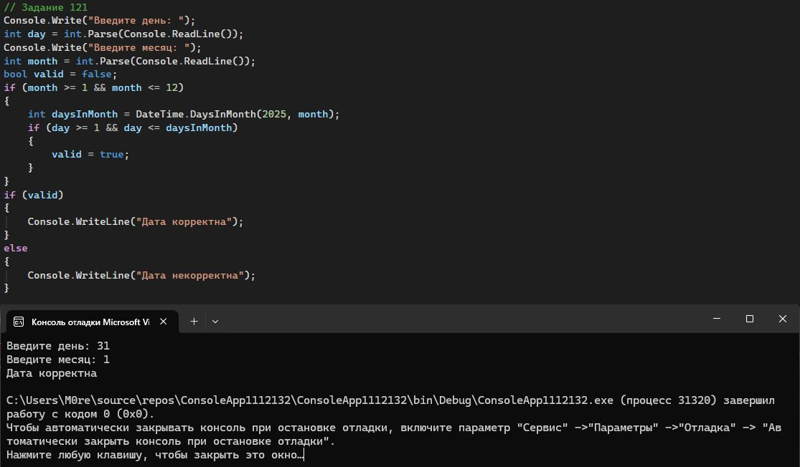

```csharp
using System;

namespace _3_practic
{
    internal class Program
    {
        static void Main(string[] args)
        {
            Console.Write("Введите день: ");
            int day = int.Parse(Console.ReadLine());
            Console.Write("Введите месяц: ");
            int month = int.Parse(Console.ReadLine());
            bool valid = false;
            if (month >= 1 && month <= 12)
            {
                int daysInMonth = DateTime.DaysInMonth(2025, month);
                if (day >= 1 && day <= daysInMonth)
                {
                    valid = true;
                }
            }
            if (valid)
            {
                Console.WriteLine("Дата корректна");
            }
            else
            {
                Console.WriteLine("Дата некорректна");
            }
        }
    }
}
```

---

№ 122. Ввести номер месяца. Проверить, относится ли он к зимнему периоду (12, 1 или 2).

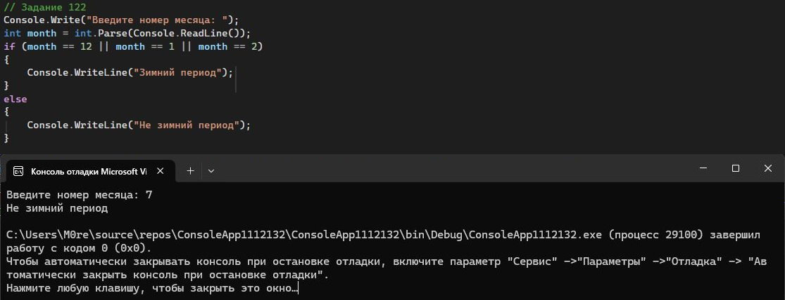

```csharp
using System;

namespace _3_practic
{
    internal class Program
    {
        static void Main(string[] args)
        {
            Console.Write("Введите номер месяца: ");
            int month = int.Parse(Console.ReadLine());
            if (month == 12 || month == 1 || month == 2)
            {
                Console.WriteLine("Зимний период");
            }
            else
            {
                Console.WriteLine("Не зимний период");
            }
        }
    }
}
```

---

№ 123. Проверить, является ли четырехзначное число «счастливым билетом» (сумма первых двух цифр равна сумме двух последних).

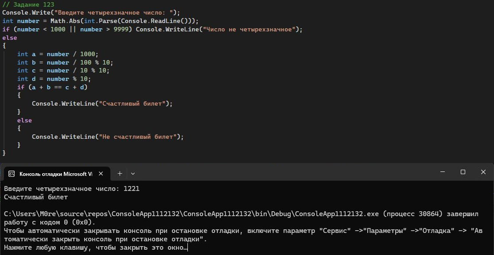

```csharp
using System;

namespace _3_practic
{
    internal class Program
    {
        static void Main(string[] args)
        {
            Console.Write("Введите четырехзначное число: ");
            int number = Math.Abs(int.Parse(Console.ReadLine()));
            if (number < 1000 || number > 9999) Console.WriteLine("Число не четырехзначное");
            else
            {
                int a = number / 1000;
                int b = number / 100 % 10;
                int c = number / 10 % 10;
                int d = number % 10;
                if (a + b == c + d)
                {
                    Console.WriteLine("Счастливый билет");
                }
                else
                {
                    Console.WriteLine("Не счастливый билет");
                }
            }
        }
    }
}
```

---

№ 124. Ввести три числа. Проверить истинность высказывания: «Хотя бы одна пара чисел взаимно противоположна ($A = -B$)».

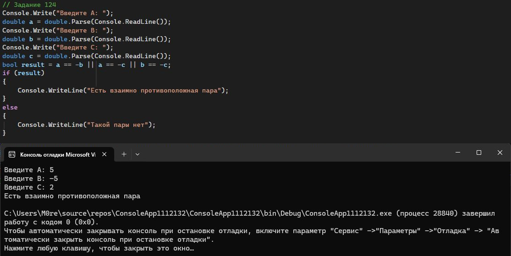

```csharp
using System;

namespace _3_practic
{
    internal class Program
    {
        static void Main(string[] args)
        {
            Console.Write("Введите A: ");
            double a = double.Parse(Console.ReadLine());
            Console.Write("Введите B: ");
            double b = double.Parse(Console.ReadLine());
            Console.Write("Введите C: ");
            double c = double.Parse(Console.ReadLine());
            bool result = a == -b || a == -c || b == -c;
            if (result)
            {
                Console.WriteLine("Есть взаимно противоположная пара");
            }
            else
            {
                Console.WriteLine("Такой пары нет");
            }
        }
    }
}
```

---

№ 125. Пользователь вводит показания двух датчиков аварии. Сформировать тревогу, если сработал хотя бы один датчик И при этом включен тумблер защиты.

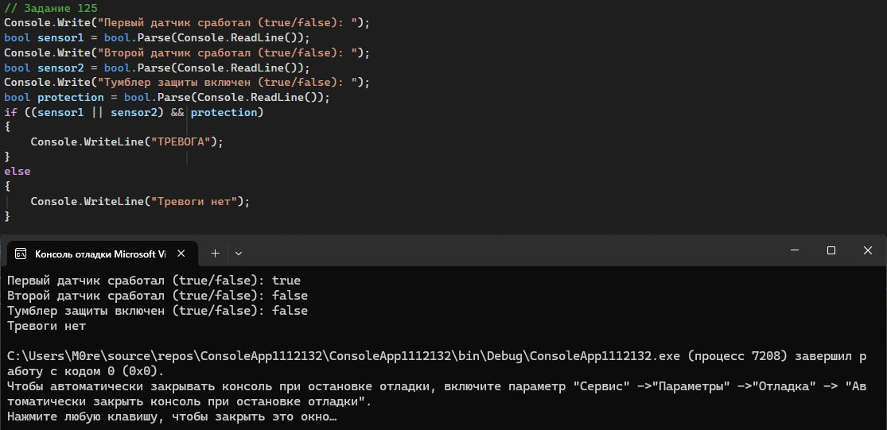

```csharp
using System;

namespace _3_practic
{
    internal class Program
    {
        static void Main(string[] args)
        {
            Console.Write("Первый датчик сработал (true/false): ");
            bool sensor1 = bool.Parse(Console.ReadLine());
            Console.Write("Второй датчик сработал (true/false): ");
            bool sensor2 = bool.Parse(Console.ReadLine());
            Console.Write("Тумблер защиты включен (true/false): ");
            bool protection = bool.Parse(Console.ReadLine());
            if ((sensor1 || sensor2) && protection)
            {
                Console.WriteLine("ТРЕВОГА");
            }
            else
            {
                Console.WriteLine("Тревоги нет");
            }
        }
    }
}
```

---

№ 126. Проверить, лежит ли число $X$ строго между числами $A$ и $B$ (учесть, что $A$ может быть больше $B$).

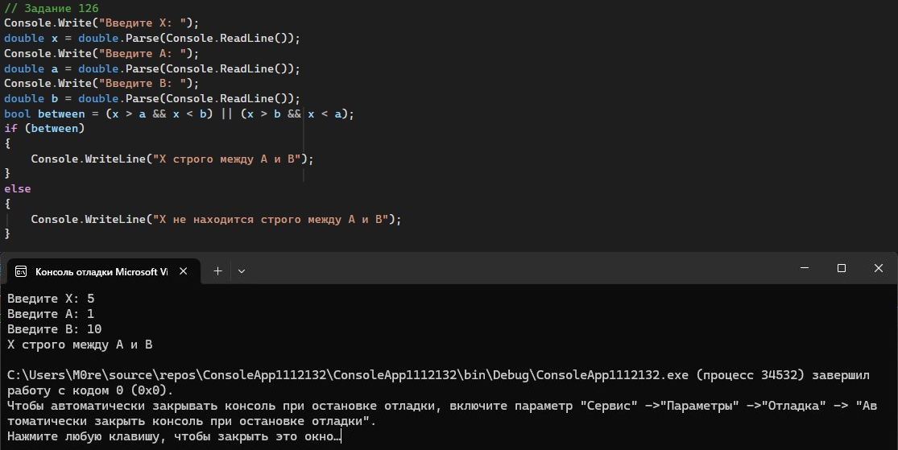

```csharp
using System;

namespace _3_practic
{
    internal class Program
    {
        static void Main(string[] args)
        {
            Console.Write("Введите X: ");
            double x = double.Parse(Console.ReadLine());
            Console.Write("Введите A: ");
            double a = double.Parse(Console.ReadLine());
            Console.Write("Введите B: ");
            double b = double.Parse(Console.ReadLine());
            bool between = (x > a && x < b) || (x > b && x < a);
            if (between)
            {
                Console.WriteLine("X строго между A и B");
            }
            else
            {
                Console.WriteLine("X не находится строго между A и B");
            }
        }
    }
}
```

---

№ 127. Даны два целых числа. Проверить, имеют ли они одинаковый знак (оба положительные или оба отрицательные).

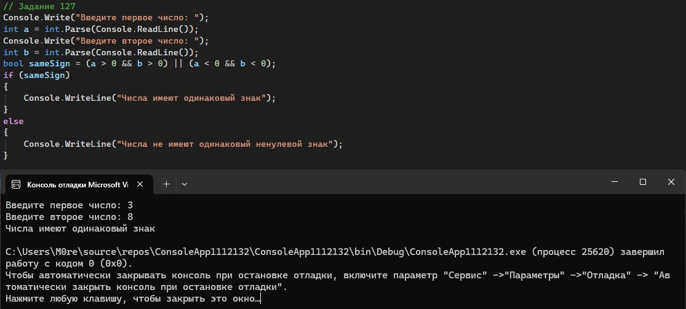

```csharp
using System;

namespace _3_practic
{
    internal class Program
    {
        static void Main(string[] args)
        {
            Console.Write("Введите первое число: ");
            int a = int.Parse(Console.ReadLine());
            Console.Write("Введите второе число: ");
            int b = int.Parse(Console.ReadLine());
            bool sameSign = (a > 0 && b > 0) || (a < 0 && b < 0);
            if (sameSign)
            {
                Console.WriteLine("Числа имеют одинаковый знак");
            }
            else
            {
                Console.WriteLine("Числа не имеют одинаковый ненулевой знак");
            }
        }
    }
}
```

---

№ 128. Даны шахматные координаты двух клеток $(x_1, y_1)$ и $(x_2, y_2)$ от 1 до 8. Определить, угрожает ли ладья с первой клетки фигуре на второй клетке (совпадает либо строка, либо столбец).

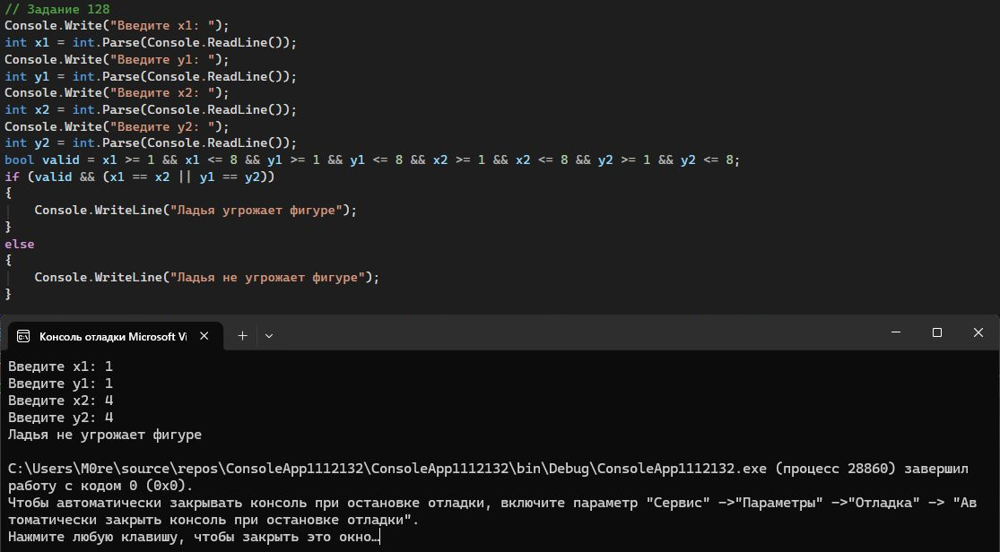

```csharp
using System;

namespace _3_practic
{
    internal class Program
    {
        static void Main(string[] args)
        {
            Console.Write("Введите x1: ");
            int x1 = int.Parse(Console.ReadLine());
            Console.Write("Введите y1: ");
            int y1 = int.Parse(Console.ReadLine());
            Console.Write("Введите x2: ");
            int x2 = int.Parse(Console.ReadLine());
            Console.Write("Введите y2: ");
            int y2 = int.Parse(Console.ReadLine());
            bool valid = x1 >= 1 && x1 <= 8 && y1 >= 1 && y1 <= 8 && x2 >= 1 && x2 <= 8 && y2 >= 1 && y2 <= 8;
            if (valid && (x1 == x2 || y1 == y2))
            {
                Console.WriteLine("Ладья угрожает фигуре");
            }
            else
            {
                Console.WriteLine("Ладья не угрожает фигуре");
            }
        }
    }
}
```

---

№ 129. Для двух клеток шахматной доски определить, угрожает ли слон (разность координат по модулю одинакова).

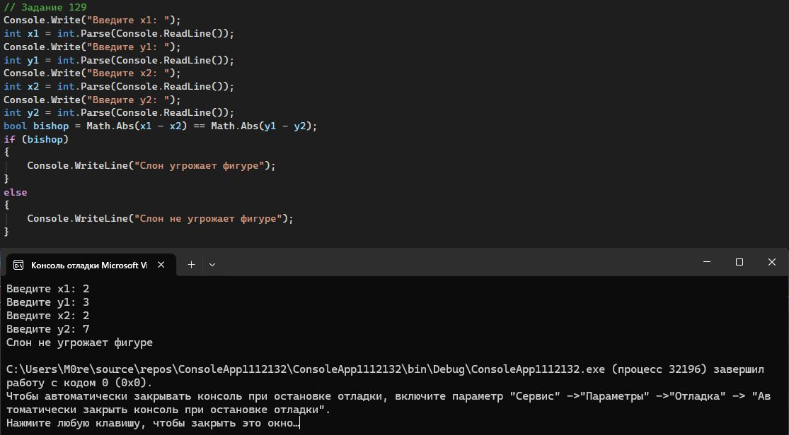

```csharp
using System;

namespace _3_practic
{
    internal class Program
    {
        static void Main(string[] args)
        {
            Console.Write("Введите x1: ");
            int x1 = int.Parse(Console.ReadLine());
            Console.Write("Введите y1: ");
            int y1 = int.Parse(Console.ReadLine());
            Console.Write("Введите x2: ");
            int x2 = int.Parse(Console.ReadLine());
            Console.Write("Введите y2: ");
            int y2 = int.Parse(Console.ReadLine());
            bool bishop = Math.Abs(x1 - x2) == Math.Abs(y1 - y2);
            if (bishop)
            {
                Console.WriteLine("Слон угрожает фигуре");
            }
            else
            {
                Console.WriteLine("Слон не угрожает фигуре");
            }
        }
    }
}
```

---

№ 130. Для двух клеток шахматной доски определить, угрожает ли ферзь (объединение логики ладьи и слона).

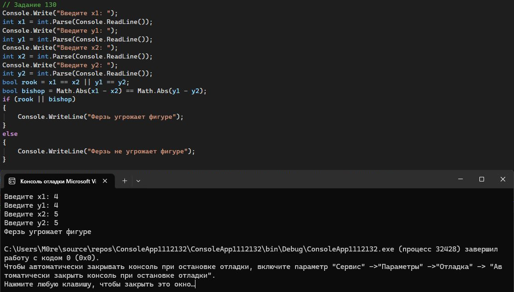

```csharp
using System;

namespace _3_practic
{
    internal class Program
    {
        static void Main(string[] args)
        {
            Console.Write("Введите x1: ");
            int x1 = int.Parse(Console.ReadLine());
            Console.Write("Введите y1: ");
            int y1 = int.Parse(Console.ReadLine());
            Console.Write("Введите x2: ");
            int x2 = int.Parse(Console.ReadLine());
            Console.Write("Введите y2: ");
            int y2 = int.Parse(Console.ReadLine());
            bool rook = x1 == x2 || y1 == y2;
            bool bishop = Math.Abs(x1 - x2) == Math.Abs(y1 - y2);
            if (rook || bishop)
            {
                Console.WriteLine("Ферзь угрожает фигуре");
            }
            else
            {
                Console.WriteLine("Ферзь не угрожает фигуре");
            }
        }
    }
}
```

---

№ 131. Для двух клеток определить, может ли конь пойти с одной на другую.

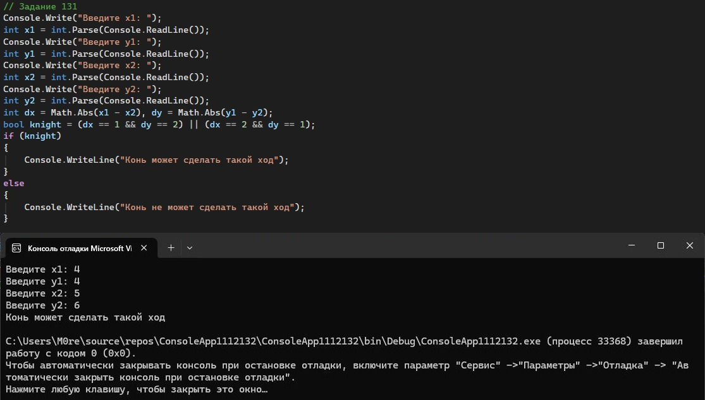

```csharp
using System;

namespace _3_practic
{
    internal class Program
    {
        static void Main(string[] args)
        {
            Console.Write("Введите x1: ");
            int x1 = int.Parse(Console.ReadLine());
            Console.Write("Введите y1: ");
            int y1 = int.Parse(Console.ReadLine());
            Console.Write("Введите x2: ");
            int x2 = int.Parse(Console.ReadLine());
            Console.Write("Введите y2: ");
            int y2 = int.Parse(Console.ReadLine());
            int dx = Math.Abs(x1 - x2), dy = Math.Abs(y1 - y2);
            bool knight = (dx == 1 && dy == 2) || (dx == 2 && dy == 1);
            if (knight)
            {
                Console.WriteLine("Конь может сделать такой ход");
            }
            else
            {
                Console.WriteLine("Конь не может сделать такой ход");
            }
        }
    }
}
```

---

№ 132. Для двух клеток шахматной доски проверить, одинакового ли они цвета.

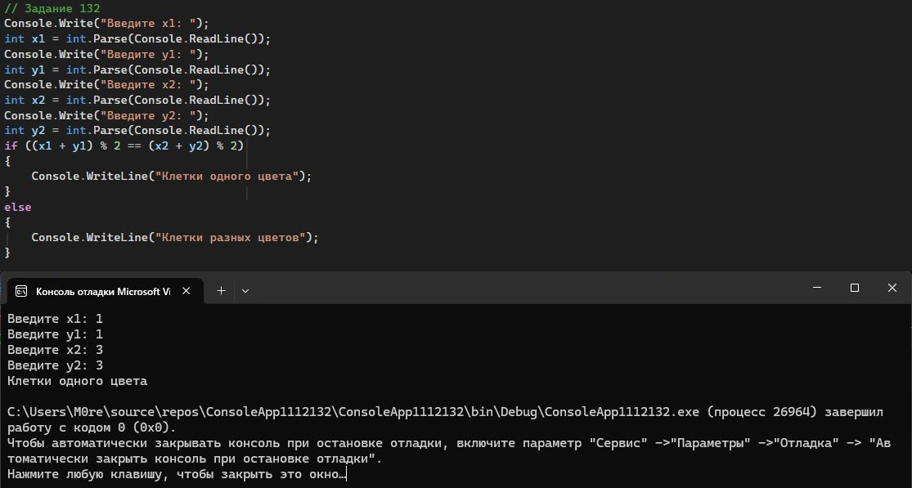

```csharp
using System;

namespace _3_practic
{
    internal class Program
    {
        static void Main(string[] args)
        {
            Console.Write("Введите x1: ");
            int x1 = int.Parse(Console.ReadLine());
            Console.Write("Введите y1: ");
            int y1 = int.Parse(Console.ReadLine());
            Console.Write("Введите x2: ");
            int x2 = int.Parse(Console.ReadLine());
            Console.Write("Введите y2: ");
            int y2 = int.Parse(Console.ReadLine());
            if ((x1 + y1) % 2 == (x2 + y2) % 2)
            {
                Console.WriteLine("Клетки одного цвета");
            }
            else
            {
                Console.WriteLine("Клетки разных цветов");
            }
        }
    }
}
```

---

№ 133. Ввести рост и вес кандидата в космонавты. Проверить соответствие: рост от 160 до 190 см И вес от 50 до 90 кг.

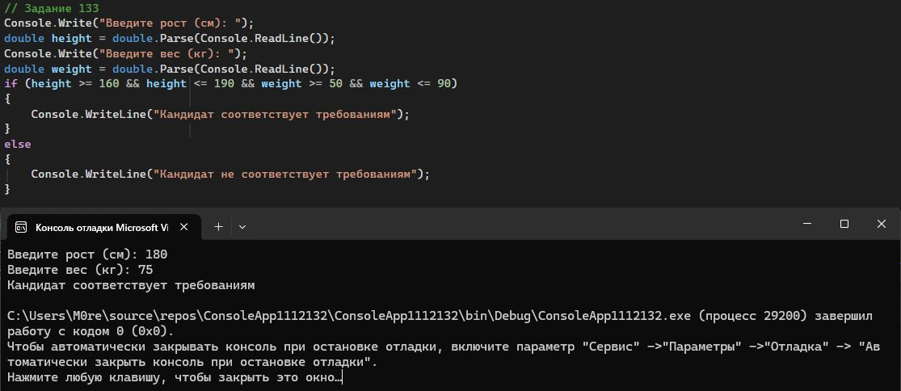

```csharp
using System;

namespace _3_practic
{
    internal class Program
    {
        static void Main(string[] args)
        {
            Console.Write("Введите рост (см): ");
            double height = double.Parse(Console.ReadLine());
            Console.Write("Введите вес (кг): ");
            double weight = double.Parse(Console.ReadLine());
            if (height >= 160 && height <= 190 && weight >= 50 && weight <= 90)
            {
                Console.WriteLine("Кандидат соответствует требованиям");
            }
            else
            {
                Console.WriteLine("Кандидат не соответствует требованиям");
            }
        }
    }
}
```

---

№ 134. Дано натуральное число $N$. Проверить, является ли оно четным двузначным числом.

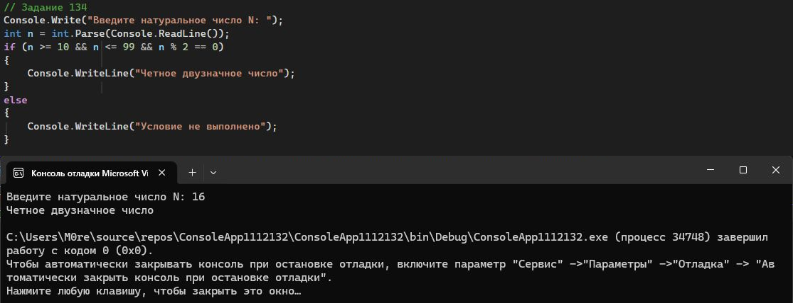

```csharp
using System;

namespace _3_practic
{
    internal class Program
    {
        static void Main(string[] args)
        {
            Console.Write("Введите натуральное число N: ");
            int n = int.Parse(Console.ReadLine());
            if (n >= 10 && n <= 99 && n % 2 == 0)
            {
                Console.WriteLine("Четное двузначное число");
            }
            else
            {
                Console.WriteLine("Условие не выполнено");
            }
        }
    }
}
```

---

№ 135. Дано натуральное число. Проверить, является ли оно нечетным трехзначным числом.

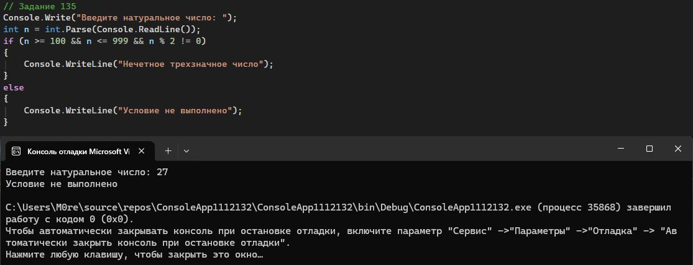

```csharp
using System;

namespace _3_practic
{
    internal class Program
    {
        static void Main(string[] args)
        {
            Console.Write("Введите натуральное число: ");
            int n = int.Parse(Console.ReadLine());
            if (n >= 100 && n <= 999 && n % 2 != 0)
            {
                Console.WriteLine("Нечетное трехзначное число");
            }
            else
            {
                Console.WriteLine("Условие не выполнено");
            }
        }
    }
}
```

---

№ 136. Ввести результаты двух экзаменов (математика и информатика). Абитуриент зачислен, если сумма баллов $\ge 150$ И по каждому предмету не менее 50 баллов.

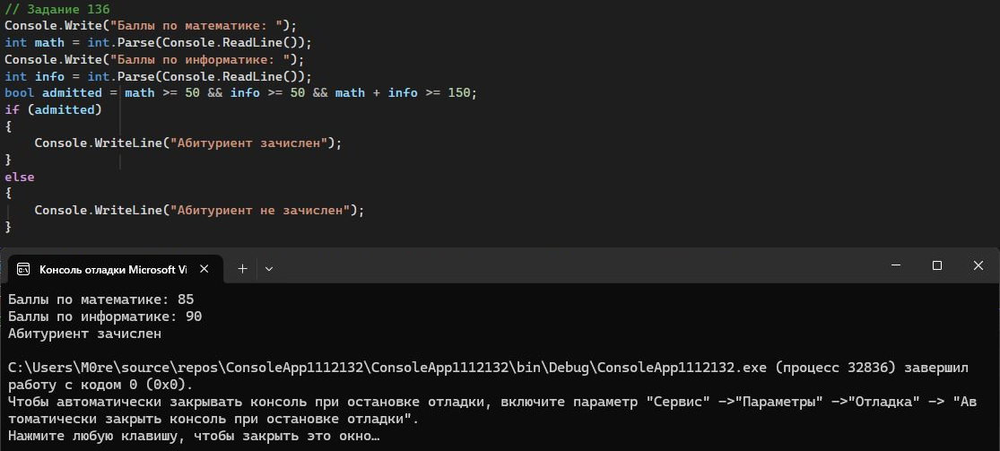

```csharp
using System;

namespace _3_practic
{
    internal class Program
    {
        static void Main(string[] args)
        {
            Console.Write("Баллы по математике: ");
            int math = int.Parse(Console.ReadLine());
            Console.Write("Баллы по информатике: ");
            int info = int.Parse(Console.ReadLine());
            bool admitted = math >= 50 && info >= 50 && math + info >= 150;
            if (admitted)
            {
                Console.WriteLine("Абитуриент зачислен");
            }
            else
            {
                Console.WriteLine("Абитуриент не зачислен");
            }
        }
    }
}
```

---

№ 137. Проверить, лежит ли точка с координатами $(X, Y)$ в круговом кольце с внутренним радиусом $R_1$ и внешним $R_2$.

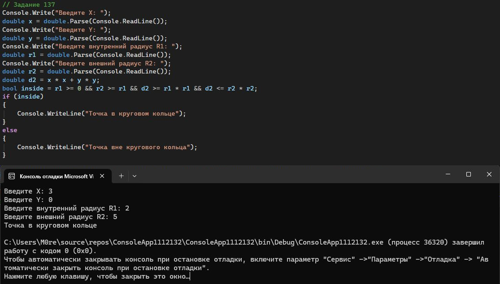

```csharp
using System;

namespace _3_practic
{
    internal class Program
    {
        static void Main(string[] args)
        {
            Console.Write("Введите X: ");
            double x = double.Parse(Console.ReadLine());
            Console.Write("Введите Y: ");
            double y = double.Parse(Console.ReadLine());
            Console.Write("Введите внутренний радиус R1: ");
            double r1 = double.Parse(Console.ReadLine());
            Console.Write("Введите внешний радиус R2: ");
            double r2 = double.Parse(Console.ReadLine());
            double d2 = x * x + y * y;
            bool inside = r1 >= 0 && r2 >= r1 && d2 >= r1 * r1 && d2 <= r2 * r2;
            if (inside)
            {
                Console.WriteLine("Точка в круговом кольце");
            }
            else
            {
                Console.WriteLine("Точка вне кругового кольца");
            }
        }
    }
}
```

---

№ 138. Ввести статус билета (true/false) и наличие багажа. Вывести: требуется ли дополнительная оплата багажа. Примечание: исходное условие не задаёт все числовые значения; здесь использованы условные учебные значения.

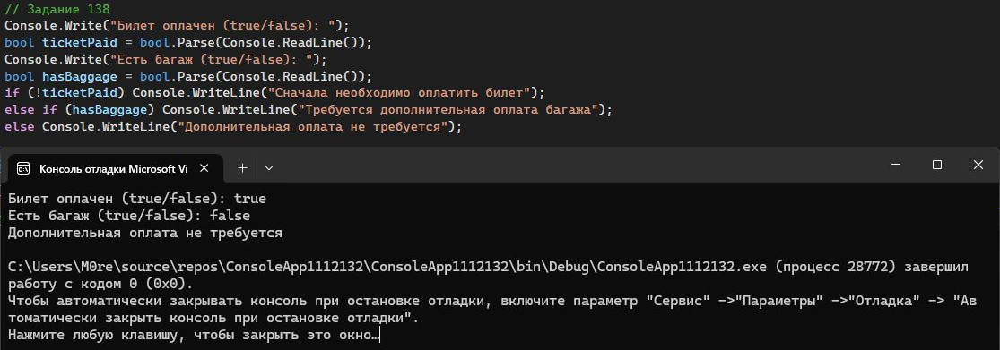

```csharp
using System;

namespace _3_practic
{
    internal class Program
    {
        static void Main(string[] args)
        {
            Console.Write("Билет оплачен (true/false): ");
            bool ticketPaid = bool.Parse(Console.ReadLine());
            Console.Write("Есть багаж (true/false): ");
            bool hasBaggage = bool.Parse(Console.ReadLine());
            if (!ticketPaid) Console.WriteLine("Сначала необходимо оплатить билет");
            else if (hasBaggage) Console.WriteLine("Требуется дополнительная оплата багажа");
            else Console.WriteLine("Дополнительная оплата не требуется");
        }
    }
}
```

---

№ 139. Дано четырехзначное число. Проверить, читается ли оно одинаково слева направо и справа налево (палиндром).

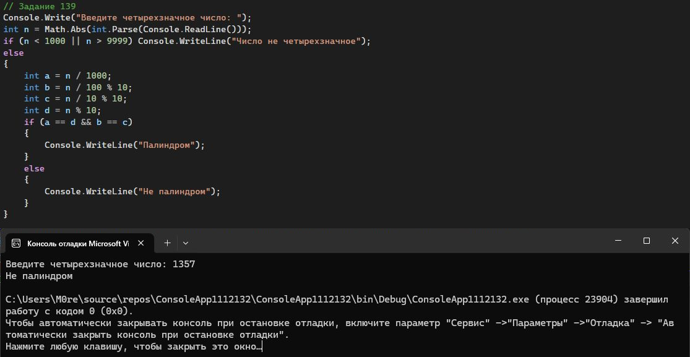

```csharp
using System;

namespace _3_practic
{
    internal class Program
    {
        static void Main(string[] args)
        {
            Console.Write("Введите четырехзначное число: ");
            int n = Math.Abs(int.Parse(Console.ReadLine()));
            if (n < 1000 || n > 9999) Console.WriteLine("Число не четырехзначное");
            else
            {
                int a = n / 1000;
                int b = n / 100 % 10;
                int c = n / 10 % 10;
                int d = n % 10;
                if (a == d && b == c)
                {
                    Console.WriteLine("Палиндром");
                }
                else
                {
                    Console.WriteLine("Не палиндром");
                }
            }
        }
    }
}
```

---

№ 140. Ввести напряжение сети (Вольты) и частоту (Гц). Норма: $220\text{ В} \pm 10\%$ И частота $50\text{ Гц} \pm 1\text{ Гц}$. Вывести статус стабильности сети.

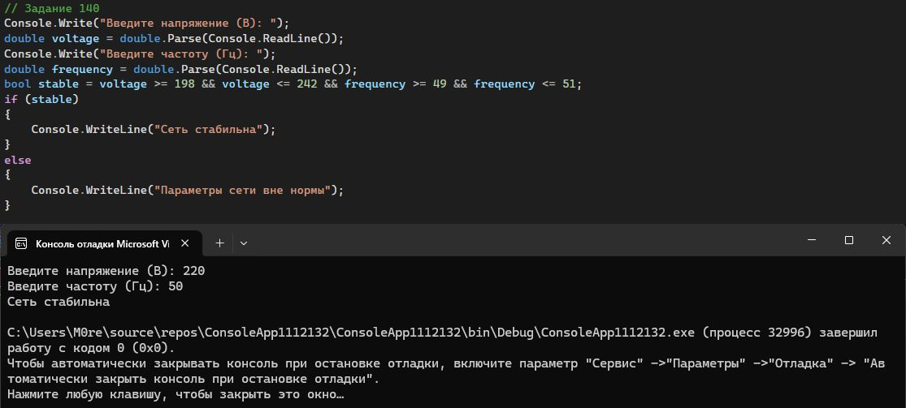

```csharp
using System;

namespace _3_practic
{
    internal class Program
    {
        static void Main(string[] args)
        {
            Console.Write("Введите напряжение (В): ");
            double voltage = double.Parse(Console.ReadLine());
            Console.Write("Введите частоту (Гц): ");
            double frequency = double.Parse(Console.ReadLine());
            bool stable = voltage >= 198 && voltage <= 242 && frequency >= 49 && frequency <= 51;
            if (stable)
            {
                Console.WriteLine("Сеть стабильна");
            }
            else
            {
                Console.WriteLine("Параметры сети вне нормы");
            }
        }
    }
}
```

---

№ 141. Ввести признак наличия прав (bool), страховки (bool) и трезвости водителя (bool). Разрешить выезд только при соблюдении всех трех факторов.

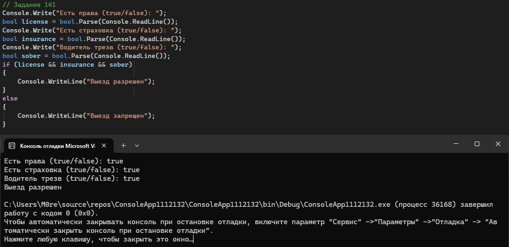

```csharp
using System;

namespace _3_practic
{
    internal class Program
    {
        static void Main(string[] args)
        {
            Console.Write("Есть права (true/false): ");
            bool license = bool.Parse(Console.ReadLine());
            Console.Write("Есть страховка (true/false): ");
            bool insurance = bool.Parse(Console.ReadLine());
            Console.Write("Водитель трезв (true/false): ");
            bool sober = bool.Parse(Console.ReadLine());
            if (license && insurance && sober)
            {
                Console.WriteLine("Выезд разрешен");
            }
            else
            {
                Console.WriteLine("Выезд запрещен");
            }
        }
    }
}
```

---

№ 142. Проверить, делится ли введенное число на 4 ИЛИ на 7, но НЕ делится на 28.

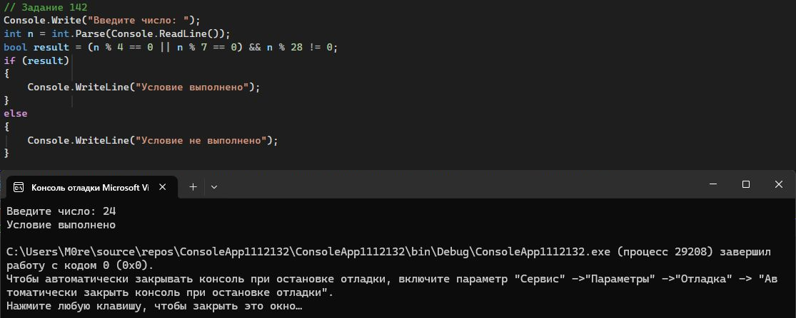

```csharp
using System;

namespace _3_practic
{
    internal class Program
    {
        static void Main(string[] args)
        {
            Console.Write("Введите число: ");
            int n = int.Parse(Console.ReadLine());
            bool result = (n % 4 == 0 || n % 7 == 0) && n % 28 != 0;
            if (result)
            {
                Console.WriteLine("Условие выполнено");
            }
            else
            {
                Console.WriteLine("Условие не выполнено");
            }
        }
    }
}
```

---

№ 143. Ввести текущий месяц и температуру. Вывести аномалию, если месяц летний (6, 7, 8), а температура ниже нуля.

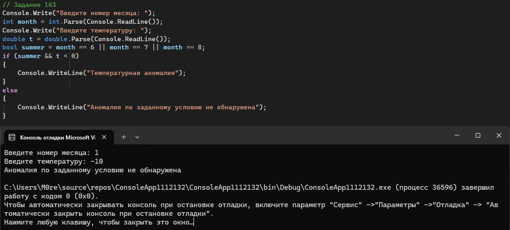

```csharp
using System;

namespace _3_practic
{
    internal class Program
    {
        static void Main(string[] args)
        {
            Console.Write("Введите номер месяца: ");
            int month = int.Parse(Console.ReadLine());
            Console.Write("Введите температуру: ");
            double t = double.Parse(Console.ReadLine());
            bool summer = month == 6 || month == 7 || month == 8;
            if (summer && t < 0)
            {
                Console.WriteLine("Температурная аномалия");
            }
            else
            {
                Console.WriteLine("Аномалия по заданному условию не обнаружена");
            }
        }
    }
}
```

---

№ 144. Даны три логические переменные $A$, $B$, $C$. Реализовать проверку формулы мажоритарного клапана: «Истинно, если хотя бы две из трех переменных истинны».

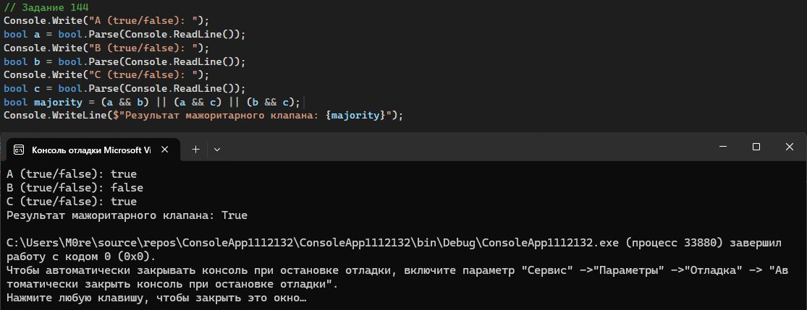

```csharp
using System;

namespace _3_practic
{
    internal class Program
    {
        static void Main(string[] args)
        {
            Console.Write("A (true/false): ");
            bool a = bool.Parse(Console.ReadLine());
            Console.Write("B (true/false): ");
            bool b = bool.Parse(Console.ReadLine());
            Console.Write("C (true/false): ");
            bool c = bool.Parse(Console.ReadLine());
            bool majority = (a && b) || (a && c) || (b && c);
            Console.WriteLine($"Результат мажоритарного клапана: {majority}");
        }
    }
}
```

---

№ 145. Даны три вещественных числа. Проверить, могут ли они являться длинами сторон тупоугольного треугольника.

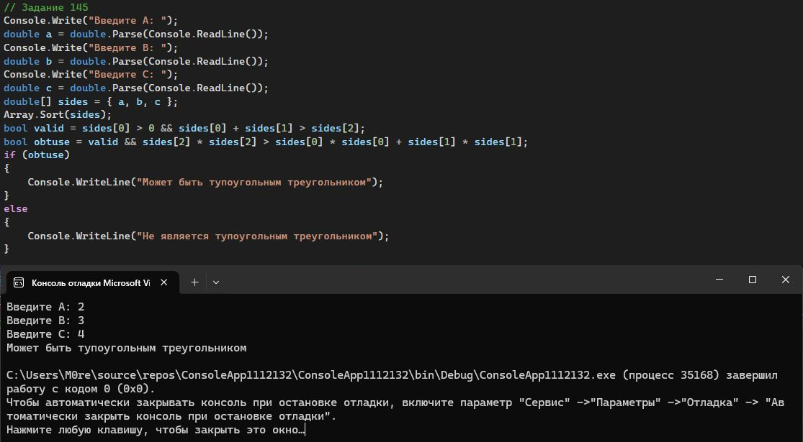

```csharp
using System;

namespace _3_practic
{
    internal class Program
    {
        static void Main(string[] args)
        {
            Console.Write("Введите A: ");
            double a = double.Parse(Console.ReadLine());
            Console.Write("Введите B: ");
            double b = double.Parse(Console.ReadLine());
            Console.Write("Введите C: ");
            double c = double.Parse(Console.ReadLine());
            double[] sides = { a, b, c };
            Array.Sort(sides);
            bool valid = sides[0] > 0 && sides[0] + sides[1] > sides[2];
            bool obtuse = valid && sides[2] * sides[2] > sides[0] * sides[0] + sides[1] * sides[1];
            if (obtuse)
            {
                Console.WriteLine("Может быть тупоугольным треугольником");
            }
            else
            {
                Console.WriteLine("Не является тупоугольным треугольником");
            }
        }
    }
}
```

---

№ 146. Даны три вещественных числа. Проверить, могут ли они являться длинами сторон остроугольного треугольника.


```csharp
using System;

namespace _3_practic
{
    internal class Program
    {
        static void Main(string[] args)
        {
            Console.Write("Введите A: ");
            double a = double.Parse(Console.ReadLine());
            Console.Write("Введите B: ");
            double b = double.Parse(Console.ReadLine());
            Console.Write("Введите C: ");
            double c = double.Parse(Console.ReadLine());
            double[] sides = { a, b, c };
            Array.Sort(sides);
            bool valid = sides[0] > 0 && sides[0] + sides[1] > sides[2];
            bool acute = valid && sides[2] * sides[2] < sides[0] * sides[0] + sides[1] * sides[1];
            if (acute)
            {
                Console.WriteLine("Может быть остроугольным треугольником");
            }
            else
            {
                Console.WriteLine("Не является остроугольным треугольником");
            }
        }
    }
}
```

---

№ 147. Ввести время (часы и минуты). Проверить, попадает ли указанное время в интервал тихого часа (с 13:00 до 15:00).

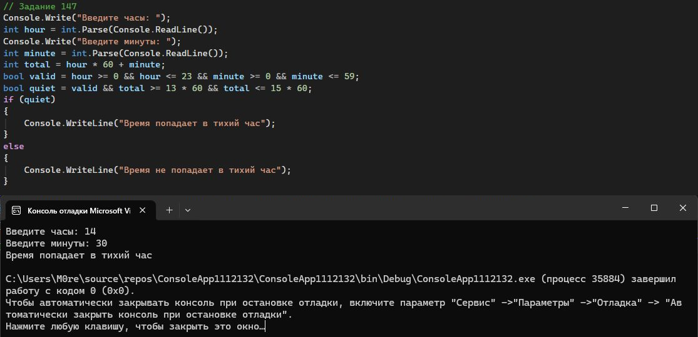

```csharp
using System;

namespace _3_practic
{
    internal class Program
    {
        static void Main(string[] args)
        {
            Console.Write("Введите часы: ");
            int hour = int.Parse(Console.ReadLine());
            Console.Write("Введите минуты: ");
            int minute = int.Parse(Console.ReadLine());
            int total = hour * 60 + minute;
            bool valid = hour >= 0 && hour <= 23 && minute >= 0 && minute <= 59;
            bool quiet = valid && total >= 13 * 60 && total <= 15 * 60;
            if (quiet)
            {
                Console.WriteLine("Время попадает в тихий час");
            }
            else
            {
                Console.WriteLine("Время не попадает в тихий час");
            }
        }
    }
}
```

---

№ 148. Проверить, что все цифры введенного трехзначного числа различны между собой.

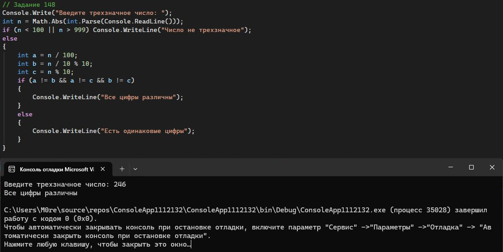

```csharp
using System;

namespace _3_practic
{
    internal class Program
    {
        static void Main(string[] args)
        {
            Console.Write("Введите трехзначное число: ");
            int n = Math.Abs(int.Parse(Console.ReadLine()));
            if (n < 100 || n > 999) Console.WriteLine("Число не трехзначное");
            else
            {
                int a = n / 100;
                int b = n / 10 % 10;
                int c = n % 10;
                if (a != b && a != c && b != c)
                {
                    Console.WriteLine("Все цифры различны");
                }
                else
                {
                    Console.WriteLine("Есть одинаковые цифры");
                }
            }
        }
    }
}
```

---

№ 149. Ввести логическое значение двух кнопок пульта. Станок запускается только при одновременном зажатии обеих кнопок (защита от случайного пуска).

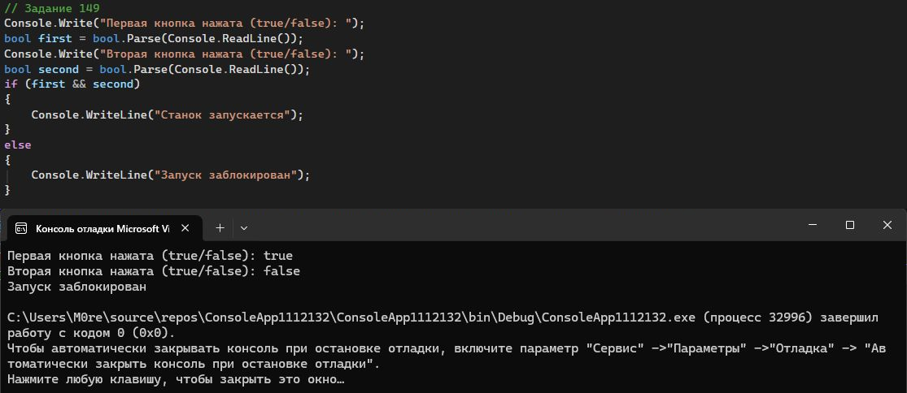

```csharp
using System;

namespace _3_practic
{
    internal class Program
    {
        static void Main(string[] args)
        {
            Console.Write("Первая кнопка нажата (true/false): ");
            bool first = bool.Parse(Console.ReadLine());
            Console.Write("Вторая кнопка нажата (true/false): ");
            bool second = bool.Parse(Console.ReadLine());
            if (first && second)
            {
                Console.WriteLine("Станок запускается");
            }
            else
            {
                Console.WriteLine("Запуск заблокирован");
            }
        }
    }
}
```

---

№ 150. Проверить, лежит ли точка $(X, Y)$ ниже прямой $Y = 2X + 1$ и выше параболы $Y = X^2$.

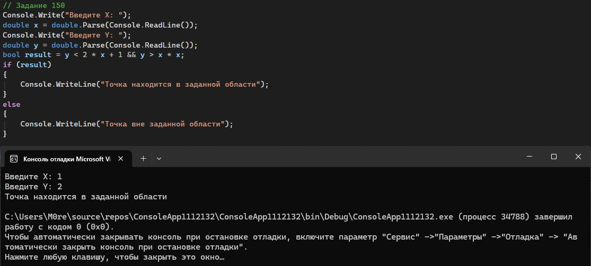

```csharp
using System;

namespace _3_practic
{
    internal class Program
    {
        static void Main(string[] args)
        {
            Console.Write("Введите X: ");
            double x = double.Parse(Console.ReadLine());
            Console.Write("Введите Y: ");
            double y = double.Parse(Console.ReadLine());
            bool result = y < 2 * x + 1 && y > x * x;
            if (result)
            {
                Console.WriteLine("Точка находится в заданной области");
            }
            else
            {
                Console.WriteLine("Точка вне заданной области");
            }
        }
    }
}
```

---

### Раздел 4. Оператор выбора switch
---
№ 151. Ввести номер дня недели (1–7). Вывести его словесное название на русском языке.

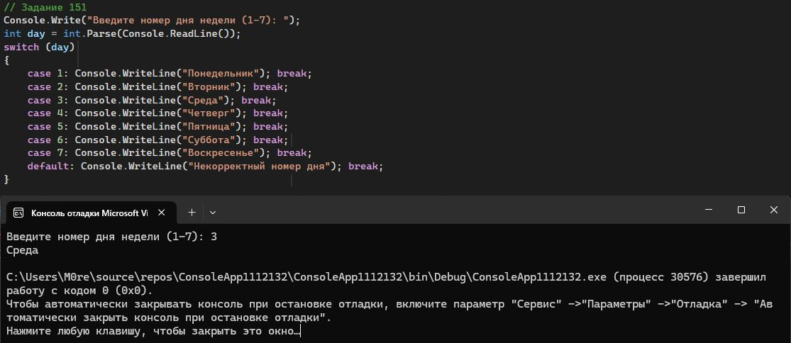

```csharp
using System;

namespace _3_practic
{
    internal class Program
    {
        static void Main(string[] args)
        {
            Console.Write("Введите номер дня недели (1-7): ");
            int day = int.Parse(Console.ReadLine());
            switch (day)
            {
                case 1: Console.WriteLine("Понедельник"); break;
                case 2: Console.WriteLine("Вторник"); break;
                case 3: Console.WriteLine("Среда"); break;
                case 4: Console.WriteLine("Четверг"); break;
                case 5: Console.WriteLine("Пятница"); break;
                case 6: Console.WriteLine("Суббота"); break;
                case 7: Console.WriteLine("Воскресенье"); break;
                default: Console.WriteLine("Некорректный номер дня"); break;
            }
        }
    }
}
```

---

№ 152. Ввести номер дня недели (1–7). Вывести, является ли день рабочим («Будни») или нерабочим («Выходной»).

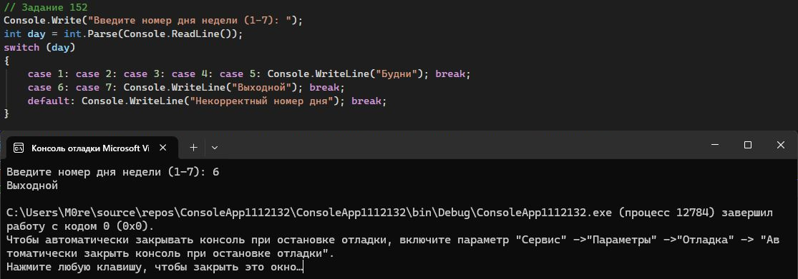

```csharp
using System;

namespace _3_practic
{
    internal class Program
    {
        static void Main(string[] args)
        {
            Console.Write("Введите номер дня недели (1-7): ");
            int day = int.Parse(Console.ReadLine());
            switch (day)
            {
                case 1: case 2: case 3: case 4: case 5: Console.WriteLine("Будни"); break;
                case 6: case 7: Console.WriteLine("Выходной"); break;
                default: Console.WriteLine("Некорректный номер дня"); break;
            }
        }
    }
}
```

---

№ 153. Ввести номер месяца (1–12). Вывести название месяца.

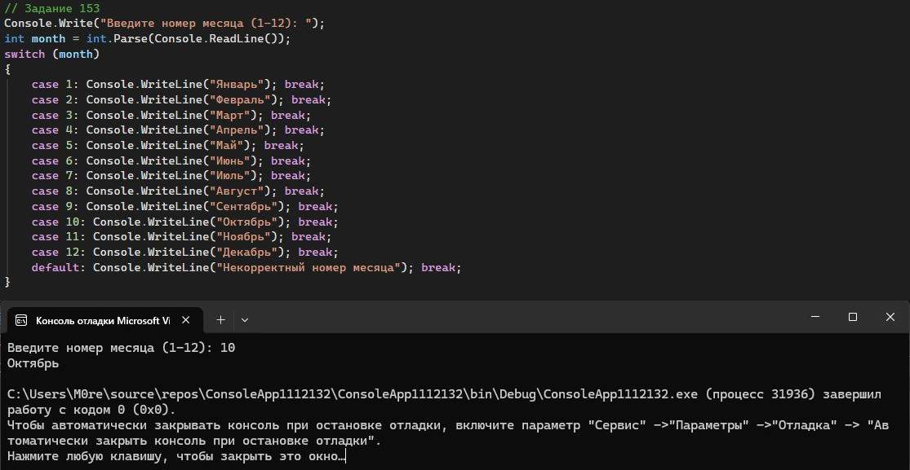

```csharp
using System;

namespace _3_practic
{
    internal class Program
    {
        static void Main(string[] args)
        {
            Console.Write("Введите номер месяца (1-12): ");
            int month = int.Parse(Console.ReadLine());
            switch (month)
            {
                case 1: Console.WriteLine("Январь"); break;
                case 2: Console.WriteLine("Февраль"); break;
                case 3: Console.WriteLine("Март"); break;
                case 4: Console.WriteLine("Апрель"); break;
                case 5: Console.WriteLine("Май"); break;
                case 6: Console.WriteLine("Июнь"); break;
                case 7: Console.WriteLine("Июль"); break;
                case 8: Console.WriteLine("Август"); break;
                case 9: Console.WriteLine("Сентябрь"); break;
                case 10: Console.WriteLine("Октябрь"); break;
                case 11: Console.WriteLine("Ноябрь"); break;
                case 12: Console.WriteLine("Декабрь"); break;
                default: Console.WriteLine("Некорректный номер месяца"); break;
            }
        }
    }
}
```

---

№ 154. Ввести номер месяца (1–12). Вывести количество дней в этом месяце (для невисокосного года).

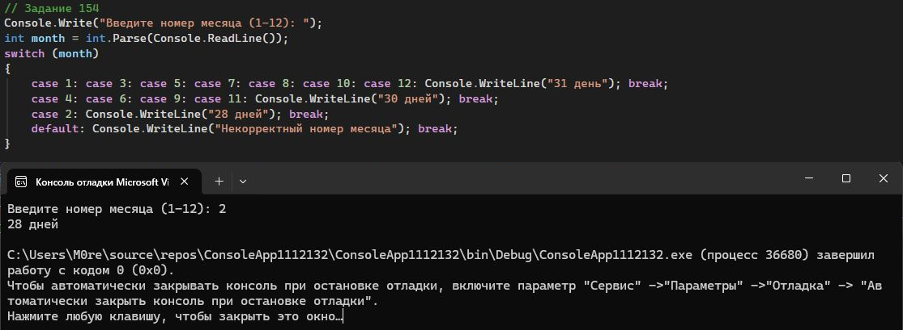

```csharp
using System;

namespace _3_practic
{
    internal class Program
    {
        static void Main(string[] args)
        {
            Console.Write("Введите номер месяца (1-12): ");
            int month = int.Parse(Console.ReadLine());
            switch (month)
            {
                case 1: case 3: case 5: case 7: case 8: case 10: case 12: Console.WriteLine("31 день"); break;
                case 4: case 6: case 9: case 11: Console.WriteLine("30 дней"); break;
                case 2: Console.WriteLine("28 дней"); break;
                default: Console.WriteLine("Некорректный номер месяца"); break;
            }
        }
    }
}
```

---

№ 155. Ввести номер месяца (1–12). Вывести название поры года («Зима», «Весна», «Лето», «Осень»).

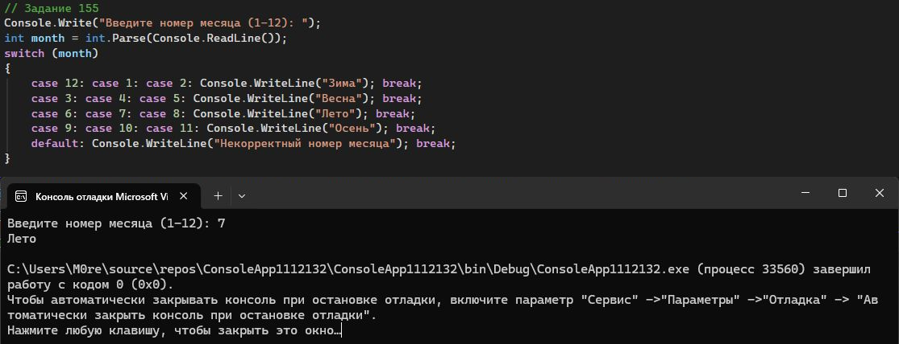

```csharp
using System;

namespace _3_practic
{
    internal class Program
    {
        static void Main(string[] args)
        {
            Console.Write("Введите номер месяца (1-12): ");
            int month = int.Parse(Console.ReadLine());
            switch (month)
            {
                case 12: case 1: case 2: Console.WriteLine("Зима"); break;
                case 3: case 4: case 5: Console.WriteLine("Весна"); break;
                case 6: case 7: case 8: Console.WriteLine("Лето"); break;
                case 9: case 10: case 11: Console.WriteLine("Осень"); break;
                default: Console.WriteLine("Некорректный номер месяца"); break;
            }
        }
    }
}
```

---

№ 156. Ввести оценку студента (1–5). Вывести текстовое описание: 1 — «Очень плохо», 2 — «Неудовлетворительно», 3 — «Удовлетворительно», 4 — «Хорошо», 5 — «Отлично».

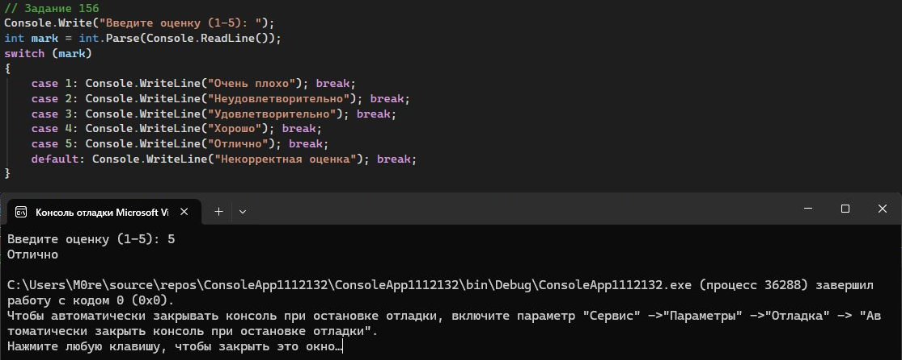

```csharp
using System;

namespace _3_practic
{
    internal class Program
    {
        static void Main(string[] args)
        {
            Console.Write("Введите оценку (1-5): ");
            int mark = int.Parse(Console.ReadLine());
            switch (mark)
            {
                case 1: Console.WriteLine("Очень плохо"); break;
                case 2: Console.WriteLine("Неудовлетворительно"); break;
                case 3: Console.WriteLine("Удовлетворительно"); break;
                case 4: Console.WriteLine("Хорошо"); break;
                case 5: Console.WriteLine("Отлично"); break;
                default: Console.WriteLine("Некорректная оценка"); break;
            }
        }
    }
}
```

---

№ 157. Реализовать простой калькулятор: ввести два вещественных числа и символ арифметической операции (`+`, `-`, `*`, `/`). Через `switch` выполнить вычисление. Предусмотреть защиту от деления на ноль.

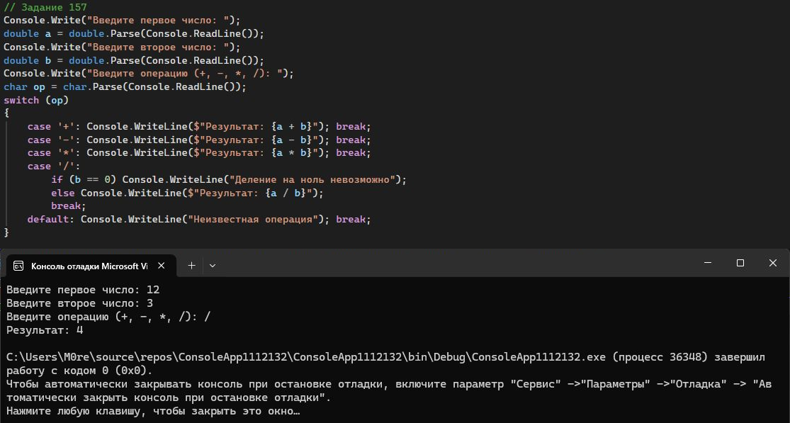

```csharp
using System;

namespace _3_practic
{
    internal class Program
    {
        static void Main(string[] args)
        {
            Console.Write("Введите первое число: ");
            double a = double.Parse(Console.ReadLine());
            Console.Write("Введите второе число: ");
            double b = double.Parse(Console.ReadLine());
            Console.Write("Введите операцию (+, -, *, /): ");
            char op = char.Parse(Console.ReadLine());
            switch (op)
            {
                case '+': Console.WriteLine($"Результат: {a + b}"); break;
                case '-': Console.WriteLine($"Результат: {a - b}"); break;
                case '*': Console.WriteLine($"Результат: {a * b}"); break;
                case '/':
                    if (b == 0) Console.WriteLine("Деление на ноль невозможно");
                    else Console.WriteLine($"Результат: {a / b}");
                    break;
                default: Console.WriteLine("Неизвестная операция"); break;
            }
        }
    }
}
```

---

№ 158. Ввести букву направления света (`N`, `S`, `W`, `E`). Вывести название направления («Север», «Юг», «Запад», «Восток»).

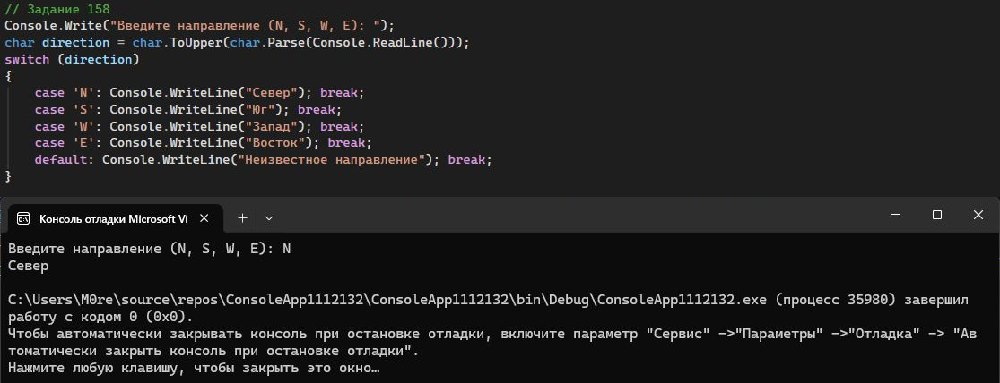

```csharp
using System;

namespace _3_practic
{
    internal class Program
    {
        static void Main(string[] args)
        {
            Console.Write("Введите направление (N, S, W, E): ");
            char direction = char.ToUpper(char.Parse(Console.ReadLine()));
            switch (direction)
            {
                case 'N': Console.WriteLine("Север"); break;
                case 'S': Console.WriteLine("Юг"); break;
                case 'W': Console.WriteLine("Запад"); break;
                case 'E': Console.WriteLine("Восток"); break;
                default: Console.WriteLine("Неизвестное направление"); break;
            }
        }
    }
}
```

---

№ 159. Ввести номер геометрической фигуры (1 — круг, 2 — прямоугольник, 3 — треугольник). Запросить соответствующие параметры фигуры и вычислить ее площадь.

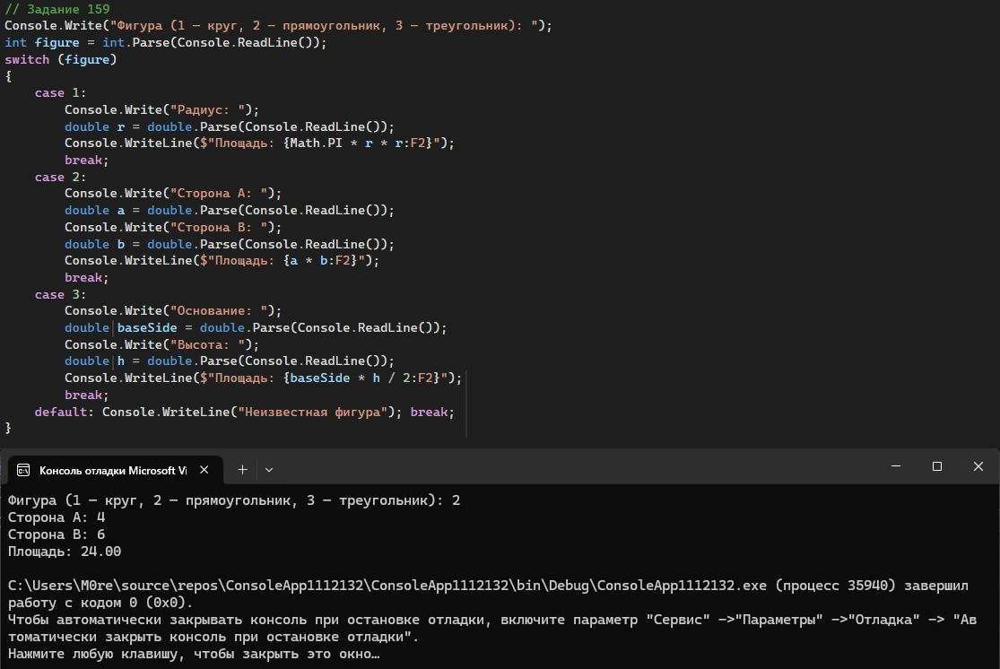

```csharp
using System;

namespace _3_practic
{
    internal class Program
    {
        static void Main(string[] args)
        {
            Console.Write("Фигура (1 — круг, 2 — прямоугольник, 3 — треугольник): ");
            int figure = int.Parse(Console.ReadLine());
            switch (figure)
            {
                case 1:
                    Console.Write("Радиус: ");
                    double r = double.Parse(Console.ReadLine());
                    Console.WriteLine($"Площадь: {Math.PI * r * r:F2}");
                    break;
                case 2:
                    Console.Write("Сторона A: ");
                    double a = double.Parse(Console.ReadLine());
                    Console.Write("Сторона B: ");
                    double b = double.Parse(Console.ReadLine());
                    Console.WriteLine($"Площадь: {a * b:F2}");
                    break;
                case 3:
                    Console.Write("Основание: ");
                    double baseSide = double.Parse(Console.ReadLine());
                    Console.Write("Высота: ");
                    double h = double.Parse(Console.ReadLine());
                    Console.WriteLine($"Площадь: {baseSide * h / 2:F2}");
                    break;
                default: Console.WriteLine("Неизвестная фигура"); break;
            }
        }
    }
}
```

---

№ 160. Ввести номер масти игральной карты (1 — пики, 2 — трефы, 3 — бубны, 4 — червы). Вывести название масти.

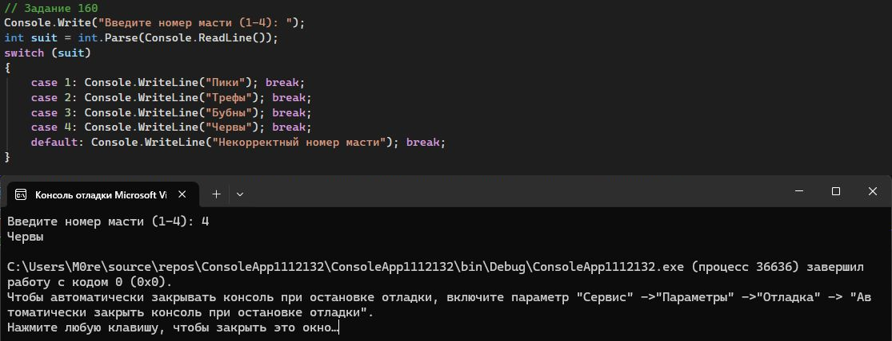

```csharp
using System;

namespace _3_practic
{
    internal class Program
    {
        static void Main(string[] args)
        {
            Console.Write("Введите номер масти (1-4): ");
            int suit = int.Parse(Console.ReadLine());
            switch (suit)
            {
                case 1: Console.WriteLine("Пики"); break;
                case 2: Console.WriteLine("Трефы"); break;
                case 3: Console.WriteLine("Бубны"); break;
                case 4: Console.WriteLine("Червы"); break;
                default: Console.WriteLine("Некорректный номер масти"); break;
            }
        }
    }
}
```

---

№ 161. Ввести достоинство карты (числа от 6 до 14). Вывести название: 11 — Валет, 12 — Дама, 13 — Король, 14 — Туз, остальные — по номиналу.

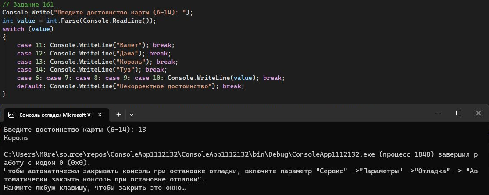

```csharp
using System;

namespace _3_practic
{
    internal class Program
    {
        static void Main(string[] args)
        {
            Console.Write("Введите достоинство карты (6-14): ");
            int value = int.Parse(Console.ReadLine());
            switch (value)
            {
                case 11: Console.WriteLine("Валет"); break;
                case 12: Console.WriteLine("Дама"); break;
                case 13: Console.WriteLine("Король"); break;
                case 14: Console.WriteLine("Туз"); break;
                case 6: case 7: case 8: case 9: case 10: Console.WriteLine(value); break;
                default: Console.WriteLine("Некорректное достоинство"); break;
            }
        }
    }
}
```

---

№ 162. Ввести буквенное обозначение размера одежды (`XS`, `S`, `M`, `L`, `XL`, `XXL`). Вывести соответствующий российский размер (42, 44, 46, 48, 50, 52).

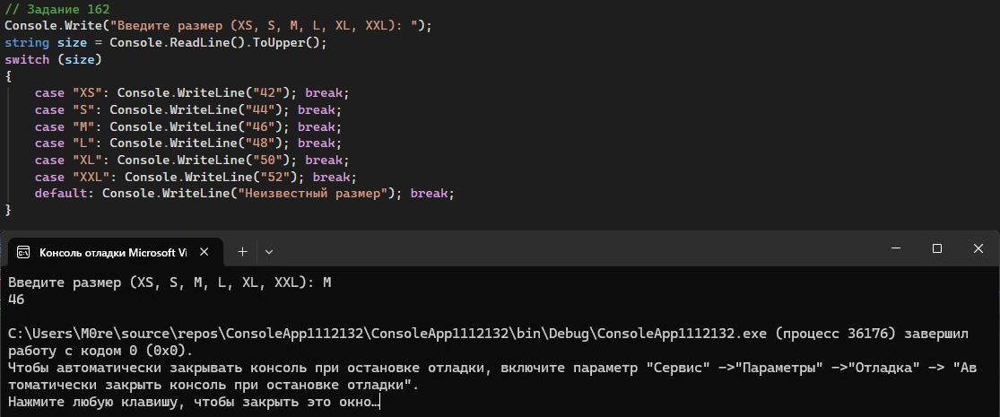

```csharp
using System;

namespace _3_practic
{
    internal class Program
    {
        static void Main(string[] args)
        {
            Console.Write("Введите размер (XS, S, M, L, XL, XXL): ");
            string size = Console.ReadLine().ToUpper();
            switch (size)
            {
                case "XS": Console.WriteLine("42"); break;
                case "S": Console.WriteLine("44"); break;
                case "M": Console.WriteLine("46"); break;
                case "L": Console.WriteLine("48"); break;
                case "XL": Console.WriteLine("50"); break;
                case "XXL": Console.WriteLine("52"); break;
                default: Console.WriteLine("Неизвестный размер"); break;
            }
        }
    }
}
```

---

№ 163. Ввести номер единицы длины (1 — дециметр, 2 — километр, 3 — метр, 4 — миллиметр, 5 — сантиметр) и длину отрезка в этих единицах. Перевести и вывести длину в метрах.

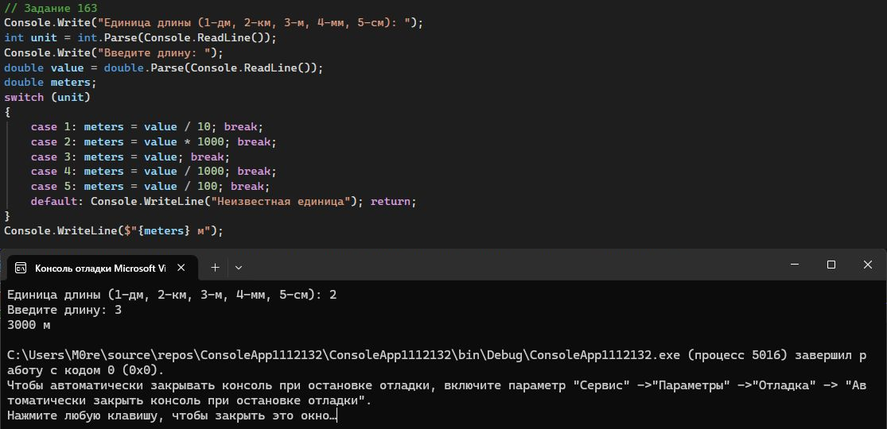

```csharp
using System;

namespace _3_practic
{
    internal class Program
    {
        static void Main(string[] args)
        {
            Console.Write("Единица длины (1-дм, 2-км, 3-м, 4-мм, 5-см): ");
            int unit = int.Parse(Console.ReadLine());
            Console.Write("Введите длину: ");
            double value = double.Parse(Console.ReadLine());
            double meters;
            switch (unit)
            {
                case 1: meters = value / 10; break;
                case 2: meters = value * 1000; break;
                case 3: meters = value; break;
                case 4: meters = value / 1000; break;
                case 5: meters = value / 100; break;
                default: Console.WriteLine("Неизвестная единица"); return;
            }
            Console.WriteLine($"{meters} м");
        }
    }
}
```

---

№ 164. Ввести номер единицы массы (1 — килограмм, 2 — миллиграмм, 3 — грамм, 4 — тонна, 5 — центнер) и массу. Вывести массу в килограммах.

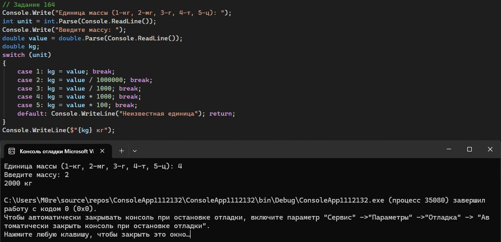

```csharp
using System;

namespace _3_practic
{
    internal class Program
    {
        static void Main(string[] args)
        {
            Console.Write("Единица массы (1-кг, 2-мг, 3-г, 4-т, 5-ц): ");
            int unit = int.Parse(Console.ReadLine());
            Console.Write("Введите массу: ");
            double value = double.Parse(Console.ReadLine());
            double kg;
            switch (unit)
            {
                case 1: kg = value; break;
                case 2: kg = value / 1000000; break;
                case 3: kg = value / 1000; break;
                case 4: kg = value * 1000; break;
                case 5: kg = value * 100; break;
                default: Console.WriteLine("Неизвестная единица"); return;
            }
            Console.WriteLine($"{kg} кг");
        }
    }
}
```

---

№ 165. Ввести код ошибки HTTP (200, 301, 400, 403, 404, 500, 502). Вывести текстовую расшифровку статуса.

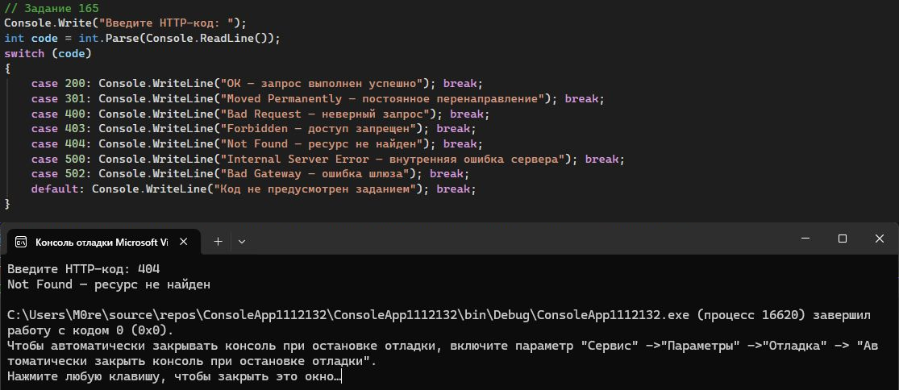

```csharp
using System;

namespace _3_practic
{
    internal class Program
    {
        static void Main(string[] args)
        {
            Console.Write("Введите HTTP-код: ");
            int code = int.Parse(Console.ReadLine());
            switch (code)
            {
                case 200: Console.WriteLine("OK — запрос выполнен успешно"); break;
                case 301: Console.WriteLine("Moved Permanently — постоянное перенаправление"); break;
                case 400: Console.WriteLine("Bad Request — неверный запрос"); break;
                case 403: Console.WriteLine("Forbidden — доступ запрещен"); break;
                case 404: Console.WriteLine("Not Found — ресурс не найден"); break;
                case 500: Console.WriteLine("Internal Server Error — внутренняя ошибка сервера"); break;
                case 502: Console.WriteLine("Bad Gateway — ошибка шлюза"); break;
                default: Console.WriteLine("Код не предусмотрен заданием"); break;
            }
        }
    }
}
```

---

№ 166. Ввести код валюты (USD, EUR, CNY, RUB). Вывести полное наименование («Доллар США», «Евро», «Китайский юань», «Российский рубль»).

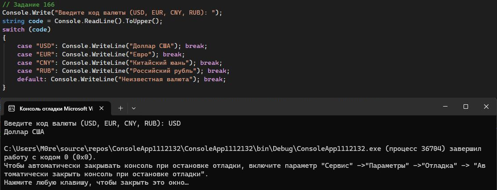

```csharp
using System;

namespace _3_practic
{
    internal class Program
    {
        static void Main(string[] args)
        {
            Console.Write("Введите код валюты (USD, EUR, CNY, RUB): ");
            string code = Console.ReadLine().ToUpper();
            switch (code)
            {
                case "USD": Console.WriteLine("Доллар США"); break;
                case "EUR": Console.WriteLine("Евро"); break;
                case "CNY": Console.WriteLine("Китайский юань"); break;
                case "RUB": Console.WriteLine("Российский рубль"); break;
                default: Console.WriteLine("Неизвестная валюта"); break;
            }
        }
    }
}
```

---

№ 167. Ввести символ клавиши управления движением персонажа (`W`, `A`, `S`, `D` в любом регистре). Вывести направление движения: вперед, влево, назад, вправо.

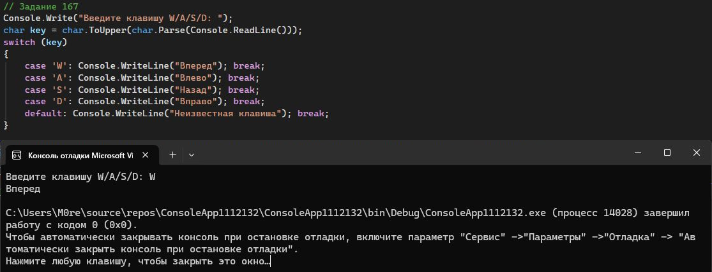

```csharp
using System;

namespace _3_practic
{
    internal class Program
    {
        static void Main(string[] args)
        {
            Console.Write("Введите клавишу W/A/S/D: ");
            char key = char.ToUpper(char.Parse(Console.ReadLine()));
            switch (key)
            {
                case 'W': Console.WriteLine("Вперед"); break;
                case 'A': Console.WriteLine("Влево"); break;
                case 'S': Console.WriteLine("Назад"); break;
                case 'D': Console.WriteLine("Вправо"); break;
                default: Console.WriteLine("Неизвестная клавиша"); break;
            }
        }
    }
}
```

---

№ 168. Ввести номер цвета радуги (1–7). Вывести название цвета.

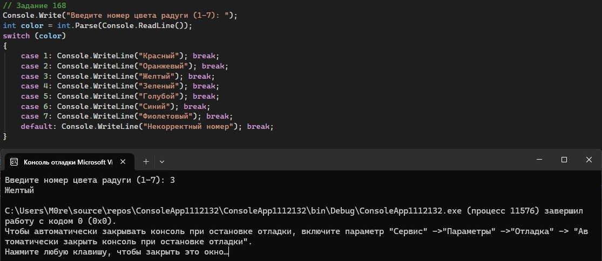

```csharp
using System;

namespace _3_practic
{
    internal class Program
    {
        static void Main(string[] args)
        {
            Console.Write("Введите номер цвета радуги (1-7): ");
            int color = int.Parse(Console.ReadLine());
            switch (color)
            {
                case 1: Console.WriteLine("Красный"); break;
                case 2: Console.WriteLine("Оранжевый"); break;
                case 3: Console.WriteLine("Желтый"); break;
                case 4: Console.WriteLine("Зеленый"); break;
                case 5: Console.WriteLine("Голубой"); break;
                case 6: Console.WriteLine("Синий"); break;
                case 7: Console.WriteLine("Фиолетовый"); break;
                default: Console.WriteLine("Некорректный номер"); break;
            }
        }
    }
}
```

---

№ 169. Ввести признак режима селектора АКПП (`P`, `R`, `N`, `D`, `M`). Вывести режим трансмиссии.

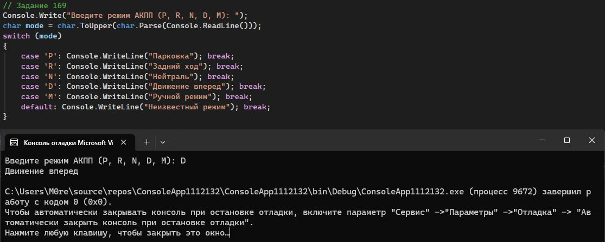

```csharp
using System;

namespace _3_practic
{
    internal class Program
    {
        static void Main(string[] args)
        {
            Console.Write("Введите режим АКПП (P, R, N, D, M): ");
            char mode = char.ToUpper(char.Parse(Console.ReadLine()));
            switch (mode)
            {
                case 'P': Console.WriteLine("Парковка"); break;
                case 'R': Console.WriteLine("Задний ход"); break;
                case 'N': Console.WriteLine("Нейтраль"); break;
                case 'D': Console.WriteLine("Движение вперед"); break;
                case 'M': Console.WriteLine("Ручной режим"); break;
                default: Console.WriteLine("Неизвестный режим"); break;
            }
        }
    }
}
```

---

№ 170. Ввести номер пальца руки (1 — большой, 2 — указательный, 3 — средний, 4 — безымянный, 5 — мизинец). Вывести название пальца.

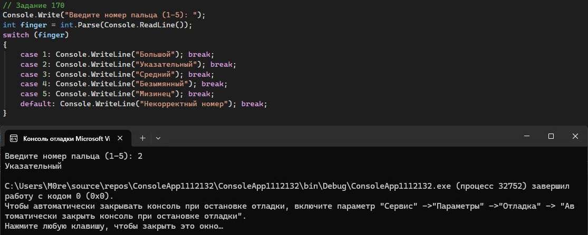

```csharp
using System;

namespace _3_practic
{
    internal class Program
    {
        static void Main(string[] args)
        {
            Console.Write("Введите номер пальца (1-5): ");
            int finger = int.Parse(Console.ReadLine());
            switch (finger)
            {
                case 1: Console.WriteLine("Большой"); break;
                case 2: Console.WriteLine("Указательный"); break;
                case 3: Console.WriteLine("Средний"); break;
                case 4: Console.WriteLine("Безымянный"); break;
                case 5: Console.WriteLine("Мизинец"); break;
                default: Console.WriteLine("Некорректный номер"); break;
            }
        }
    }
}
```

---

№ 171. Ввести номер планеты от Солнца (1–8). Вывести название планеты Солнечной системы.

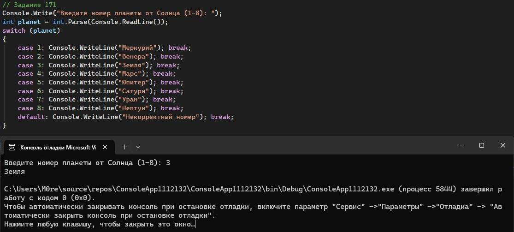

```csharp
using System;

namespace _3_practic
{
    internal class Program
    {
        static void Main(string[] args)
        {
            Console.Write("Введите номер планеты от Солнца (1-8): ");
            int planet = int.Parse(Console.ReadLine());
            switch (planet)
            {
                case 1: Console.WriteLine("Меркурий"); break;
                case 2: Console.WriteLine("Венера"); break;
                case 3: Console.WriteLine("Земля"); break;
                case 4: Console.WriteLine("Марс"); break;
                case 5: Console.WriteLine("Юпитер"); break;
                case 6: Console.WriteLine("Сатурн"); break;
                case 7: Console.WriteLine("Уран"); break;
                case 8: Console.WriteLine("Нептун"); break;
                default: Console.WriteLine("Некорректный номер"); break;
            }
        }
    }
}
```

---

№ 172. Ввести код тарифа мобильной связи (1 — Базовый, 2 — Студенческий, 3 — Безлимит). Вывести абонентскую плату и включенные гигабайты. Примечание: исходное условие не задаёт все числовые значения; здесь использованы условные учебные значения.

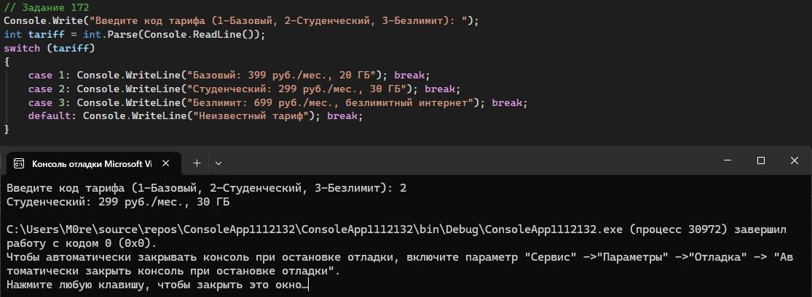

```csharp
using System;

namespace _3_practic
{
    internal class Program
    {
        static void Main(string[] args)
        {
            Console.Write("Введите код тарифа (1-Базовый, 2-Студенческий, 3-Безлимит): ");
            int tariff = int.Parse(Console.ReadLine());
            switch (tariff)
            {
                case 1: Console.WriteLine("Базовый: 399 руб./мес., 20 ГБ"); break;
                case 2: Console.WriteLine("Студенческий: 299 руб./мес., 30 ГБ"); break;
                case 3: Console.WriteLine("Безлимит: 699 руб./мес., безлимитный интернет"); break;
                default: Console.WriteLine("Неизвестный тариф"); break;
            }
        }
    }
}
```

---

№ 173. Ввести номер квартала года (1–4). Вывести список входящих в него месяцев.

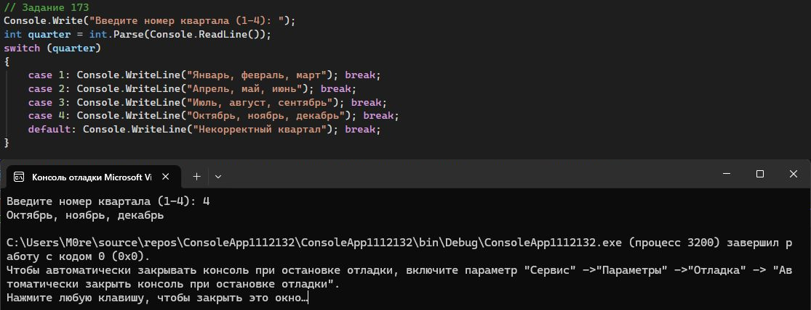

```csharp
using System;

namespace _3_practic
{
    internal class Program
    {
        static void Main(string[] args)
        {
            Console.Write("Введите номер квартала (1-4): ");
            int quarter = int.Parse(Console.ReadLine());
            switch (quarter)
            {
                case 1: Console.WriteLine("Январь, февраль, март"); break;
                case 2: Console.WriteLine("Апрель, май, июнь"); break;
                case 3: Console.WriteLine("Июль, август, сентябрь"); break;
                case 4: Console.WriteLine("Октябрь, ноябрь, декабрь"); break;
                default: Console.WriteLine("Некорректный квартал"); break;
            }
        }
    }
}
```

---

№ 174. Ввести букву оценки американской системы (A, B, C, D, F). Вывести эквивалент в пятибалльной системе РФ.

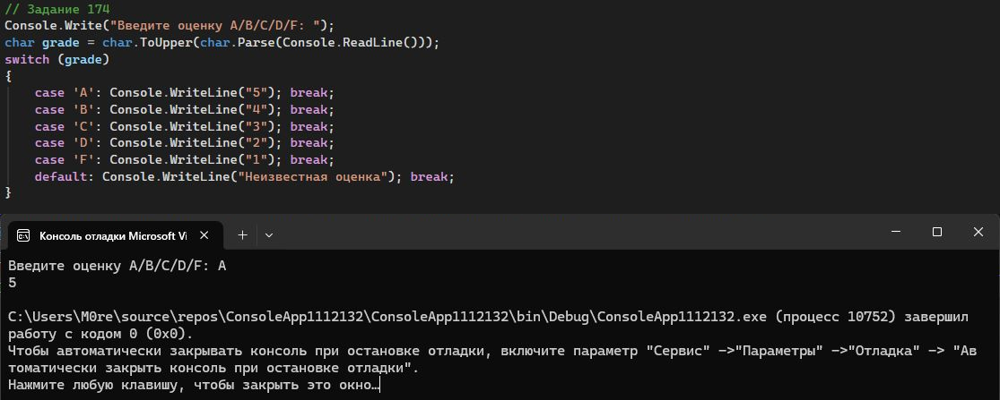

```csharp
using System;

namespace _3_practic
{
    internal class Program
    {
        static void Main(string[] args)
        {
            Console.Write("Введите оценку A/B/C/D/F: ");
            char grade = char.ToUpper(char.Parse(Console.ReadLine()));
            switch (grade)
            {
                case 'A': Console.WriteLine("5"); break;
                case 'B': Console.WriteLine("4"); break;
                case 'C': Console.WriteLine("3"); break;
                case 'D': Console.WriteLine("2"); break;
                case 'F': Console.WriteLine("1"); break;
                default: Console.WriteLine("Неизвестная оценка"); break;
            }
        }
    }
}
```

---

№ 175. Ввести символ операции над множествами (`U` — объединение, `I` — пересечение, `D` — разность). Вывести расшифровку операции.

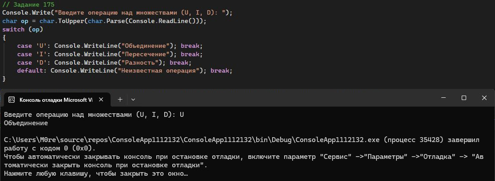

```csharp
using System;

namespace _3_practic
{
    internal class Program
    {
        static void Main(string[] args)
        {
            Console.Write("Введите операцию над множествами (U, I, D): ");
            char op = char.ToUpper(char.Parse(Console.ReadLine()));
            switch (op)
            {
                case 'U': Console.WriteLine("Объединение"); break;
                case 'I': Console.WriteLine("Пересечение"); break;
                case 'D': Console.WriteLine("Разность"); break;
                default: Console.WriteLine("Неизвестная операция"); break;
            }
        }
    }
}
```

---

№ 176. Ввести номер режима работы светофора (1 — Красный, 2 — Желтый, 3 — Зеленый, 4 — Мигающий желтый). Вывести предписание для водителя.

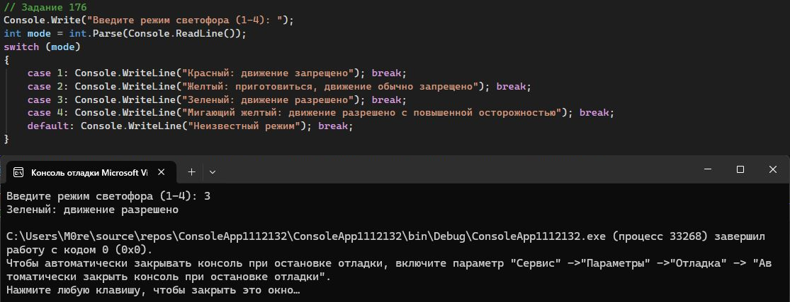

```csharp
using System;

namespace _3_practic
{
    internal class Program
    {
        static void Main(string[] args)
        {
            Console.Write("Введите режим светофора (1-4): ");
            int mode = int.Parse(Console.ReadLine());
            switch (mode)
            {
                case 1: Console.WriteLine("Красный: движение запрещено"); break;
                case 2: Console.WriteLine("Желтый: приготовиться, движение обычно запрещено"); break;
                case 3: Console.WriteLine("Зеленый: движение разрешено"); break;
                case 4: Console.WriteLine("Мигающий желтый: движение разрешено с повышенной осторожностью"); break;
                default: Console.WriteLine("Неизвестный режим"); break;
            }
        }
    }
}
```

---

№ 177. Ввести цифру (0–9). Вывести ее словесное написание на русском языке.

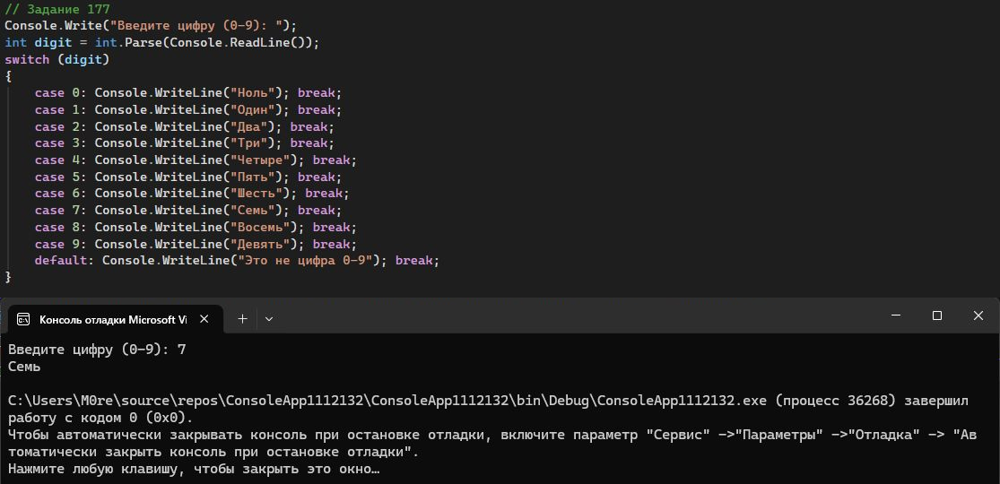

```csharp
using System;

namespace _3_practic
{
    internal class Program
    {
        static void Main(string[] args)
        {
            Console.Write("Введите цифру (0-9): ");
            int digit = int.Parse(Console.ReadLine());
            switch (digit)
            {
                case 0: Console.WriteLine("Ноль"); break;
                case 1: Console.WriteLine("Один"); break;
                case 2: Console.WriteLine("Два"); break;
                case 3: Console.WriteLine("Три"); break;
                case 4: Console.WriteLine("Четыре"); break;
                case 5: Console.WriteLine("Пять"); break;
                case 6: Console.WriteLine("Шесть"); break;
                case 7: Console.WriteLine("Семь"); break;
                case 8: Console.WriteLine("Восемь"); break;
                case 9: Console.WriteLine("Девять"); break;
                default: Console.WriteLine("Это не цифра 0-9"); break;
            }
        }
    }
}
```

---

№ 178. Ввести римскую цифру (`I`, `V`, `X`, `L`, `C`, `D`, `M`). Вывести ее арабское значение.

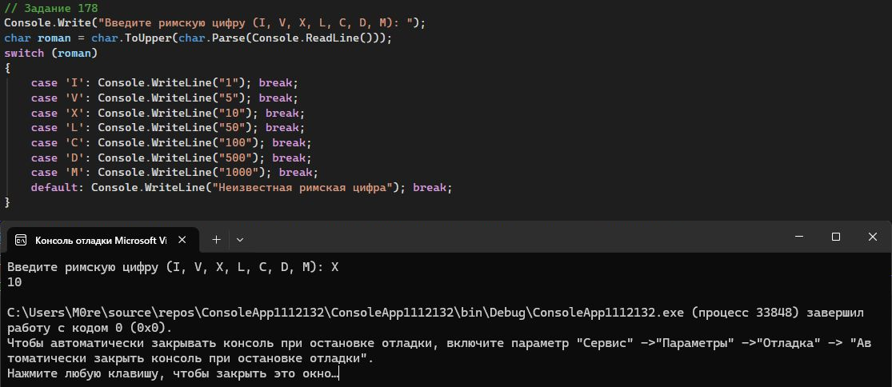

```csharp
using System;

namespace _3_practic
{
    internal class Program
    {
        static void Main(string[] args)
        {
            Console.Write("Введите римскую цифру (I, V, X, L, C, D, M): ");
            char roman = char.ToUpper(char.Parse(Console.ReadLine()));
            switch (roman)
            {
                case 'I': Console.WriteLine("1"); break;
                case 'V': Console.WriteLine("5"); break;
                case 'X': Console.WriteLine("10"); break;
                case 'L': Console.WriteLine("50"); break;
                case 'C': Console.WriteLine("100"); break;
                case 'D': Console.WriteLine("500"); break;
                case 'M': Console.WriteLine("1000"); break;
                default: Console.WriteLine("Неизвестная римская цифра"); break;
            }
        }
    }
}
```

---

№ 179. Ввести номер типа транспортного средства (1 — Мотоцикл, 2 — Легковой авто, 3 — Грузовой авто, 4 — Автобус). Вывести категорию водительского удостоверения (A, B, C, D).

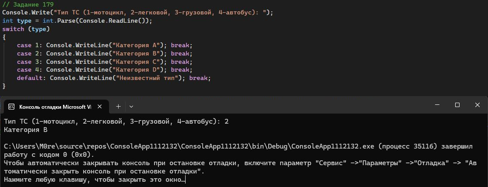

```csharp
using System;

namespace _3_practic
{
    internal class Program
    {
        static void Main(string[] args)
        {
            Console.Write("Тип ТС (1-мотоцикл, 2-легковой, 3-грузовой, 4-автобус): ");
            int type = int.Parse(Console.ReadLine());
            switch (type)
            {
                case 1: Console.WriteLine("Категория A"); break;
                case 2: Console.WriteLine("Категория B"); break;
                case 3: Console.WriteLine("Категория C"); break;
                case 4: Console.WriteLine("Категория D"); break;
                default: Console.WriteLine("Неизвестный тип"); break;
            }
        }
    }
}
```

---

№ 180. Ввести тип двигателя (1 — Бензиновый, 2 — Дизельный, 3 — Гибридный, 4 — Электрический). Вывести вид используемого источника энергии.

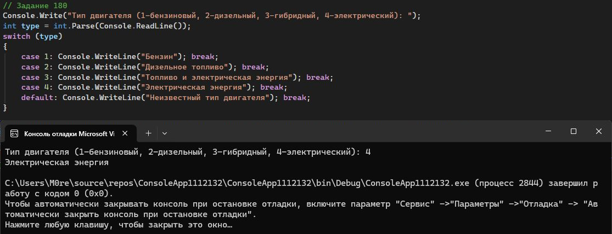

```csharp
using System;

namespace _3_practic
{
    internal class Program
    {
        static void Main(string[] args)
        {
            Console.Write("Тип двигателя (1-бензиновый, 2-дизельный, 3-гибридный, 4-электрический): ");
            int type = int.Parse(Console.ReadLine());
            switch (type)
            {
                case 1: Console.WriteLine("Бензин"); break;
                case 2: Console.WriteLine("Дизельное топливо"); break;
                case 3: Console.WriteLine("Топливо и электрическая энергия"); break;
                case 4: Console.WriteLine("Электрическая энергия"); break;
                default: Console.WriteLine("Неизвестный тип двигателя"); break;
            }
        }
    }
}
```

---

№ 181. Ввести номер операции в банкомате: 1 — Баланс, 2 — Снятие наличных, 3 — Пополнение, 4 — Перевод. Вывести сообщение о начале выбранной процедуры.

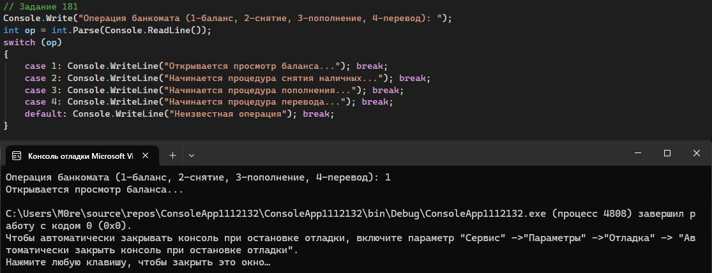

```csharp
using System;

namespace _3_practic
{
    internal class Program
    {
        static void Main(string[] args)
        {
            Console.Write("Операция банкомата (1-баланс, 2-снятие, 3-пополнение, 4-перевод): ");
            int op = int.Parse(Console.ReadLine());
            switch (op)
            {
                case 1: Console.WriteLine("Открывается просмотр баланса..."); break;
                case 2: Console.WriteLine("Начинается процедура снятия наличных..."); break;
                case 3: Console.WriteLine("Начинается процедура пополнения..."); break;
                case 4: Console.WriteLine("Начинается процедура перевода..."); break;
                default: Console.WriteLine("Неизвестная операция"); break;
            }
        }
    }
}
```

---

№ 182. Ввести расширение файла (`txt`, `cs`, `html`, `png`, `mp3`). Вывести тип содержимого: текстовый документ, исходный код C#, веб-страница, изображение, аудиофайл.

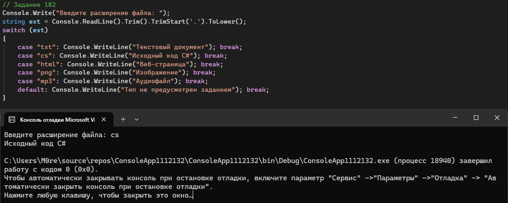

```csharp
using System;

namespace _3_practic
{
    internal class Program
    {
        static void Main(string[] args)
        {
            Console.Write("Введите расширение файла: ");
            string ext = Console.ReadLine().Trim().TrimStart('.').ToLower();
            switch (ext)
            {
                case "txt": Console.WriteLine("Текстовый документ"); break;
                case "cs": Console.WriteLine("Исходный код C#"); break;
                case "html": Console.WriteLine("Веб-страница"); break;
                case "png": Console.WriteLine("Изображение"); break;
                case "mp3": Console.WriteLine("Аудиофайл"); break;
                default: Console.WriteLine("Тип не предусмотрен заданием"); break;
            }
        }
    }
}
```

---

№ 183. Ввести номер химического элемента из первых пяти таблицы Менделеева (1–5). Вывести название элемента и его символ.

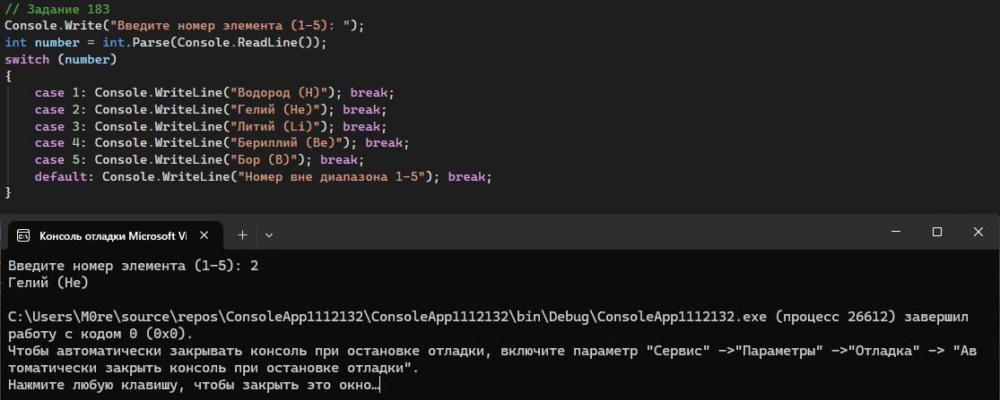

```csharp
using System;

namespace _3_practic
{
    internal class Program
    {
        static void Main(string[] args)
        {
            Console.Write("Введите номер элемента (1-5): ");
            int number = int.Parse(Console.ReadLine());
            switch (number)
            {
                case 1: Console.WriteLine("Водород (H)"); break;
                case 2: Console.WriteLine("Гелий (He)"); break;
                case 3: Console.WriteLine("Литий (Li)"); break;
                case 4: Console.WriteLine("Бериллий (Be)"); break;
                case 5: Console.WriteLine("Бор (B)"); break;
                default: Console.WriteLine("Номер вне диапазона 1-5"); break;
            }
        }
    }
}
```

---

№ 184. Ввести код статуса заказа в интернет-магазине (NEW, PAID, SHIPPED, DELIVERED, CANCELED). Вывести подсказку для клиента.

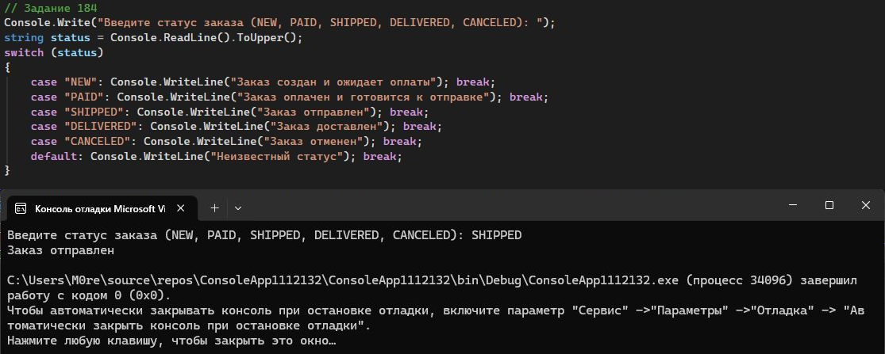

```csharp
using System;

namespace _3_practic
{
    internal class Program
    {
        static void Main(string[] args)
        {
            Console.Write("Введите статус заказа (NEW, PAID, SHIPPED, DELIVERED, CANCELED): ");
            string status = Console.ReadLine().ToUpper();
            switch (status)
            {
                case "NEW": Console.WriteLine("Заказ создан и ожидает оплаты"); break;
                case "PAID": Console.WriteLine("Заказ оплачен и готовится к отправке"); break;
                case "SHIPPED": Console.WriteLine("Заказ отправлен"); break;
                case "DELIVERED": Console.WriteLine("Заказ доставлен"); break;
                case "CANCELED": Console.WriteLine("Заказ отменен"); break;
                default: Console.WriteLine("Неизвестный статус"); break;
            }
        }
    }
}
```

---

№ 185. Ввести код системы счисления (2, 8, 10, 16) и перевести введенное десятичное число в выбранную систему (через методы класса `Convert`).

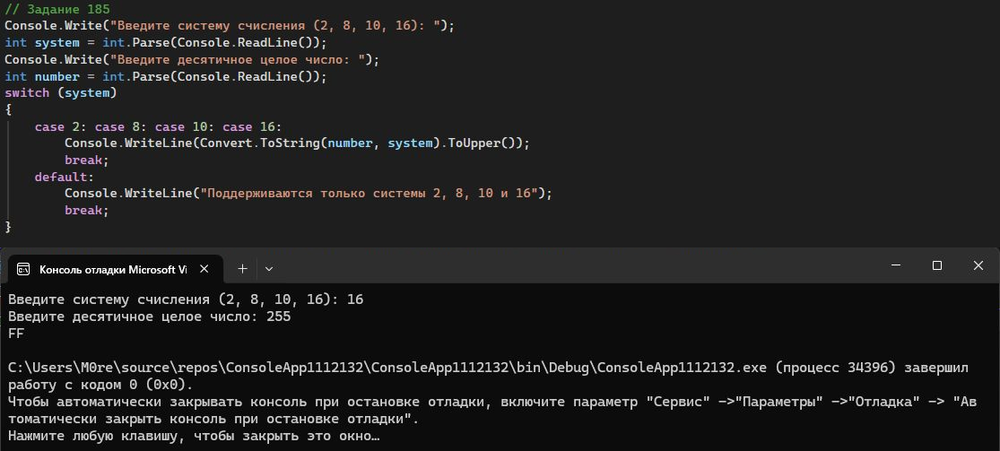

```csharp
using System;

namespace _3_practic
{
    internal class Program
    {
        static void Main(string[] args)
        {
            Console.Write("Введите систему счисления (2, 8, 10, 16): ");
            int system = int.Parse(Console.ReadLine());
            Console.Write("Введите десятичное целое число: ");
            int number = int.Parse(Console.ReadLine());
            switch (system)
            {
                case 2: case 8: case 10: case 16:
                    Console.WriteLine(Convert.ToString(number, system).ToUpper());
                    break;
                default:
                    Console.WriteLine("Поддерживаются только системы 2, 8, 10 и 16");
                    break;
            }
        }
    }
}
```

---

№ 186. Ввести номер курса колледжа (1–4). Вывести: «Первокурсник», «Второй курс», «Предвыпускной курс», «Выпускник».

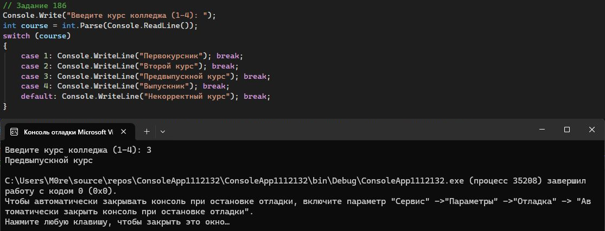

```csharp
using System;

namespace _3_practic
{
    internal class Program
    {
        static void Main(string[] args)
        {
            Console.Write("Введите курс колледжа (1-4): ");
            int course = int.Parse(Console.ReadLine());
            switch (course)
            {
                case 1: Console.WriteLine("Первокурсник"); break;
                case 2: Console.WriteLine("Второй курс"); break;
                case 3: Console.WriteLine("Предвыпускной курс"); break;
                case 4: Console.WriteLine("Выпускник"); break;
                default: Console.WriteLine("Некорректный курс"); break;
            }
        }
    }
}
```

---

№ 187. Ввести код климатической зоны (1 — Арктическая, 2 — Субарктическая, 3 — Умеренная, 4 — Субтропическая, 5 — Тропическая). Вывести краткую характеристику.

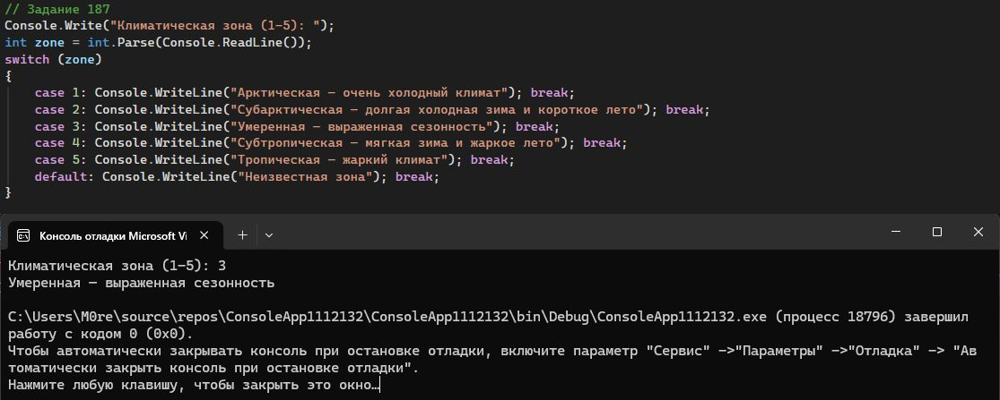

```csharp
using System;

namespace _3_practic
{
    internal class Program
    {
        static void Main(string[] args)
        {
            Console.Write("Климатическая зона (1-5): ");
            int zone = int.Parse(Console.ReadLine());
            switch (zone)
            {
                case 1: Console.WriteLine("Арктическая — очень холодный климат"); break;
                case 2: Console.WriteLine("Субарктическая — долгая холодная зима и короткое лето"); break;
                case 3: Console.WriteLine("Умеренная — выраженная сезонность"); break;
                case 4: Console.WriteLine("Субтропическая — мягкая зима и жаркое лето"); break;
                case 5: Console.WriteLine("Тропическая — жаркий климат"); break;
                default: Console.WriteLine("Неизвестная зона"); break;
            }
        }
    }
}
```

---

№ 188. Ввести класс пожарной опасности (1–5). Вывести уровень угрозы и ограничения на посещение лесов. Примечание: исходное условие не задаёт все числовые значения; здесь использованы условные учебные значения.

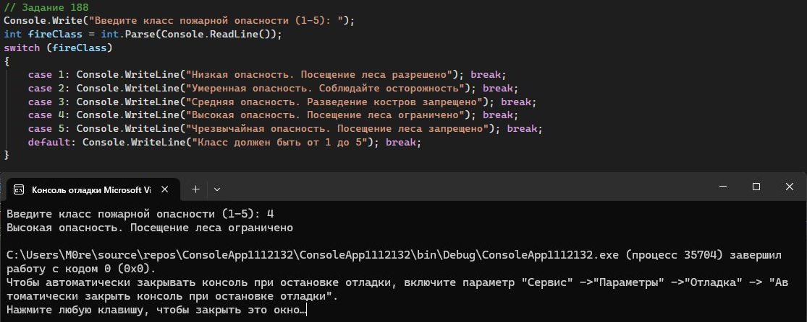

```csharp
using System;

namespace _3_practic
{
    internal class Program
    {
        static void Main(string[] args)
        {
            Console.Write("Введите класс пожарной опасности (1-5): ");
            int fireClass = int.Parse(Console.ReadLine());
            switch (fireClass)
            {
                case 1: Console.WriteLine("Низкая опасность. Посещение леса разрешено"); break;
                case 2: Console.WriteLine("Умеренная опасность. Соблюдайте осторожность"); break;
                case 3: Console.WriteLine("Средняя опасность. Разведение костров запрещено"); break;
                case 4: Console.WriteLine("Высокая опасность. Посещение леса ограничено"); break;
                case 5: Console.WriteLine("Чрезвычайная опасность. Посещение леса запрещено"); break;
                default: Console.WriteLine("Класс должен быть от 1 до 5"); break;
            }
        }
    }
}
```

---

№ 189. Ввести номер спортивного разряда (1 — Юношеский, 2 — Взрослый, 3 — КМС, 4 — МС, 5 — МСМК). Вывести расшифровку.

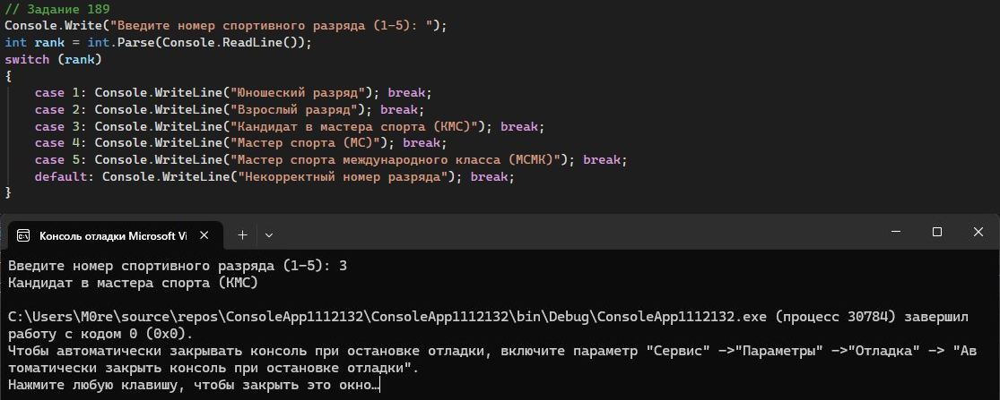

```csharp
using System;

namespace _3_practic
{
    internal class Program
    {
        static void Main(string[] args)
        {
            Console.Write("Введите номер спортивного разряда (1-5): ");
            int rank = int.Parse(Console.ReadLine());
            switch (rank)
            {
                case 1: Console.WriteLine("Юношеский разряд"); break;
                case 2: Console.WriteLine("Взрослый разряд"); break;
                case 3: Console.WriteLine("Кандидат в мастера спорта (КМС)"); break;
                case 4: Console.WriteLine("Мастер спорта (МС)"); break;
                case 5: Console.WriteLine("Мастер спорта международного класса (МСМК)"); break;
                default: Console.WriteLine("Некорректный номер разряда"); break;
            }
        }
    }
}
```

---

№ 190. Ввести код уровня доступа пользователя (`G` — Guest, `U` — User, `M` — Moderator, `A` — Administrator). Вывести перечень разрешенных действий.

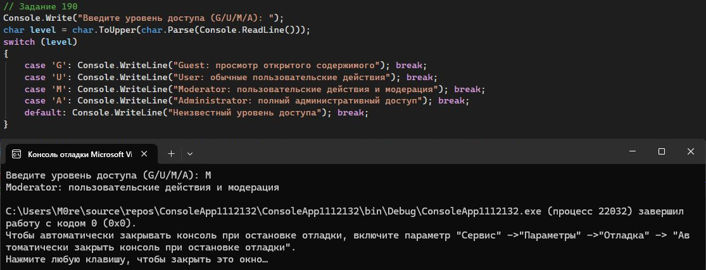

```csharp
using System;

namespace _3_practic
{
    internal class Program
    {
        static void Main(string[] args)
        {
            Console.Write("Введите уровень доступа (G/U/M/A): ");
            char level = char.ToUpper(char.Parse(Console.ReadLine()));
            switch (level)
            {
                case 'G': Console.WriteLine("Guest: просмотр открытого содержимого"); break;
                case 'U': Console.WriteLine("User: обычные пользовательские действия"); break;
                case 'M': Console.WriteLine("Moderator: пользовательские действия и модерация"); break;
                case 'A': Console.WriteLine("Administrator: полный административный доступ"); break;
                default: Console.WriteLine("Неизвестный уровень доступа"); break;
            }
        }
    }
}
```

---

№ 191. Ввести букву ноты (`C`, `D`, `E`, `F`, `G`, `A`, `B`). Вывести русское словесное обозначение (До, Ре, Ми, Фа, Соль, Ля, Си).

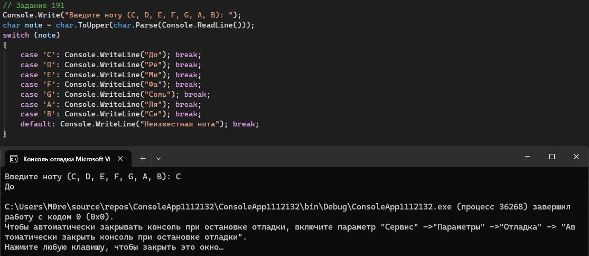

```csharp
using System;

namespace _3_practic
{
    internal class Program
    {
        static void Main(string[] args)
        {
            Console.Write("Введите ноту (C, D, E, F, G, A, B): ");
            char note = char.ToUpper(char.Parse(Console.ReadLine()));
            switch (note)
            {
                case 'C': Console.WriteLine("До"); break;
                case 'D': Console.WriteLine("Ре"); break;
                case 'E': Console.WriteLine("Ми"); break;
                case 'F': Console.WriteLine("Фа"); break;
                case 'G': Console.WriteLine("Соль"); break;
                case 'A': Console.WriteLine("Ля"); break;
                case 'B': Console.WriteLine("Си"); break;
                default: Console.WriteLine("Неизвестная нота"); break;
            }
        }
    }
}
```

---

№ 192. Ввести номер типа кузова автомобиля (1 — Седан, 2 — Хэтчбек, 3 — Универсал, 4 — Купе, 5 — Внедорожник). Вывести описание вместимости и компоновки.

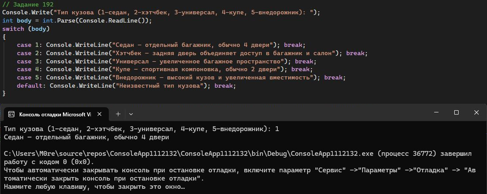

```csharp
using System;

namespace _3_practic
{
    internal class Program
    {
        static void Main(string[] args)
        {
            Console.Write("Тип кузова (1-седан, 2-хэтчбек, 3-универсал, 4-купе, 5-внедорожник): ");
            int body = int.Parse(Console.ReadLine());
            switch (body)
            {
                case 1: Console.WriteLine("Седан — отдельный багажник, обычно 4 двери"); break;
                case 2: Console.WriteLine("Хэтчбек — задняя дверь объединяет доступ в багажник и салон"); break;
                case 3: Console.WriteLine("Универсал — увеличенное багажное пространство"); break;
                case 4: Console.WriteLine("Купе — спортивная компоновка, обычно 2 двери"); break;
                case 5: Console.WriteLine("Внедорожник — высокий кузов и увеличенная вместимость"); break;
                default: Console.WriteLine("Неизвестный тип кузова"); break;
            }
        }
    }
}
```

---

№ 193. Ввести код типа датчика охранной сигнализации: `M` (движение), `D` (открытие двери), `S` (дым), `W` (протечка воды). Вывести сообщение о типе угрозы.

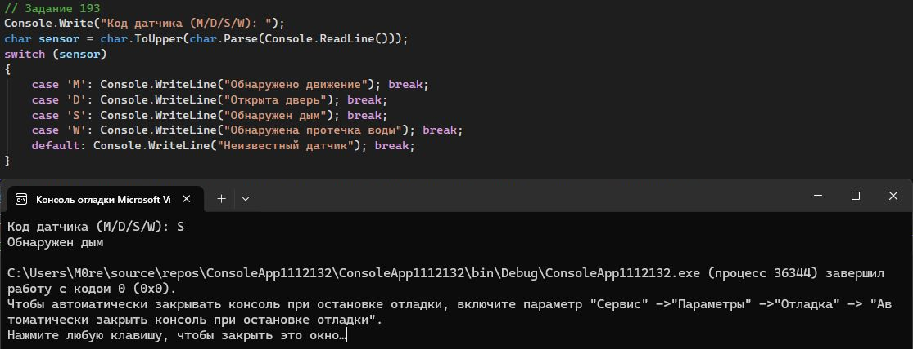

```csharp
using System;

namespace _3_practic
{
    internal class Program
    {
        static void Main(string[] args)
        {
            Console.Write("Код датчика (M/D/S/W): ");
            char sensor = char.ToUpper(char.Parse(Console.ReadLine()));
            switch (sensor)
            {
                case 'M': Console.WriteLine("Обнаружено движение"); break;
                case 'D': Console.WriteLine("Открыта дверь"); break;
                case 'S': Console.WriteLine("Обнаружен дым"); break;
                case 'W': Console.WriteLine("Обнаружена протечка воды"); break;
                default: Console.WriteLine("Неизвестный датчик"); break;
            }
        }
    }
}
```

---

№ 194. Ввести номер фазы Луны (1 — Новолуние, 2 — Первая четверть, 3 — Полнолуние, 4 — Последняя четверть). Вывести характеристику фазы.

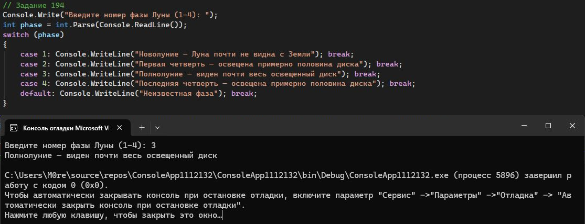

```csharp
using System;

namespace _3_practic
{
    internal class Program
    {
        static void Main(string[] args)
        {
            Console.Write("Введите номер фазы Луны (1-4): ");
            int phase = int.Parse(Console.ReadLine());
            switch (phase)
            {
                case 1: Console.WriteLine("Новолуние — Луна почти не видна с Земли"); break;
                case 2: Console.WriteLine("Первая четверть — освещена примерно половина диска"); break;
                case 3: Console.WriteLine("Полнолуние — виден почти весь освещенный диск"); break;
                case 4: Console.WriteLine("Последняя четверть — освещена примерно половина диска"); break;
                default: Console.WriteLine("Неизвестная фаза"); break;
            }
        }
    }
}
```

---

№ 195. Ввести символ разделителя пути в операционной системе (`/` или `\`). Вывести, к какому семейству ОС относится разделитель (Unix/Linux или Windows).

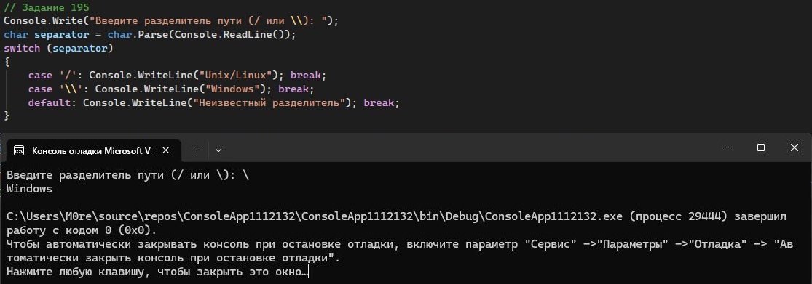

```csharp
using System;

namespace _3_practic
{
    internal class Program
    {
        static void Main(string[] args)
        {
            Console.Write("Введите разделитель пути (/ или \\): ");
            char separator = char.Parse(Console.ReadLine());
            switch (separator)
            {
                case '/': Console.WriteLine("Unix/Linux"); break;
                case '\\': Console.WriteLine("Windows"); break;
                default: Console.WriteLine("Неизвестный разделитель"); break;
            }
        }
    }
}
```

---

№ 196. Ввести номер поколения мобильной связи (2, 3, 4, 5). Вывести название стандарта (GPRS/EDGE, UMTS/HSPA, LTE, NR) и типичную скорость. Примечание: исходное условие не задаёт все числовые значения; здесь использованы условные учебные значения.

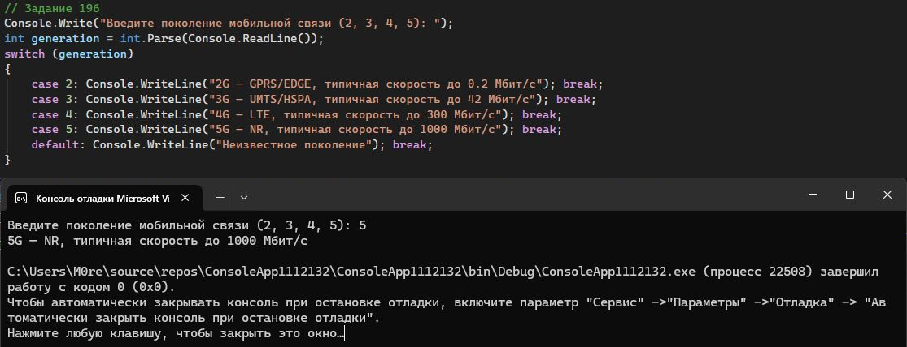

```csharp
using System;

namespace _3_practic
{
    internal class Program
    {
        static void Main(string[] args)
        {
            Console.Write("Введите поколение мобильной связи (2, 3, 4, 5): ");
            int generation = int.Parse(Console.ReadLine());
            switch (generation)
            {
                case 2: Console.WriteLine("2G — GPRS/EDGE, типичная скорость до 0.2 Мбит/с"); break;
                case 3: Console.WriteLine("3G — UMTS/HSPA, типичная скорость до 42 Мбит/с"); break;
                case 4: Console.WriteLine("4G — LTE, типичная скорость до 300 Мбит/с"); break;
                case 5: Console.WriteLine("5G — NR, типичная скорость до 1000 Мбит/с"); break;
                default: Console.WriteLine("Неизвестное поколение"); break;
            }
        }
    }
}
```

---

№ 197. Ввести номер порта протокола (21, 22, 25, 80, 443). Вывести название сетевого протокола (FTP, SSH, SMTP, HTTP, HTTPS).

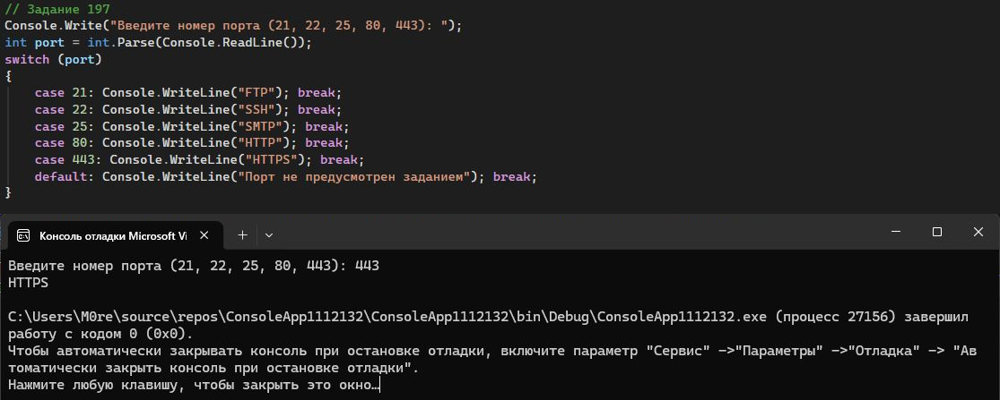

```csharp
using System;

namespace _3_practic
{
    internal class Program
    {
        static void Main(string[] args)
        {
            Console.Write("Введите номер порта (21, 22, 25, 80, 443): ");
            int port = int.Parse(Console.ReadLine());
            switch (port)
            {
                case 21: Console.WriteLine("FTP"); break;
                case 22: Console.WriteLine("SSH"); break;
                case 25: Console.WriteLine("SMTP"); break;
                case 80: Console.WriteLine("HTTP"); break;
                case 443: Console.WriteLine("HTTPS"); break;
                default: Console.WriteLine("Порт не предусмотрен заданием"); break;
            }
        }
    }
}
```

---

№ 198. Ввести код режима стиральной машины (1 — Хлопок, 2 — Синтетика, 3 — Шерсть, 4 — Быстрая 15 мин, 5 — Отжим). Вывести температуру стирки и скорость отжима. Примечание: исходное условие не задаёт все числовые значения; здесь использованы условные учебные значения.

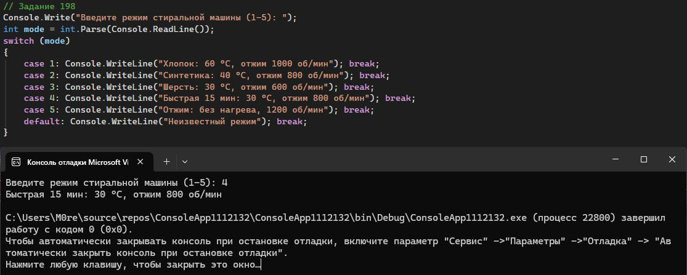

```csharp
using System;

namespace _3_practic
{
    internal class Program
    {
        static void Main(string[] args)
        {
            Console.Write("Введите режим стиральной машины (1-5): ");
            int mode = int.Parse(Console.ReadLine());
            switch (mode)
            {
                case 1: Console.WriteLine("Хлопок: 60 °C, отжим 1000 об/мин"); break;
                case 2: Console.WriteLine("Синтетика: 40 °C, отжим 800 об/мин"); break;
                case 3: Console.WriteLine("Шерсть: 30 °C, отжим 600 об/мин"); break;
                case 4: Console.WriteLine("Быстрая 15 мин: 30 °C, отжим 800 об/мин"); break;
                case 5: Console.WriteLine("Отжим: без нагрева, 1200 об/мин"); break;
                default: Console.WriteLine("Неизвестный режим"); break;
            }
        }
    }
}
```

---

№ 199. Ввести код тарифной зоны электроэнергии (1 — Пик, 2 — Полупик, 3 — Ночь). Вывести стоимость киловатт-часа. Примечание: исходное условие не задаёт все числовые значения; здесь использованы условные учебные значения.

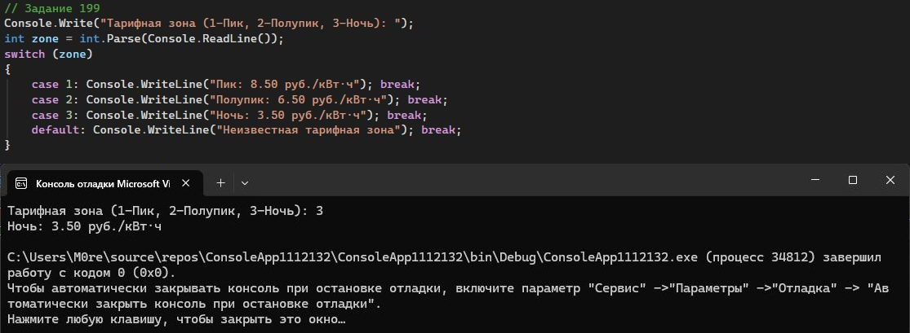

```csharp
using System;

namespace _3_practic
{
    internal class Program
    {
        static void Main(string[] args)
        {
            Console.Write("Тарифная зона (1-Пик, 2-Полупик, 3-Ночь): ");
            int zone = int.Parse(Console.ReadLine());
            switch (zone)
            {
                case 1: Console.WriteLine("Пик: 8.50 руб./кВт·ч"); break;
                case 2: Console.WriteLine("Полупик: 6.50 руб./кВт·ч"); break;
                case 3: Console.WriteLine("Ночь: 3.50 руб./кВт·ч"); break;
                default: Console.WriteLine("Неизвестная тарифная зона"); break;
            }
        }
    }
}
```

---

№ 200. Ввести код состояния потока выполнения в C# (Running, Suspended, Stopped, Aborted). Вывести пояснение жизненного цикла потока.

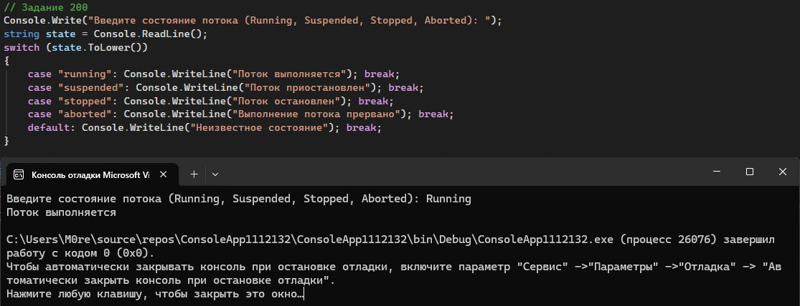

```csharp
using System;

namespace _3_practic
{
    internal class Program
    {
        static void Main(string[] args)
        {
            Console.Write("Введите состояние потока (Running, Suspended, Stopped, Aborted): ");
            string state = Console.ReadLine();
            switch (state.ToLower())
            {
                case "running": Console.WriteLine("Поток выполняется"); break;
                case "suspended": Console.WriteLine("Поток приостановлен"); break;
                case "stopped": Console.WriteLine("Поток остановлен"); break;
                case "aborted": Console.WriteLine("Выполнение потока прервано"); break;
                default: Console.WriteLine("Неизвестное состояние"); break;
            }
        }
    }
}
```

---
